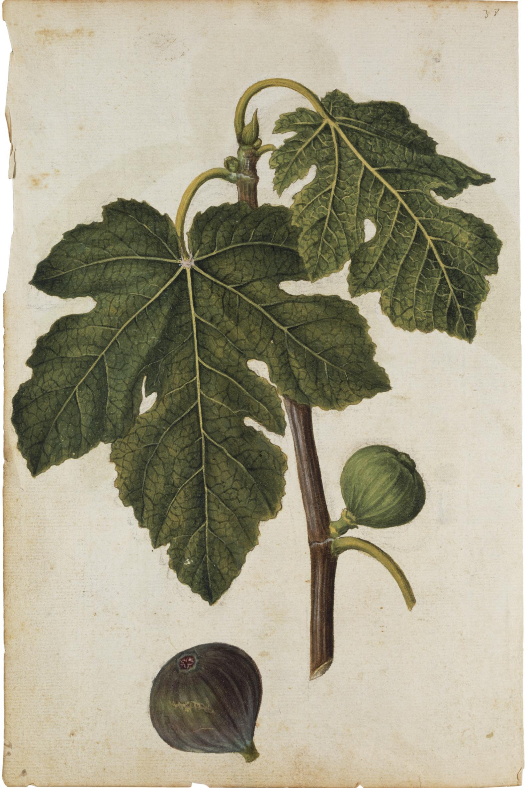

# A Common Fig Walks North

UC ANR’s caprification circular starts where it should: the fig comes with the mission at San Diego in 1769. The clone that takes the name Mission is a black common fig, a tree that sets without a wasp, a fruit that dries dark and eats rich. It walks north with the chain — a garden at each stop, a cutting for the next. That is Spanish America reaching its last province. It is not an industry.

Spanish and Franciscan movement of *F. carica* into New Spain is older than 1769 (mid-sixteenth-century introductions appear in the synthesis literature). Florida 1575 shows up in some compilations; treat dates that only live in secondary stacks as stacks. What California has that those stacks do not is a named clone and a mission corridor you can still drive.

## Two Californias

The coast is Mission and backyard. The San Joaquin — Fresno, Merced, Tulare — is heat, irrigation, rail, and a wish to be Aydın. Commercial culture, the ANR circular says, starts in 1885. Dried Adriatic figs go east in 1889. They are inferior in eating quality to the imported Smyrna article. Smyrna cuttings had already arrived, 1881–82. Thousands of trees. Almost no fruit. The wasp is still in the Old World.

<!-- figure-id: shared.timeline-master -->

*Figure 1. 1769, 1881–82, 1885, 1889 — dated nodes only. Schematic.*

Condit’s patience: Mission and Adriatic were navel oranges. Smyrna was a Valencia. Different machines. Growers who did not understand the four types thought the Turks had cheated them.

<!-- figure-id: shared.map-med-belt -->

*Figure 2. The Mediterranean belt does not include San Diego; the cutting does. Schematic.*

<!-- figure-id: shared.chart-variety-regions -->

*Figure 3. Mission as a New World common type. Qualitative.*

<!-- orchard_slot: ORCH-06 Mission label; ORCH-07 valley -->

Le Moyne’s *F. carica* watercolour is a colonial Atlantic botanical, not a California photograph. Use it in the art article. Do not caption it as a mission garden.

The next article is the missing insect. This one stops at the wish, because the wish is already a historical fact: California would not be content to be a mission garden.

<!-- figure-id: california-mission.le-moyne -->

*Figure 4. Jacques Le Moyne de Morgues, *Ficus carica*. Public domain. Atlantic colonial botanical — not a photograph of a California mission garden.*

## Corridor, then valley

The mission chain is a garden logistics: a cutting that has to fruit for a kitchen that cannot wait on a wasp. The San Joaquin is a rail logistics: a crate that has to face an imported taste. 1769 and 1885 are not one story. They share a state and fight over a type.

## 1769 is a kitchen; 1885 is a crate

UC ANR: San Diego 1769, Mission as black common type, commercial culture 1885, Adriatic east 1889, Smyrna wood 1881–82 without fruit. Mid-sixteenth-century New Spain introductions sit in syntheses; Florida 1575 is a stack date. The corridor walks north as garden logistics. The San Joaquin wants Aydın as rail logistics. Condit’s navel/Valencia analogy still holds. Le Moyne’s plate is Atlantic botanical, not a mission photograph. ORCH-06/07 wait for living Mission labels and valley shots.

## 1769 is a date, not a variety trial

The Franciscan missions of Alta California planted figs with the first
gardens. The usual citation is Mission San Diego, 1769, and then the chain
north. The tree that later English speakers called “Mission” is a black
common-type fig — parthenocarpic, two-crop in a kind year, no wasp required.
That physiological fact is why the mission fig *could* spread in a landscape
that did not yet have *Blastophaga*. The Smyrna types of the 1880s could not.

A mission inventory that lists *higos* is not Condit. It does not tell you
whether the black fig on a Sonoma adobe is the same clone as the black fig
at San Juan Capistrano. Common-type black figs are a pile of names. Mission,
Franciscana, Black Mission — the market collapsed them. A DNA pass on living
mission trees (work that belongs to the variety essay, not this one) is the
only way to say “same clone.” Until then, say “mission-type black fig” when
you mean the class, and “Mission” when you mean the California market name.

## Secularization and the backyard

After secularization, mission orchards became ranch orchards, then backyard
trees, then the neglected standards twentieth-century farm advisors
complained about. The fig did not leave. It changed tenure. A Californian
who thinks “Mission fig” began with the 1880s Smyrna boom has the sequence
backward. The mission tree was already in the ground. The boom was an attempt
to add a different fig — the dried Smyrna — on top of that common-type
baseline.

The mission chain is garden logistics: a cutting that has to fruit for a
kitchen that cannot wait on a wasp. The San Joaquin is rail logistics: a
crate that has to face an imported taste. 1769 and 1885 are not one story.
They share a state and fight over a type. Condit’s later circulars still
treat Mission as the reliable dark drier — the tree a valley already had
when it decided it wanted someone else’s pale crate.

## What the Le Moyne plate is doing here

The Le Moyne *Ficus carica* plate in this article’s assets is a European
botanical image, not a photograph of a California mission orchard. It is in
the file because the mission fathers planted a European tree they already
had a picture of. It is not evidence of 1769. PHOTO_NOTES says so; the
caption should too. A watercolour of an Atlantic colonial plant is how
Europe already saw the species before Serra walked north.

## A corridor that could not wait

San Diego 1769, then the chain north: a kitchen that needed fruit before
Algeria sent a wasp. The black common-type tree later called Mission —
Franciscana, Black Mission, a pile the market collapsed — sets without
*Blastophaga*. That is why it could walk the corridor. Smyrna wood in the
1880s could not. A mission *higos* inventory is not Condit and not a DNA
pass. Say “mission-type” for the class and “Mission” for the California
market name until a lab says same clone.

Secularization turned mission orchards into ranch trees, then backyards,
then the neglected standards advisors complained about. The tree did not
leave. Tenure did. 1769 is garden logistics. 1885 is rail logistics and
someone else’s pale taste. Condit’s later circulars still treat Mission as
the reliable dark drier — the tree the valley already had. Le Moyne’s
plate is Atlantic colonial seeing, not a photograph of Serra’s garden.
PHOTO_NOTES says so. The caption should too.

## Tenure changed; the stick did not

Ranch, backyard, neglected standard: the black common-type tree stayed
in the ground while owners changed names. Advisors complained. Kitchens
still ate. The Smyrna boom was a second fig trying to sit on that
baseline. Le Moyne remains Atlantic seeing. Serra’s corridor remains
garden logistics without a wasp. DNA, when it comes, belongs to the
variety essay. Until then, class and market name stay apart.

## Sources for this piece

- UC ANR, “Caprification: A Unique Relationship…” (1769, 1885, 1889, 1881–82).
- Condit, *The Fig* (1947) and California circulars.
- Eisen 1901.

See `BIBLIOGRAPHY.md`.
