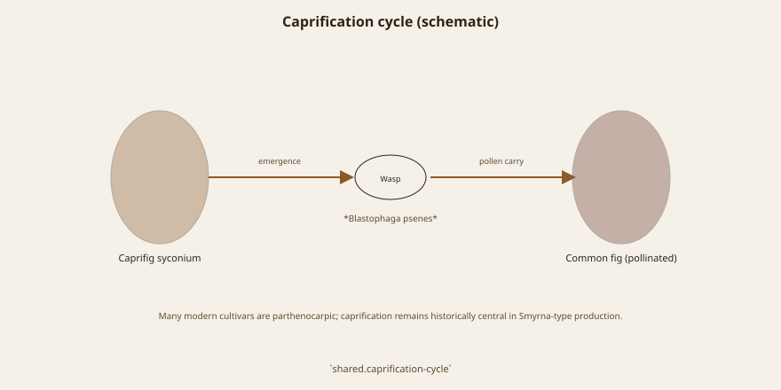
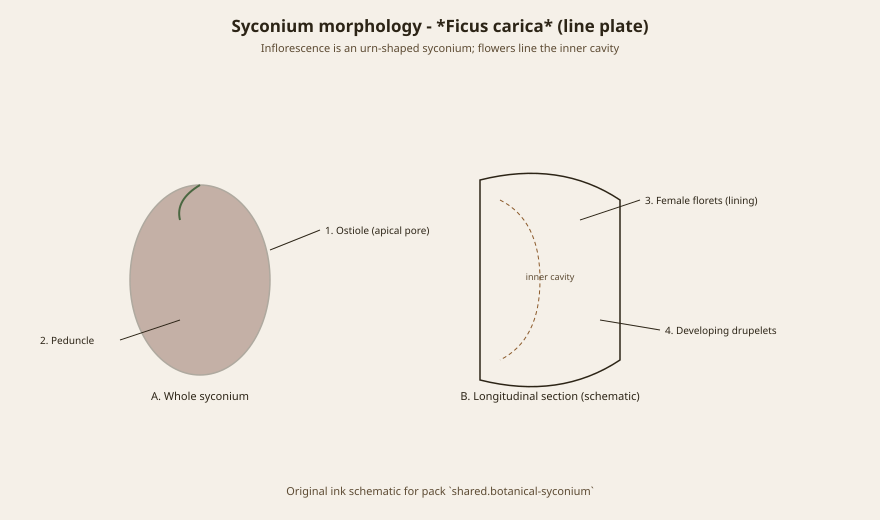
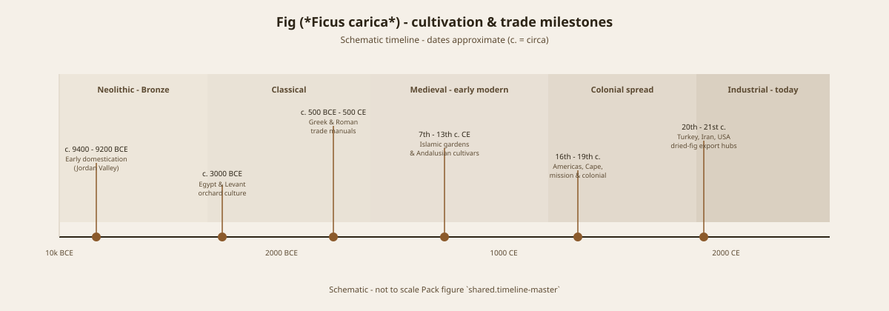

# Before Anyone Named the Wasp

*Historia Plantarum* is not a chapbook of garden tips. It is an attempt to say how plants differ, and how they go on. In the pages on propagation Theophrastus puts the fig among the trees that grow from a piece of themselves. In the pages on wild and cultivated life he records something a later Italian professor would try to abolish: gall insects come out of wild figs and make the cultivated figs swell, which helps keep the fruit from shedding.

That is caprification, seen without a microscope and without a USDA bulletin. The wild fig is the caprifig. The insect is the fig wasp. The swell is seed set and the hormonal answer of the syconium. Galil and Ne’eman, in the 1970s, wrote the modern papers on pollen transfer and seed set in *Ficus carica*. They are not correcting Theophrastus so much as giving him genera and species.

## A practice older than the name

Aegean growers did not wait for a Linnaean binomial. They hung wild fruit in the tame tree, or they planted caprifigs upwind, or they did both and argued about it. Roman agronomic writers keep the practice in the villa books. Pliny knows the wild fig’s job even when he is busy naming twenty-nine kinds. The Italian crop words that California later imported — *mamme*, *profichi*, *mammoni* — are a calendar of wasp generations, not a poem.

<!-- figure-id: shared.caprification-cycle -->

*Figure 1. Caprification cycle linking caprifig, *Blastophaga psenes*, and pollinated common fig. Schematic.*

What a keen observer sees is “the insect helps.” What a later dogmatist sees is a rustic superstition. Guglielmo Gasparrini, in the mid-nineteenth century (English readers often meet him through an 1890s translation), argued that caprification was useless and spoiled flavor. He had reasons that looked scientific in a laboratory that did not include Smyrna types. Condit is patient and a little savage about the damage. California believed the denial long enough to plant thousands of Smyrna cuttings in the 1880s and watch them drop.

## The decade the valley wasted

Smyrna wood arrived in California in 1881–82. Fruit did not. Hand pollination in 1890 made a curiosity. The rumor that Turkish exporters had sent sterile wood was a consolation. The consolation was wrong. The trees were the right clone and the wrong ecology. L. O. Howard and Walter T. Swingle brought *Blastophaga psenes* from Algeria in the spring of 1899. E. A. Schwarz spent 1900 on George C. Roeding’s Fresno place — about 62 acres of faith — and called the result the first large seeded Smyrna crop in America. Eisen’s 1901 USDA bulletin is the English book of that moment.

Prefer 1899 for the successful establishment. Older summaries sometimes print 1890, which is the year of the blowpipe, not the year of the insect.

<!-- figure-id: shared.botanical-syconium -->

*Figure 2. Syconium external form and longitudinal section (generalized). Original pack line plate.*

<!-- figure-id: shared.timeline-master -->

*Figure 3. Selected milestones from early domestication through modern export hubs. Schematic timeline; dates approximate.*

## Discovery is the wrong word

Nobody discovered caprification in 1899. Aegean women on drying yards already knew which trees needed the hanging. Theophrastus already wrote the swell. What 1899 discovered, for an American industry, was that a professor can be wrong and a practice can be right. The word *caprification* itself is a learned Latinizing of a folk act. Use it. Just do not pretend the act waited for the word.

This article is the history of a recognition. The next one, on *Blastophaga psenes*, is the biology of the guest. Keep them apart. One is a human argument. The other is an insect’s year.

## Recognition, not invention

Theophrastus wrote the swell. Villa books kept the hanging. Gasparrini denied the bill. 1899 imported the insect to a valley that had the wrong theory. The word *caprification* is late Latinizing. The act is older than the word and older than USDA.

## A practice that outlasted a professor

Theophrastus: insects from wild figs make cultivated fruit swell and hold. Villa books keep the hanging. Gasparrini denies; California plants Smyrna wood and watches it drop. 1899 imports the insect; 1900 proves the rumor of sterile Turkish wood false. Discovery is the wrong word. Recognition is the right one. The next article is the insect’s year. This one is the human argument.

## A professor, a valley, and a practice that did not need either

Guglielmo Gasparrini’s mid-nineteenth-century denial of caprification looked
like laboratory courage. He had studied trees that set without a wasp —
Common types — and issued a theory that spoiled flavor and wasted labor.
Condit is patient and a little savage about the damage. California believed
the denial long enough to plant Smyrna cuttings in 1881–82 and watch fruit
drop for a decade. The rumor of sterile Turkish wood was a consolation. The
consolation was wrong.

1890 is the blowpipe year: hand pollen, a curiosity. 1899 is Howard and
Swingle’s Algerian insects. 1900 is Schwarz on Roeding’s sixty-two acres,
the first large seeded Smyrna crop in America. Eisen’s 1901 bulletin is the
English book of the moment, written by a man who had already seen Mayer in
Naples in 1896. Prefer 1899 for successful establishment. Older summaries
that print 1890 have collapsed the curiosity into the insect.

## Recognition is the right word

Theophrastus already wrote the swell. Villa books already kept the hanging.
Aegean yards already knew which trees needed wild fruit in the branches. The
word *caprification* is late Latinizing. The act is older than the word and
older than USDA. Nobody discovered it in 1899. An American industry
discovered that a professor can be wrong.

The next article is the insect’s year — pollen on a body, other wasps, other
rooms. This one is the human argument: a Greek sentence, a Roman habit, an
Italian denial, a Californian invoice. Keep them apart. Discovery is how a
bulletin likes to talk. Recognition is how a history series should.

## A calendar with Italian names

*Mamme*, *profichi*, *mammoni* are not a poem. They are a year of wasp
generations Aegean and southern Italian growers already timed when
California still believed Gasparrini. Hang wild fruit in the tame tree, or
plant caprifigs upwind, or do both and argue. Villa books kept the hanging.
Theophrastus kept the swell. The word *caprification* arrived later, a
Latinizing of a folk act. Use the word. Do not pretend the act waited.

1890 remains the blowpipe. 1899 remains Howard and Swingle’s Algerian
insects. 1900 remains Schwarz on Roeding’s sixty-two acres. Eisen’s 1901
bulletin remains the English book, written after Naples. Prefer 1899 for
establishment; 1890 is the curiosity. The rumor of sterile Turkish wood
was consolation. The trees were the right clone and the wrong ecology. A
professor who studied Common types issued a theory that cost a valley a
decade. Recognition is the right word. Discovery is how a bulletin talks.
The next article is the insect’s year. This one is the human argument.

## Sources for this piece

- Theophrastus, *Historia Plantarum* (Hort).
- Galil and Ne’eman, *New Phytologist* 1977, 1978.
- Condit 1947 on Gasparrini’s denial.
- Schwarz 1900; Eisen 1901; UC ANR caprification circular (1899 introduction).

See `BIBLIOGRAPHY.md`.
