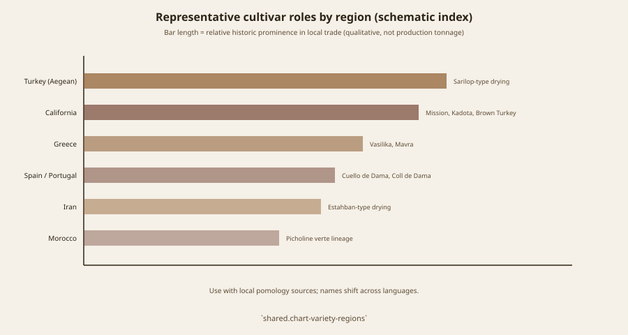

# *Higuera* After 1532

Figs are on the list of Andalusian and Canary food plants that move to coastal Peru after 1532 — garbanzo, citrus, banana, eggplant, date, fig — in Zimmerer and colleagues’ 2024 table of post-conquest biota, with Cieza de León among the early witnesses. That is an introduction story, not an Andean domestication. The tree arrives with the huerta habit: dooryard, irrigation, a sweet that dries in a desert valley.

Siguas, in Arequipa, keeps monumental colonial *higueras* in a landscape of pre-Hispanic remains. Local writing calls the fruit *albacor* and talks in centuries. Uchumayo’s “Negro” fig and *chimbango*, a local liquor, are living names. Use them as living-orchard reportage. Do not run a “world’s oldest productive figs” contest. Age of a trunk is a local pride. It is not Gilgal.

## Chile’s small cadastre

Chilean commercial fig is a niche inside a fruit-export state. ODEPA–CIREN’s *Catastro Frutícola* is the official area series; exporter blogs that cite ~104 ha in the early 2010s, ~113 ha in 2017, and higher later numbers should be checked against the cadastre year you print. Fresh export to the United States is reported from 2014. Airfreight, not a clipper of dried *sporte*, is the modern voice. Hortofrutícola Sudamericana’s 2016–17 tonnages (on the order of 100–120 t, mostly flown) are a company scale, not a national FAOSTAT rank.

<!-- figure-id: shared.timeline-master -->

*Figure 1. Post-1532 introduction; 2014 US fresh access as a modern node. Schematic.*

<!-- figure-id: shared.map-med-belt -->

*Figure 2. The belt’s western end ships wood; the Andes receive it. Schematic.*

<!-- figure-id: shared.chart-variety-regions -->

*Figure 3. Albacor / Negro as local names, not Condit IDs. Qualitative.*

Mexico’s Mission-based northwest is a different extra sentence (Franciscan sixteenth century in the syntheses). This article stays with the south: a Spanish tree in desert valleys, a liquor, a small Chilean hectare count, no invented Inca fig.

## Huerta in a desert valley

Coastal Peru’s post-1532 gardens mix Andean and Iberian plants because people were hungry and the irrigation was already there. A Siguas trunk is a colonial landscape feature. A Chilean cadastre hectare is an export-state niche. Neither is an Inca *carica*. Say the introduction date range and stop.

## Introduction, not a contest

Zimmerer et al. (2024) put figs on the post-1532 coastal Peru list with garbanzo, citrus, date — Andalusian and Canary food plants, Cieza de León among the witnesses. Siguas *higueras* are a colonial landscape in an archaeological valley; local writing says *albacor* and talks in centuries. Uchumayo’s “Negro” and *chimbango* are living names. Age-of-trunk pride is not a Gilgal contest.

Chile’s ODEPA–CIREN cadastre is the hectare desk; exporter blogs that cite ~104–192 ha across the 2010s–2020s should be checked against the year you print. Fresh US access from 2014 is airfreight, not a *sporta*. Company tonnages around 100–120 t are company scale. No Inca *carica*. Mexico’s Mission northwest is a different sentence.

## A Spanish tree in someone else’s irrigation

Figs sit on Zimmerer and colleagues’ 2024 table of food plants that move to coastal Peru after 1532 — garbanzo, citrus, eggplant, date, fig — Andalusian and Canary biota, Cieza de León among the early witnesses. That is an introduction story, not an Andean domestication. The tree arrives with the huerta habit: dooryard, a canal that was already there, a sweet that dries in a desert valley.

Siguas, Arequipa, keeps monumental colonial *higueras* among pre-Hispanic remains. Local writing says *albacor* and talks in centuries. Uchumayo’s “Negro” fig and *chimbango* are living names. Use them as living-orchard reportage. Do not run a world’s-oldest-productive-figs contest against Estahban or Gilgal. Age of a trunk is pride. It is not an excavation.

Chile’s commercial fig is a niche inside a fruit-export state. ODEPA–CIREN’s *Catastro Frutícola* is the hectare desk. Exporter blogs that cite ~104 ha in the early 2010s and higher later numbers should be checked against the cadastre year you print. Fresh export to the United States from 2014 is airfreight, not a medieval *sporta*. Company stories on the order of 100–120 tonnes are company scale. No Inca *carica*. Mexico’s Mission-based northwest is a different extra sentence. This article stays with the south: a guest tree, a liquor, a small Chilean count.

## *Chimbango* is a living noun

Use Uchumayo’s names as reportage. Use Zimmerer’s 1532 table as the
introduction. Use ODEPA–CIREN as hectares. Use 2014 as airfreight to
the United States. Do not use a trunk’s girth as an excavation. Do not
run Siguas against Gilgal. The canal was Andean. The tree was a guest.
Mexico’s Mission northwest can wait for another sentence.

## Airfreight is not a *sporta*

2014 US entry is a plane, a niche, a cadastre year you must print.
Cieza’s generation is a canal and a guest tree. Siguas girth is pride.
Do not convert any of those into a medieval unit or an Inca crop.
Zimmerer’s table is the introduction. ODEPA–CIREN is the hectare desk.

## Sources for this piece

- Zimmerer et al., *Journal of Peasant Studies* (2024), table of introduced biota; Cieza de León.
- Siguas / Uchumayo local studies — living landscape, not deep-time proof.
- ODEPA–CIREN *Catastro Frutícola*; 2014 US market-access notices.

See `BIBLIOGRAPHY.md`.
