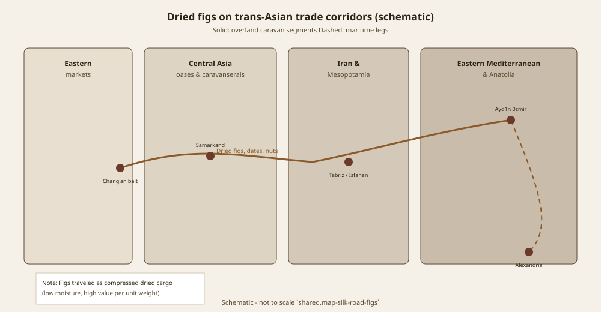

# A Guest Tree Called Flowerless Fruit

*Wúhuāguǒ* — flowerless fruit — is the best vernacular this series has for a syconium. Someone looking at *Ficus carica* without a Linnaean lecture saw a fruit that refused to put on a flower show. The name is accurate. The dates around the name are not friends.

*Flora of China* 5: 52 says the common fig was introduced during the Tang (618–906 CE) and is cultivated especially in Xinjiang. Julia Morton’s 1987 compilation *Fruits of Warm Climates* says Chinese gardens by 1550. Wang Lianju and colleagues, in *Acta Horticulturae* 605, treat commercial cultivation as recent and introduction as “about one thousand years.” Print all three. A timeline graphic that picks one to look clean has left the seam this series promised to keep.

## Three desks, no imperial orchard

Flora’s Tang is a flora desk. Morton’s 1550 is a compilation desk — useful, secondary, not a palace garden diary. Wang’s “about one thousand years” is already a hedge, and the same paper’s “recent” commercial is a twentieth-century desk. The three can live in one paragraph if no one is trying to win a map.

This pack will not book a walkable Tang orchard. It will not give the Tang a Smyrna industry, a drying yard that taught Europe a taste, or a PDO adjective. If Flora is right, *carica* entered China in the same long weather Laufer mapped in *Sino-Iranica*: Iranian plants and Iranian names moving east. Laufer’s Chinese *a-ži* and related forms hang on those names and, behind them, a Babylonian *tittu* peg. That is a history of words. It is not a Samarkand invoice and not a packing list.

<!-- figure-id: shared.map-silk-road-figs -->

*Figure 1. Arrows fade for a reason. Schematic; the eastern fade is a fade.*

## Xinjiang is climate

Dry summers and irrigation cultures make *Ficus carica* a sensible guest in Xinjiang. *Flora of China* says so as a cultivation note. It does not make Gilgal Chinese. It does not move Kislev’s Jordan Valley house, or Khadari’s three gene pools, onto a Tang frontier. The origin argument stays in the Levant and in the genetics essays. China is a guest chapter.

Native East Asian *Ficus* species are other crops and other religions. A pipal is not a *wúhuāguǒ*. Do not write a Buddhist fig that is actually *F. religiosa* and call it *carica*. The South Asia essay exists so that theft has a dedicated police. This essay’s job is the Chinese seam and the Xinjiang climate note.

<!-- figure-id: shared.timeline-master -->

*Figure 2. Two ticks, one seam. Schematic. Do not collapse the ticks.*

Ishizaki Yūshi’s *F. carica* watercolour in the Cock Blomhoff / Naturalis collection is a later Japanese seeing. The file’s institutional licence must be re-checked (WC-013 in the reserved list). It is not a Tang witness. It lives in the Japan–Korea essay.

<!-- figure-id: shared.botanical-syconium -->

*Figure 3. The Chinese name saw the room. Pack plate.*

Commercial orchards in the ISHS paper are allowed to be young. A guest tree does not become ancient because a magazine wants Asia on the spine. Print the seam. Fade the map. Keep the name.

## What “especially Xinjiang” does not mean

*Flora of China*’s cultivation note is climate and irrigation, the same dry-summer logic that makes Estahban and Aydın work, at another longitude. It is not a claim that the common fig is a Neolithic Chinese founder fruit. Zohary, Hopf, and Weiss keep the founder-fruit sentence in the Mediterranean and Southwest Asia. Khadari’s 2025 pools are Moroccan–Algerian, northern Mediterranean, Levantine. China is not on that list as a domestication center. A guest can be old and still be a guest.

Laufer’s *Sino-Iranica* is a book about plants and names that rode east with Iranian traffic — not only fig. Reading *a-ži* as a packing list is how a word-history becomes a fake orchard. Wang’s ISHS paper is useful because it refuses to pretend commercial acreage is Tang. “About one thousand years” is already a shrug. Print the shrug. Commercial recent is a twentieth-century desk and may be the only desk that ever had a packing house.

Do not write a Buddhist *carica*. Do not put a Smyrna stencil on a Tang frontier. Do not collapse Flora, Morton, and Wang into one clean tick. The map’s eastern fade is a fade for a reason. *Wúhuāguǒ* remains the vernacular that saw the room.

## A guest among other Iranian plants

Laufer did not write a fig monograph. He wrote a book in which fig is one entry in a long eastward ride of Iranian plants and names. Reading only the fig pages is allowed. Treating those pages as a Tang packing house is not. *A-ži* is a sound. *Tittu* is an Akkadian peg Postgate already gave Mesopotamia. Neither is a Xinjiang invoice.

*Flora of China*’s “especially Xinjiang” sits next to a dry-summer, irrigation-culture note that would make sense to an Estahban grower without making Fars Chinese. Wang’s ISHS paper is the commercial desk: recent orchards, an introduction shrug of “about one thousand years.” Morton’s 1550 gardens are a compilation date from a Florida desk that also gave England 1525–1548. Three desks, three jobs. A timeline that picks one has left the seam.

Native East Asian *Ficus* — pipal among them — keep their religions. The South Asia essay is the longer police on that theft. This page’s police is narrower: do not write a Buddhist *carica*, do not book a walkable imperial orchard, do not give the Tang a Smyrna industry. Ishizaki stays a later Japanese seeing, licence reserved. *Wúhuāguǒ* saw the room. The map fades.

A timeline graphic that picks Tang to look clean, or 1550 to look conservative, or “a thousand years” to look vague-and-safe, has left the seam. Print all three desks. Xinjiang remains climate. Gilgal remains a Jordan Valley house. *Wúhuāguǒ* remains flowerless fruit.

## Sources for this piece

- *Flora of China* 5: 52, *Ficus carica*.
- Morton, *Fruits of Warm Climates* (1987) — compilation date 1550.
- Laufer 1919; Wang et al., *Acta Hort.* 605.

See `BIBLIOGRAPHY.md`.
