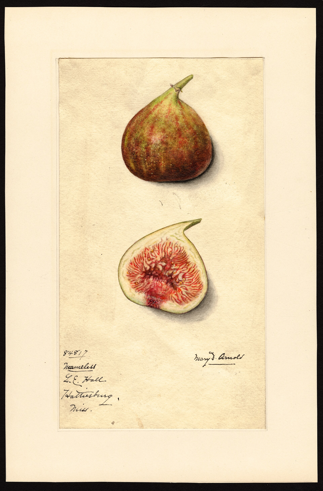

# Seven Hundred Names

Ira J. Condit wrote *The Fig* in 1947 and “Fig Varieties: A Monograph” in *Hilgardia* 23 (1955): 323–538. The first book is readable. The monograph is a monster. UC Davis still hosts the PDF. A 2024 *HortScience* paper pulled 717 cultivar attributes out of that monster — a machine rereading of a mid-century desk. Storey’s later handbook chapters and UC ANR circulars sit on the same wood. English-speaking fig people still live in Condit’s house even when they slam the doors.

He knew the matching grief: Pliny’s Livian, Bimbi’s court names, nursery aliases, a Brown Turkey pile. He still tried. The collector century after him — backyard exchanges, online forums, NCGR Davis — multiplied wood faster than anyone sequenced it. Forums invented “lost Roman” names he never saw. This series’ rule — if it is not in the bibliography, it does not ship — exists because of those forums.

## The house measured, then scandalized

The 2022 *PLOS ONE* re-evaluation of NCGR Davis SSR profiles is the scandal the house needed: mislabels, *Ficus palmata* mix-ups, Chicago Hardy sitting next to Abruzzi. A living collection must be re-genotyped. A grocery shelf will still sell five names. Both facts can sit in one paragraph.

Storey’s breeding notes chased nematode resistance, persistence, ripening windows, a Calimyrna that might need less faith. This article will not print an unsourced “miracle cultivar.” It will say the printed hinge is 1955 and the living hinge is a laboratory plus a fruiting. Scripture is the wrong word for a monograph. A clone’s true name is not a PDF alone.

<!-- figure-id: shared.chart-variety-regions -->

*Figure 1. The market used a handful. Condit wrote the rest. Qualitative.*

UC ANR circulars taught a country that no longer leads the tonne board. That is why Mission and Kadota still arrive in other people’s nurseries. Extension English outlived the acreage. FAOSTAT’s recent first places are Türkiye and Egypt, not Fresno. Condit’s afterlife is the English house, not the world tonne.

<!-- figure-id: shared.timeline-master -->

*Figure 2. The printed word as a node, not an ending. Schematic.*

## Watercolors before the monograph

The USDA pomological watercolors in this pack — Calimyrna at Fresno in 1912, Celeste at Cape Charles in 1911, “Fig X1” at Wadesboro in 1910, Endgere from Roeding’s place in 1899 — are the naming habit Condit later tried to police. Elsie Lower Pomeroy’s 1910 “Royal Black,” painted in Washington, D.C., is one more courtly noun from a government desk. It is not Condit’s last word. It is the kind of card he had to sort.

<!-- figure-id: condit.usda-royal-black -->

*Figure 3. Elsie Lower Pomeroy, “Royal Black,” Washington, D.C., 1910. USDA NAL Pomological Watercolor Collection. Public domain (U.S. government work). A name on a card, not a last identification.*

Improvement for a grocer is fewer names that ship. Improvement for a collector is the opposite. This series has to live in both rooms without lying about which room it is in. Treat 1955 as the last great printed word. Do not treat it as the last word.

## What a collector century costs

Backyard exchanges and online forums did a kind of work Condit’s PDF could not: they moved wood faster than anyone checked a label. “Lost Roman” tags, uncle’s-tree romances, a Brown Turkey in every climate — the house could not police that after 1955. The 2022 NCGR Davis paper is useful because it is rude. Chicago Hardy sitting next to Abruzzi is not a scandal a magazine invented. It is a laboratory sentence about a collection that had become a rumor with accession numbers.

Storey’s handbook chapters are the workshop: nematodes, persistence, a Calimyrna that might need less faith. Cite the papers. Do not print a miracle from a nursery press release. Khadari’s 2025 diffuse-domestication shape — three pools, *colchica* and *rupestris* off *carica* s.s. — is the genetics desk Condit did not have. It does not retire 1955. It reminds a reader that a printed name is not a haplogroup.

Pomeroy’s “Royal Black” card is the naming habit in watercolor, painted in Washington in 1910, a generation before the monograph. The Calimyrna, Celeste, Endgere, and Fig X1 cards in other folders are the same habit in other towns. Condit’s job was to sort that habit into English. Grocery shelves still sell a handful. Collectors still want the rest. Re-genotype the living collection. Do not treat a PDF as scripture.

## English left the tonne board and kept the house

California no longer leads FAOSTAT. Türkiye and Egypt do, in the years the production essay will re-check. UC ANR circulars still teach Mission, Kadota, and a wasp bill to nurseries in countries that outgrow Fresno. That is Condit’s afterlife: extension English, a PDF at UC Davis, a 2024 machine rereading of 717 attributes, a 2022 laboratory rude enough to say Chicago Hardy ≈ Abruzzi.

*The Fig* (1947) remains the readable book — history, culture, curing, composition. *Hilgardia* 23 (1955), pages 323–538, remains the monster list. Storey remains the workshop. Forums remain the scandal. Grocery shelves remain conservative because skin and shipping are conservative. Pomeroy’s 1910 “Royal Black” remains a card from the habit he sorted. A living collection must be re-genotyped. A clone’s true name is a fruiting and a lab. Scripture is the wrong word.

## Eisen before the house, Storey in the shop

Gustav Eisen’s 1901 USDA bulletin is the English book of the wasp decade — history, culture, curing, a catalogue — written by a man who had seen Mayer in Naples and fought Gasparrini in print. Condit’s 1947 book sits on that desk and widens it. The 1955 monograph is the widening that became a monster. Storey’s later handbook chapters are the breeding shop that tried to make the wood easier: nematodes, persistence, a Calimyrna that might need less faith. Cite those chapters. Do not print a miracle cultivar from a press release.

Brown Turkey stays a pile in the glossary because Condit could not make it one clone and neither can a backyard tag. Mission stays a California market name with a 1769 corridor story. Calimyrna stays a stitch. Dottato stays wood with two stamps. The house English lives in is a sorting house. The tonne board moved. The PDF stayed.

Mary Daisy Arnold painted the matching grief in so many words. A card from Hattiesburg, Mississippi, 1915, for L. E. Hall, is labeled **Nameless**. Whole fruit, a cut face, no clone to hang it on. Pomeroy’s “Royal Black” in Washington five years earlier at least offered a noun. Arnold offered a shrug. Condit’s 1955 job was to take such shrugs and either find a name or put them in a pile. Forums later invented Romans to fill the blank. The card is the honest blank.

<!-- figure-id: condit.usda-nameless -->

*Figure 4. Mary Daisy Arnold, “Nameless,” L. E. Hall, Hattiesburg, Mississippi, 1915. USDA NAL POM00001044. Public domain. A government shrug Condit had to sort.*

## Sources for this piece

- Condit 1947; *Hilgardia* 23 (1955): 323–538 (UC Davis PDF).
- *HortScience* 2024 attribute database (717 cultivars extracted).
- *PLOS ONE* 2022 NCGR Davis SSR re-evaluation; Storey 1975.
- USDA NAL POM00001045 (Royal Black); POM00001044 (Nameless, Hattiesburg, 1915).

See `BIBLIOGRAPHY.md`.
