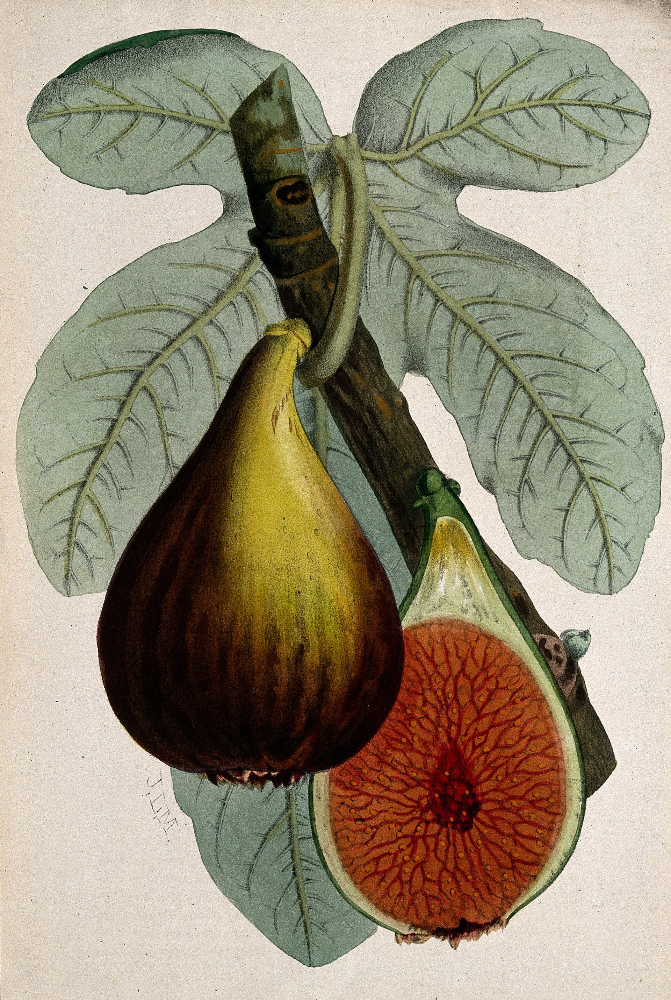

# From Humors to a Label

Dioscorides organizes the fig by effect. Ibn Sīnā, in the *Canon*’s book-2 monograph on *tīn*, organizes it by humoral quality — softening, heating, moistening — and he will give fresh and dried different sentences because a physician’s job was to place a food in a body already described as a balance. Condit’s 1947 tables organize the same fruit by water driven off and sugar that stayed, a drying yield that costs a grower. USDA FoodData Central organizes it by a serving and a nutrient list that the database revises.

These are three desks. A magazine that “updates” Avicenna with potassium is doing parlor magic. The medicine essays hold the trunk — simples, the Arabic physicians, what a label must not claim as efficacy. This page holds the police: do not convert the languages.

## A serving is a modern invention

FoodData Central’s dried-fig entry is a laboratory seeing of a tray: water gone, sugars concentrated, fiber remaining, a mineral list that looks friendly on a panel. The access year matters because the numbers move. A live WordPress import should print the data-type — SR Legacy, FNDDS, Foundation, or whatever the editor actually pulled — and the year of the pull. “USDA says” without those two facts is a vibe.

Condit’s 1947 composition and curing tables are an older cousin of the same honesty. He wanted to know what a California dryer lost and what remained sweet enough to pack. Neither desk owes the *Canon* a milligram. A later editor who wants a table can print three columns — humoral note, Condit yield, USDA serving — and must refuse a fourth that pretends they convert.

<!-- figure-id: shared.botanical-syconium -->

*Figure 1. Seeds, wall, water — the room as food. Pack plate.*

Dried figs are dense sweet and fiber. Fresh figs are mostly water and a short clock. That physics is why freight dried for two millennia and why a wellness brand photographs dew on a split fruit. The sundrying and tunnel-dryer essays hold the how. This one holds the why a panel and a humoral degree cannot be added.

## A cake is not a panel

Hezekiah’s cake of figs (2 Kings 20:7 / Isaiah 38:21) is a poultice. The folklore essay keeps it in the sourced-motif list. A fiber claim is a nutrition panel. They do not translate. Ancient athletes ate what was there. So did ancient clerks, stevedores, and children. “Superfood of the ancients” is a cart without a horse. Do not say the word on this page except to bury it.

<!-- figure-id: shared.process-drying-sundry -->

*Figure 2. The label changes because the fruit changed state. Schematic.*

Humoral language can put dried and fresh figs in different degrees. That is not a failed nutrition label. It is a different question: what does this food do in a body imagined as heat and moisture? The modern label asks what a serving contains. Condit’s dryer asked what a tray cost. All three questions are legitimate in their centuries. The failure is the sentence that treats “moist in the second degree” as a milligram of potassium wearing a toga.

<!-- figure-id: shared.timeline-master -->

*Figure 3. Simple, monograph, circular, panel. Schematic timeline; not a conversion chart.*

If this pack ever prints a number from FoodData Central in a caption, the caption will carry the data-type and the year. Until that import, the modern desk is named, not quoted. Condit’s tables stay historical yield. Dioscorides and Ibn Sīnā stay effect. Three desks. No parlor trick.

## Freight chose dry for a reason

A fresh fig is a short clock: thin skin, high water, a bruise that becomes a rumor by the second morning. That is why a wellness photograph loves it and why a quay did not. Dried figs are what Pegolotti’s *sporte* and an İzmir stencil could move. The Venetian-cargo and İzmir-packing essays hold the units. This page holds the physics those units assume. Water leaves. Sugar stays. Fiber stays. A mineral list appears on a modern panel because a laboratory asked a modern question.

Condit’s 1947 tables are a grower’s cost dressed as composition. A dryer who does not know yield is a dryer who will lie to himself about a cull pile. FoodData Central is a serving dressed as a nutrient list. Ibn Sīnā is a degree dressed as an effect. The Greco-Roman and Islamic medicine essays will tell you what those physicians actually wrote. They will not tell you a milligram. This page’s only additional rule: if a live caption quotes USDA, it quotes a data-type and a year, or it does not quote.

Hezekiah’s cake remains in the folklore list as a poultice. A fiber claim remains a panel. Athletes and clerks ate what was there. “Superfood of the ancients” stays buried. Three columns if an editor insists on a table. No fourth.

## What this page will not print

It will not print a potassium number until an editor pulls FoodData Central and writes the data-type and year. It will not print “superfood.” It will not print “ancient athletes” as a marketing clause. It will not update the *Canon* with a milligram. It will not turn Hezekiah’s cake into fiber. It will not treat Condit’s 1947 yield as a wellness panel.

It will print three desks and a physics: water leaves, sugar stays, freight chose dry, wellness photographs dew. The medicine essays hold Dioscorides and Ibn Sīnā as physicians. The drying essays hold the tray and the tunnel. This page holds the police between them. Three columns if a table is required. No fourth.

## Three businesses, not one science

A packing house is a business of yield. Condit’s 1947 tables exist because a dryer who does not know what a cull pile costs will lie to himself. A regulator is a business of servings. FoodData Central exists because a label needs a number that can be revised. A physician in the *Canon* is a business of balance. Degrees exist because a body was already described as heat and moisture. Three businesses. One fruit. The failure is the magazine that pretends they merged.

Winter freight chose the dry face because water is heavy and rot is fast. A wellness photograph chooses the fresh face because dew looks like virtue. Neither choice is a humor. Neither choice is a milligram. Print the desk you are sitting at.

<!-- figure-id: fig-nutrition.wellcome -->

*Figure 4. Wellcome Collection V0044761, fruiting stem and halved fruit. CC BY 4.0. The same file as the [medicine](../figs-in-greek-roman-medicine/) essay. A pharmacy-book seeing of the simple. Not a conversion table and not a FoodData Central panel.*

The Wellcome plate is stem and a cut room — what a later pharmacy book wanted the simple to look like. Dioscorides organized that room by effect. Condit organized a tray by yield. USDA organizes a serving by a list it revises. The cut face will not add those three languages. If a live caption ever quotes FoodData Central, it quotes a data-type and a year. Until then the modern desk is named, not numbered.

## Sources for this piece

- Dioscorides, *De Materia Medica*; Ibn Sīnā, *al-Qānūn* book 2, fig monograph.
- Condit 1947, composition and curing yields.
- USDA FoodData Central — cite data-type and access year on any live number.

See `BIBLIOGRAPHY.md`.
