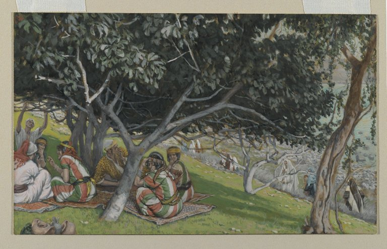

# Under His Fig Tree

1 Kings 4:25 and Micah 4:4 share a political sentence: every man under his vine and under his fig tree. The vine is wine and tax. The fig is shade and sweetness and a fruit you do not have to mill. Together they mean a life that is not being raided. When the sentence is a promise, it is a promise about ordinary trees. When it is a memory of Solomon’s peace, it is still about ordinary trees. A history that turns the proverb into a royal orchard has already left the Hebrew.

Deuteronomy 8:8 puts the fig among the seven species of the land. Numbers 13:23 sends the spies back with grapes, pomegranates, and figs from wadi Eshcol. Genesis 3:7 sews fig leaves. 2 Kings 20:7 / Isaiah 38:21 lays a cake of figs on Hezekiah’s boil. These are not one symbol. They are a kitchen, a border report, a shame covering, a poultice. The Bible is a library. Libraries repeat useful objects.

## Amos is not your orchard

Amos 7:14 — dresser of sycomore-figs — is *Ficus sycomorus*. The job is gashing, the southern tree, the Egyptian cousin. English “sycamore” later wandered to *Acer* and to plane. The prophet is not standing in a *carica* row in the hill country. Keep the two trees apart here as strictly as in the Egypt article.

<!-- figure-id: shared.map-med-belt -->

*Figure 1. Hill country and coast: household *carica*. South: sycomore work. Schematic.*

James Tissot’s Brooklyn Museum watercolours — *Nathaniel Under the Fig Tree*, *The Vine Dresser and the Fig Tree* — are nineteenth-century midrash in paint, useful as reception, useless as archaeology. They belong in the museum article and, if licensed PD, as rasters. They do not prove a first-century leaf shape.

<!-- figure-id: shared.timeline-master -->

*Figure 2. Iron Age library sitting on an older tree. Schematic.*

<!-- figure-id: shared.botanical-leaf-lobing -->

*Figure 3. Genesis 3:7 is a leaf, not a fruit. Pack plate.*

Do not invent a lost “Song of the Fig.” Do not date a Hebron market clone to David. Do not medicalize the poultice beyond what the verse says: a cake of figs was applied. Later physicians will have opinions. The verse has a cake.

The New Testament parables sit next door. This article’s job is the older library’s household tree — and the one verse that is a different species.

<!-- figure-id: hebrew-bible.tissot-nathaniel -->

*Figure 4. James Tissot, *Nathaniel Under the Fig Tree*. Brooklyn Museum. Public domain. Nineteenth-century reception, not a first-century photograph.*

## A library, not a cultivar key

The seven species are a land list, not a market order. Eshcol is a wadi report. Micah’s shade is a political weather. Genesis is a covering. Amos is another species. A commentary tradition that turns all of them into one “symbol of Israel” is doing theology. This series can note the theology and still keep the horticulture split.

Tissot’s Brooklyn Nathanael is reception history hung in a museum. Useful as a later seeing. Useless as Iron Age leaf shape.

## Ordinary trees, one other species

Deut 8:8 seven species; Num 13:23 Eshcol; 1 Kgs 4:25 / Mic 4:4 shade as peace; Gen 3:7 leaves; 2 Kgs 20:7 cake; Amos 7:14 *sycomorus*. A library repeats useful objects. Theology may unify them. Horticulture will not. Tissot’s Nathanael (Brooklyn, PD) is nineteenth-century shade, not Iron Age proof. No lost Song of the Fig. No Davidic Hebron clone.

## A library repeats useful objects

The seven species in Deuteronomy 8:8 are a land list: wheat, barley, vine,
fig, pomegranate, olive, honey. They are not a market order and not a
planting calendar for a modern Hebron clone. Numbers 13:23 is a wadi report
— grapes, pomegranates, figs from Eshcol — the kind of sentence a border
scout would still write if he wanted to be believed. 1 Kings 4:25 and Micah
4:4 are political weather: shade as the opposite of a raid. Genesis 3:7 is
a covering. 2 Kings 20:7 is a cake. Amos 7:14 is another species.

Theology may unify them as “Israel.” Horticulture will not. A commentary
tradition that turns every fig into one symbol has every right to do church
or synagogue work. This series’ job is to keep the kitchen, the border, the
shade, the leaf, the poultice, and the sycomore from collapsing into a
logo.

## What Tissot is doing in this folder

James Tissot’s Brooklyn *Nathaniel Under the Fig Tree* is nineteenth-century
reception hung in a museum. Public domain. Useful as a later seeing of John
1:48’s shade. Useless as Iron Age leaf shape. The New Testament article
holds the verse; this one holds the older library and the warning that
English “sycamore” later wandered to maple and plane. Amos’s dresser is
gashing *F. sycomorus*, the southern tree, not a *carica* row in the hill
country.

Do not invent a lost Song of the Fig. Do not date a market clone to David.
Do not medicalize the poultice beyond the verse: a cake of figs was applied.
Later physicians will have opinions. The verse has a cake. Zohary, Hopf, and
Weiss remain the crop desk for the land under the library.

## Eshcol is a scout’s sentence

Numbers 13:23 wants to be believed: grapes, pomegranates, figs from a
wadi. That is how a border report still works. Deuteronomy 8:8 is a land
list, not a Hebron nursery tag. 1 Kings 4:25 and Micah 4:4 are the opposite
of a raid. Genesis 3:7 is a covering later sculpture shops industrialized.
2 Kings 20:7 is a cake later physicians will have opinions about. Amos
7:14 is gashing *F. sycomorus*, the southern job, not a hill-country
*carica* row.

Theology may unify them as Israel. Horticulture will not. Tissot’s
Brooklyn Nathanael is nineteenth-century shade over a New Testament verse;
useless as Iron Age leaf. No lost Song of the Fig. No Davidic clone.
Zohary, Hopf, and Weiss remain the crop desk under the library. The NT
essay holds the first-century uses. This one holds the older household
archive and the one verse that is another species.

## Honey in the land list is not a fig

Deuteronomy’s seventh species is honey — date syrup in many readings,
not a fig product. Keep the list’s items from collapsing into one sweet.
Eshcol is grapes first. Shade is vine and fig. Amos is the other tree.
Tissot is Brooklyn. Zohary is the crop desk. No Davidic Hebron tag. No
medicalized poultice beyond a cake applied. Libraries repeat useful
objects. They do not issue cultivar keys.

## Micah is weather, not a royal orchard

Shade as the opposite of a raid is a political sentence about ordinary
trees. Turn it into Solomon’s cultivar list and you have left the
Hebrew. Eshcol remains a scout. Amos remains a dresser of sycomores.
Tissot remains Brooklyn. The cake remains a cake.

## The spies wanted to be believed

Eshcol’s figs sit next to grapes because a scout’s bag has to look like
a land, not like a symbol. That is the oldest journalism in the file.
Micah’s shade is later politics. Amos’s other species is a job. Keep
the bag, the shade, and the gashing apart.

## Sources for this piece

- Gen 3:7; Num 13:23; Deut 8:8; 1 Kgs 4:25; Mic 4:4; 2 Kgs 20:7 / Isa 38:21; Amos 7:14.
- Zohary, Hopf, and Weiss (2012) on the crop in the land.

See `BIBLIOGRAPHY.md`.
