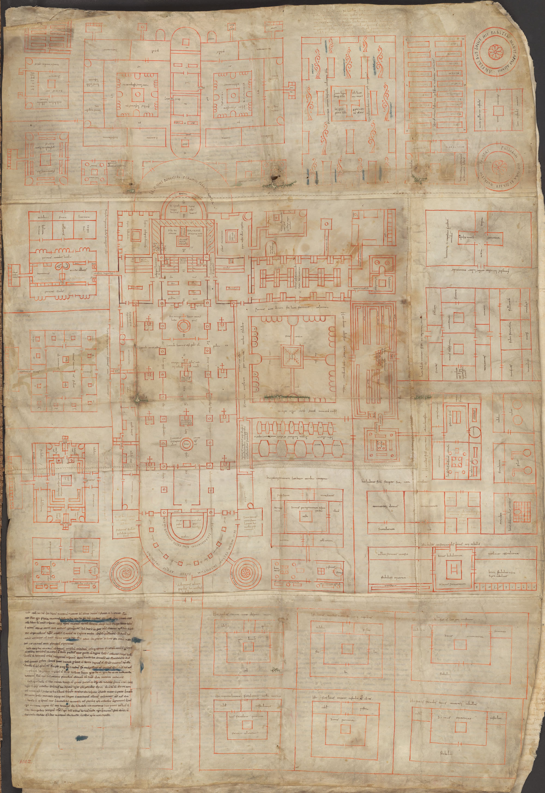

# *Ficus* on the Estate List

Chapter LXX of the *Capitulare de villis* ends with trees the royal estates should have: apples of named sorts, pears, plums, service, medlar, chestnut, peach, quince, hazel, almond, mulberry, laurel, pine, **fig**, walnut, cherries. The fig is in the list. The list is an ordinance for *villae* of the Carolingian fisc, not a Benedictine rule and not a climate guarantee. A steward in the Loire and a steward on the Rhine are being told the same wish. One of them may have seen a fruit. The other may have seen a dead stick.

The Plan of St. Gall, drawn about 820 as an ideal Benedictine complex, labels an orchard-cemetery with apple, pear, plum, quince, peach, almond, mulberry, walnut — and fig. Thirteen trees around a cross, a sermon in planting. Horn and Born and every later garden historian warn that the parchment is a model, not a survey of the built abbey. What it proves is desire: a fig belongs among the fruits of a perfect house of God, even north of the easy ripening line.

## What Walahfrid did not write

Walahfrid Strabo’s *De cultura hortorum* (*Hortulus*), about 840, names twenty-four garden plants in verse from the Reichenau beds. Fig is not among them. The poem is herbs, vegetables, melon, gourd — the medicinal and kitchen close-work of a monk who got his hands dirty. Do not invent a Hortulus fig stanza to make the monastery tidier. The orchard plan wanted the tree. The herb poem did not mention it. Both can be true.

<!-- figure-id: shared.timeline-master -->

*Figure 1. Ordinance and ideal plan, not a harvest total. Schematic.*

Southern houses — Monte Cassino’s wider world, Iberian monasteries, Provençal houses — could ripen what the Rhine could only try. Matthew Paris, in 1257, is sometimes cited for an English fig notice; treat later medieval northern figs as wall-and-shelter stories (the Lambeth article), not as St. Gall come true.

<!-- figure-id: shared.map-med-belt -->

*Figure 2. The belt’s northern edge is a wish in the ninth century. Schematic.*

<!-- figure-id: shared.schematic-orchard-irrigation -->

*Figure 3. St. Gall’s orchard-cemetery is symbolic space; this plan is labor space. Schematic.*

Do not write “every medieval monastery had a fig.” Do not date a surviving Reichenau tree to Walahfrid. Do not collapse royal estate and cloister. The capitulary is a king’s pantry. The plan is a monk’s map of holiness. The fig sits on both pages because a Mediterranean tree had already become a Christian ordinary — in ink, if not always in fruit.

## North of ripening, south of the list

A Reichenau or St. Gall fig, if it lived, was a sheltered bet. A Monte Cassino or Catalan house could treat the tree as ordinary. The capitulary does not admit the difference. That is how imperial lists work. They flatten climate into obedience.

Later Cistercian and Benedictine customaries talk gardens more than they talk named fruit clones. Do not harvest a “monastic Dottato” from that silence. Southern houses dried. Northern houses made medicinal use of whatever ripened. The Plan’s drying house is the honest middle: someone expected stored fruit, not a miracle August.

English wall figs (Lambeth extra) are the long echo of the same wish: keep the Mediterranean on a brick.

## Two lists, one climate problem

The *Capitulare de villis* is a king’s pantry. Chapter LXX wants *ficus*
among royal-estate trees the way it wants named apples and a walnut. A
steward on the Loire and a steward on the Rhine receive the same wish. One
may have eaten a fruit. The other may have buried a stick. Imperial lists
flatten climate into obedience. That is how they work.

The Plan of St. Gall is a monk’s map of holiness, drawn about 820 as an
ideal complex, not a survey of the built abbey. Horn and Born and every
later garden historian say so. The orchard-cemetery labels include fig
among apple, pear, plum, quince, peach, almond, mulberry, walnut — thirteen
trees around a cross. The drying house on the same parchment is the honest
middle: someone expected stored fruit, not a miracle August.

Walahfrid’s *Hortulus* names twenty-four close-work plants and does not name
the fig. Do not invent the stanza. The orchard plan wanted the tree. The
herb poem did not mention it. Both can be true on the same lake.

## South of the list, north of ripening

Monte Cassino’s wider world, Iberian houses, Provençal houses could treat
the tree as ordinary and dry what they grew. Reichenau and St. Gall, if they
kept a fig, kept a sheltered bet. Later Cistercian and Benedictine
customaries talk gardens more than named clones. Do not harvest a “monastic
Dottato” from that silence. English wall figs — Lambeth’s White Marseilles
with its three dates — are the long echo of the same wish: keep the
Mediterranean on a brick.

“Every medieval monastery had a fig” is a lie the list tempts. Date a
surviving Reichenau tree to Walahfrid and you have left the poem. Collapse
royal estate and cloister and you have left the Latin. The fig sits on both
pages because a Mediterranean tree had already become a Christian ordinary —
in ink, if not always in fruit.

## A sermon in thirteen trees

The Plan of St. Gall’s orchard-cemetery is a cross surrounded by named
fruit, fig among them, a drying house because winter is the point. Horn
and Born and every later garden historian say the parchment is a model, not
a survey. What it proves is desire. Chapter LXX of the *Capitulare de
villis* proves a king’s desire on a different desk: *ficus* among royal
estate trees, the same wish sent to the Loire and the Rhine. One steward
may have eaten. The other may have buried a stick.

Walahfrid named twenty-four close-work plants and not the fig. Do not
invent the stanza. Southern houses ripened and dried. Rhine houses tried.
Later customaries talk gardens more than clones; do not harvest a monastic
Dottato from that silence. Lambeth’s White Marseilles, with its three
dates, is the English brick echo. “Every monastery had a fig” is the lie
the list tempts. Collapse fisc and cloister and you have left the Latin.
The tree had already become a Christian ordinary in ink. Fruit was a
climate problem the ink refused to admit.

## Boseva’s trio, and the climate the ink denied

Later plant-list scholarship (Boseva and Bosseva 2016 among the cloister
surveys) treats the capitulary, the St. Gall plan, and Walahfrid as a
trio that must be read against each other, not stacked as one orchard.
The king wants *ficus*. The ideal abbey labels it. The herb poet, with
dirt on his hands at Reichenau, does not name it. That disagreement is
the ninth-century climate report the ordinance refused to file. A
southern house could ignore the report. A Rhine house could not. The
drying house on the parchment is the compromise: store what you can
buy or what a warmer daughter-house sent. Do not date a living
Reichenau trunk to 840.

<!-- figure-id: monastic.st-gall-plan -->

*Figure 4. Plan of St. Gall, Codex Sangallensis 1092 recto, c. 820. Public domain. An ideal Benedictine complex, not a surveyed orchard. The orchard-cemetery labels include fig among other fruit trees; this is the whole parchment, not a fig close-up. Pack file is a 2000 px reduction of the Commons original for weight.*

## Sources for this piece

- *Capitulare de villis* LXX (Latin: bibliotheca Augustana / standard editions).
- Plan of St. Gall orchard-cemetery labels (c. 820).
- Walahfrid, *Hortulus* — negative check: no fig among the 24.
- Boseva & Bosseva, cloister-garden plant lists (2016), for the trio of sources.

See `BIBLIOGRAPHY.md`.
