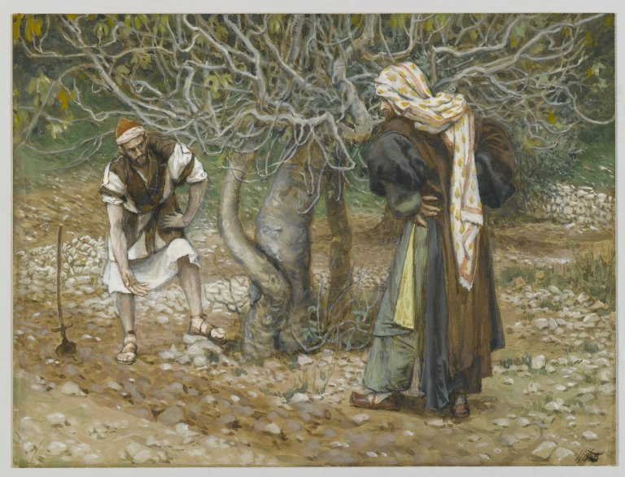

# Shade, Oaths, and a Tree That Would Not Fruit

Three New Testament fig scenes do three jobs. Mash them and you get a sermon. Keep them apart and you get a landscape.

John 1:48: Jesus saw Nathanael under the fig tree. The verse does not say what Nathanael was doing. Later midrash and Tissot’s Brooklyn watercolour will fill the shade with prayer. The text has shade. In a Levantine town that is already a sentence.

Luke 19:4: Zacchaeus climbs a *sykomorea* — the sycomore-fig, *F. sycomorus*, the street tree of the Jericho road, not a *carica*. English Bibles that print “sycamore” are one letter and two centuries of botany away from maple. The tax collector needed a climbable public tree. *Carica* is the wrong architecture.

Mark 11 (and Matthew 21): a fig tree with leaves and no fruit, cursed, withered. Commentators have spent careers on the week, the breba crop, the prophetic sign against a temple. Horticulturally, a leafy fig in Passover week may be between crops. Theologically, the passage is doing other work. This series will not pretend to settle the theology. It will say: the story assumes an audience that knows a fig can look ready and not be.

## Parable of the unfruitful fig

Luke 13:6–9 — a man has a fig in a vineyard that has not fruited for three years; the vinedresser asks for one more year of dung and digging. That is villa practice in one parable. Columella would recognize the labor. The mercy is the point of the telling. The dung is the point of the farming.

<!-- figure-id: shared.map-med-belt -->

*Figure 1. Jericho’s sycomore street tree is south of the *carica* hill-country habit. Schematic.*

<!-- figure-id: shared.botanical-syconium -->

*Figure 2. Mark’s ‘no fruit’ is an empty room, not a missing apple. Pack plate.*

<!-- figure-id: shared.timeline-master -->

*Figure 3. First-century stories on an Iron Age tree. Schematic.*

Do not caption Tissot as a photograph of Nathanael. Do not use the cursed tree as a cultivar note. Do not turn Zacchaeus into evidence for *carica* in Jericho’s streets. The species name in Luke is the evidence, and it points at the other fig.

<!-- figure-id: nt-parables.tissot-vinedresser -->

*Figure 4. James Tissot, *The Vine Dresser and the Fig Tree*. Brooklyn Museum. Public domain. Reception of Luke 13, not archaeology.*

## Three weeks, three trees

Passover-week leaves without fruit are a horticultural maybe and a narrative sure thing. Luke’s vineyard fig getting dung is Columella in a parable. Zacchaeus’s climbable *sykomorea* is street architecture. A homily that merges them into “the fig tree of Israel” may be doing church work. It is not doing this series’s work.

Keep Luke 19 out of the *carica* orchard. Keep Mark 11 out of a nursery guide. Keep John 1:48 as shade.

## Do not mash the week

John 1:48: shade. Luke 19:4: *sykomorea*, street architecture, not *carica*. Mark 11 / Matt 21: leaves without fruit in a Passover week — horticultural maybe, narrative sure. Luke 13:6–9: dung and a year, Columella in a parable. Tissot’s vine-dresser (Brooklyn, PD) is reception of Luke 13. Homilies may merge “the fig tree of Israel.” This series will not. Amos 7:14 remains the older sycomore job.

## Sources for this piece

- John 1:48; Luke 13:6–9; Luke 19:4; Mark 11:12–14, 20–21; Matt 21:18–19.
- Amos 7:14 and the Egypt article — for *sycomorus* work.

See `BIBLIOGRAPHY.md`.
