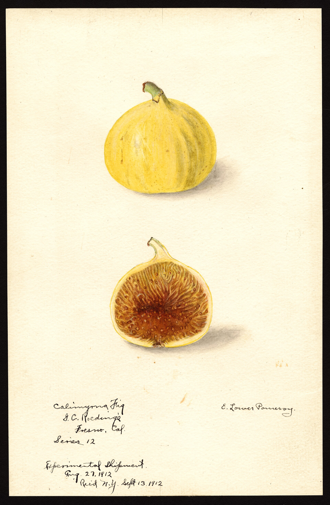

# The Port Was Called Smyrna

European grocery language learned “Smyrna fig” from a quay. The trees that made the crate were not a port planting. They stood inland, in the Büyük and Küçük Menderes country, on slopes that later lawyers would fence as Aydın İnciri. The clone is Sarılop — Lob Injir, Sari Lop — a pale, thin-shelled, wasp-needy drying fig. Condit: identical with the principal drying fig of the Smyrna district. California’s Calimyrna is the same wood under a passport stamp.

Ottoman Smyrna (İzmir) was the counting house: grades, boxes, Levantine merchants, later European houses, a reputation that could be stolen by a tray dried somewhere cheaper. Eisen, writing for USDA in 1901, still had to explain to Californians that the famous fruit was a pollinated fruit. The quay had not explained the wasp. The quay explained the stencil.

## An industry before a PDO

“Thousands of years” in a GI specification is a tone. What is not a tone: a conventional sun-dry, a public research station under the Turkish ministry, a town named İncirliova — fig-plain — that does not wait for Brussels. The EU registered Aydın İnciri on 17 February 2016 (UK scheme 31 December 2020). A Turkish GI sat earlier (2005 in some national summaries). The legal name is dried Sarılop, not more than ninety fruits to the kilo, from named towns: Sultanhisar, İncirliova, Germencik, Nazilli, Ödemiş, Tire, Selçuk, the southwest faces, 0–900 meters.

<!-- figure-id: shared.map-med-belt -->

*Figure 1. Port on the coast; trees in the valleys. Schematic — not the official PDO map.*

Nineteenth-century travelers and consular notes treat the Smyrna fig as a known Levantine export beside raisins and carpets. This article will not invent a 1620 invoice. It will say the reputation is early modern and the legal fence is twenty-first century, and both can be true.

<!-- figure-id: shared.process-drying-sundry -->

*Figure 2. The crate begins as a tray in the valley, not as a stencil on the quay. Schematic.*

<!-- figure-id: shared.trade-med-maritime -->

*Figure 3. İzmir as the western hinge of an inland crop. Schematic.*

The next article walks the packing house. The Sarılop grades article walks the specification. This one walks the lie of the port: useful for trade, fatal for terroir.

## Reputation as a transferable asset

A stencil can travel farther than a slope. That is the substitution problem the PDO exists to fight. Nineteenth-century European groceries that said “Smyrna” were buying a reputation. Sometimes they were buying the valley. Eisen had to teach Americans that the reputation included a wasp. The quay had skipped that paragraph.

## Quay language, valley wood

Smyrna is a stencil. Sarılop is a slope. Condit’s identity with Calimyrna is the English hinge. GI 2005-class national / EU 2016 legal fence; towns the spec names as a freight book. “Thousands of years” in a GI is tone. İncirliova is not. Nineteenth-century consular Smyrna-fig fame sits beside raisins; this pack will not invent a 1620 invoice. The next articles split packing house and legal adjectives. This one splits port from tree.

## Smyrna was a port name before it was a fruit name

English “Smyrna fig” does not mean a wild fig that grew only in Smyrna. It
means a dried fig that *left* Smyrna — the Ottoman, then Turkish, port the
west could spell. The orchards were inland: the Büyük and Küçük Menderes
basins, the Aydın and Germencik terraces, the villages whose PDO paperwork
now lists as the geography of Aydın İnciri. A ship’s manifest that says
*fichi di Smyrne* is telling you the custom-house, not the clone.

That distinction keeps the nineteenth-century California story honest.
Roeding and the USDA did not import “the port.” They imported *Sarılop*
cuttings and, later, the wasp. The fruit they wanted already had a Turkish
name. The English market had a port name. Both are true. Only one belongs on
a variety label.

## The Ottoman customs fig

Ottoman *incir* appears in customs registers the way Venetian *fichi* appears
in the *Racione*: as a taxable dry good. The volume is not a modern FAOSTAT
line, but it is not a kitchen anecdote either. European consuls in Smyrna
wrote home about fig seasons the way they wrote about raisins and opium — as
commodities that moved sterling. A magazine that romanticizes “Ottoman figs”
without the custom-house is writing a postcard.

The packing house is the other Ottoman inheritance California copied.
Stringing, boxing, the *lerida* face, the sulfur room — those are Aegean
industrial habits that crossed with the cuttings. Condit’s bulletins describe
California floors. They are describing a transplanted Smyrna floor as much as
a new one. Eisen’s 1901 bulletin is the English book of that transplant: he
had already seen Mayer in Naples and was trying to teach a valley what a
quay already knew.

A stencil can travel farther than a slope. That is the substitution problem
the PDO exists to fight. Nineteenth-century European groceries that said
“Smyrna” were buying a reputation. Sometimes they were buying the valley.
Eisen had to teach Americans that the reputation included a wasp. The quay
had skipped that paragraph.

## After the empire

The Turkish Republic did not invent the Aydın fig. It inherited the orchards,
lost Greek and Armenian commercial networks that had moved a share of the
crop, and rebuilt the export under new firms and, eventually, a PDO. The 2016
Aydın İnciri registration is a legal sentence over that rebuilt trade. It is
not a claim that the fruit began in 2016. Readers who want the clone should
read the Sarılop essay in this pack. Readers who want the port should stay
here. İncirliova — fig-plain — is not a marketing invention. It is a place
name that already told the truth the stencil sometimes lied about.

## Networks the Republic had to rebuild

Smyrna was a spelling the west could say. The orchards were inland —
Menderes basins, Aydın and Germencik terraces, İncirliova already telling
the truth in a place name. Ottoman *incir* in customs registers is a
taxable dry good. Consuls wrote fig seasons the way they wrote raisins.
The packing house — stringing, *lerida* face, sulfur room — is the
industrial habit California copied with the cuttings.

The Turkish Republic inherited trees and lost Greek and Armenian commercial
networks that had moved a share of the crop. The 2016 Aydın İnciri PDO is
a legal sentence over a rebuilt trade, not a birth date. A stencil can
travel farther than a slope; that is why the fence exists. Eisen had to
teach Americans that the reputation included a wasp. The quay had skipped
that paragraph. Readers who want the clone should leave for the Sarılop
essay. Readers who want the port should stay. Calimyrna is a stitch. The
wood is Turkish.

## İncirliova already said it

Fig-plain, as a place name, is older than a PDO lawyer. The stencil
that said Smyrna sometimes told the truth about the valley and sometimes
sold a reputation. After the empire, new firms rebuilt the export the
old networks had moved. 2016 is a fence over that rebuild. Eisen’s
American readers needed the wasp paragraph the quay had skipped.
Calimyrna remains a stitch. The wood remains Sarılop. Stay here for
the port. Leave for the specification when you want the adjectives.

<!-- figure-id: ottoman.calimyrna-1912 -->

*Figure 4. Elsie Lower Pomeroy, Calimyrna, Fresno, 1912. USDA NAL POM00007440. Public domain. The same file as the [market clones](../mission-kadota-brown-turkey/) essay. The wood is Sarılop. The name is a California stitch. Not an Ottoman photograph.*

Pomeroy painted the clone after the quay had already taught the west a taste and after Howard and Swingle had finally brought the wasp. Caption it as Fresno 1912. The orchards were inland — Menderes basins, İncirliova already saying fig-plain. Smyrna was the spelling the west could say. Eisen had to add the wasp paragraph the stencil skipped. The 2016 PDO is a fence over a rebuilt trade, not a birth date.

## Sources for this piece

- Aydın İnciri specification (DEFRA/EU); GOV.UK listing.
- Condit on Calimyrna / Loh Injir.
- Eisen 1901 — American explanation of the Smyrna article.

See `BIBLIOGRAPHY.md`.
