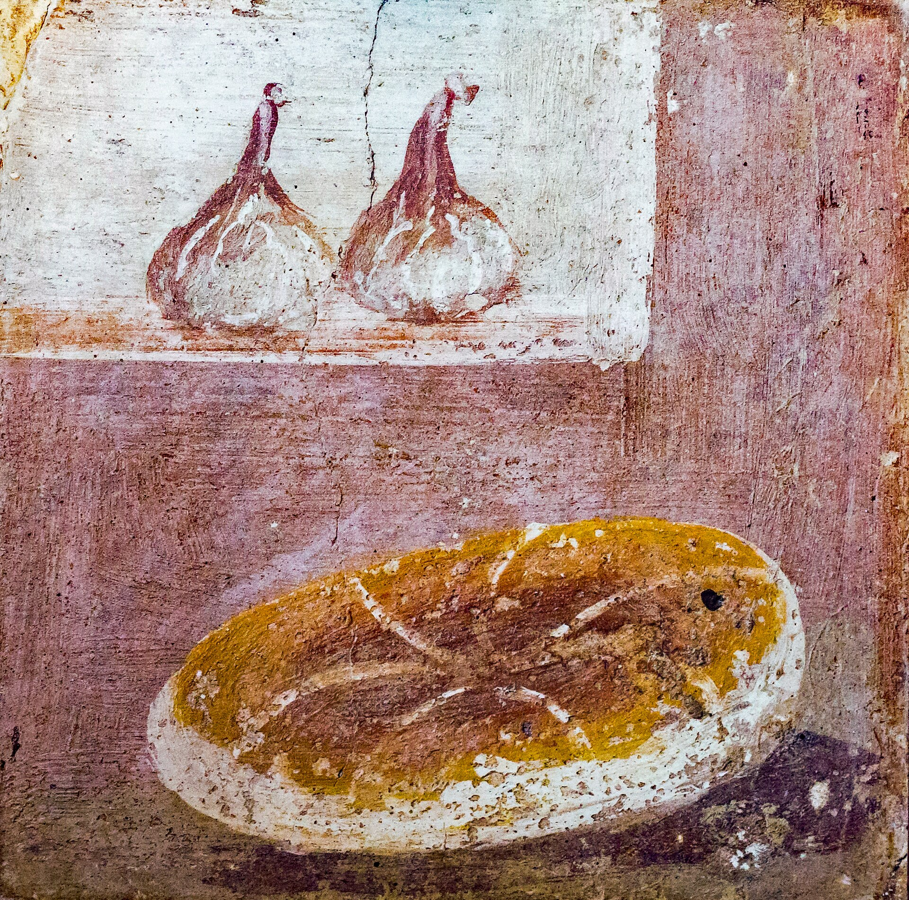
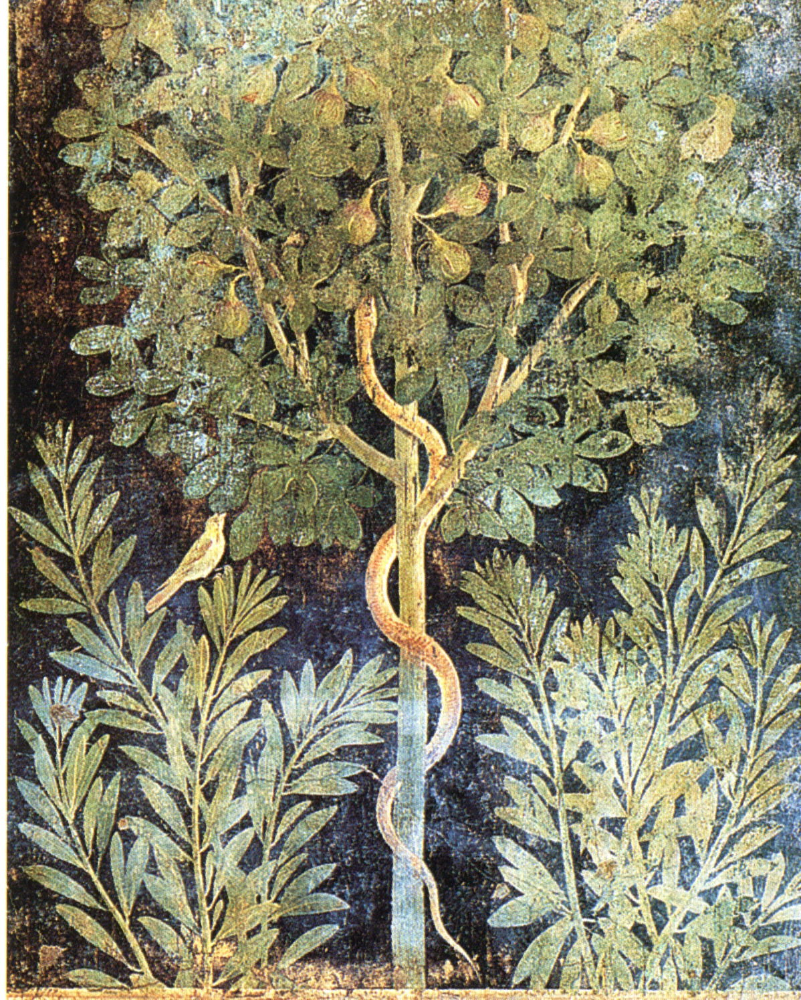

# Ash on the Still Life

Museo Archeologico Nazionale, Naples, inventory 8625: a Fourth-Style still life from Herculaneum, bread and two figs. The loaf is the modest food of every Italian moralist. The figs are the modest sweet. Together they are a sentence about enough. The eruption of 79 CE, which killed the man who had just listed twenty-nine varieties, sealed the painting. That coincidence is almost vulgar. It is also why this article exists.

The Commons file we use (ArchaiOptix, 2018, CC BY-SA 4.0) is a photograph of a painting. The painting is not a photograph of a market. Fourth-Style still lifes are arrangements. Someone chose two fruits and a loaf because the room wanted that quiet. Another Commons photograph of the same subject exists under a Flickr public-domain mark. Use either; credit the photographer and the museum; do not pretend the figs are a cultivar ID.

## A tree with a serpent

Pompeii, Casa del Frutteto (I.9.5): a Third-Style fresco of a fig tree and a serpent. Orchard, garden, omen — the catalogues argue the tone. What they do not argue is the leaf. The painter knew the palmate outline. Casa dei Cervi at Herculaneum hangs fruit vignettes — peaches, dried figs, dates — the winter cupboard put on a wall. These are not “fruit, generic.” They are a Bay of Naples kitchen speaking in the only voice that survived.

<!-- figure-id: shared.timeline-master -->

*Figure 1. The ash date is a hard node. Schematic.*

Garden archaeology at Pompeii has found planting pits, carbonized wood, pollen. Figs appear among the woody plants of peristyles and *horti* the way they appear in any Campanian town: not always as a monoculture row, often as the tree you want near the house. The pack’s orchard schematic is a later terrace. Put it here only as a reminder that a painted tree had a hole in the ground.

<!-- figure-id: shared.schematic-orchard-irrigation -->

*Figure 2. Not a reconstruction of I.9.5. A working orchard, for distance. Schematic.*

<!-- figure-id: shared.chart-variety-regions -->

*Figure 3. Pompeian and Herculanean names in Pliny will not map onto these walls. Qualitative chart.*

Priapus in the Casa dei Vettii is a fertility account with a fig in the joke more than once. This article will not use him as a thumbnail. If an art editor wants that fresco, they can have the labor-and-image piece and a caption that does not wink.

The still life’s gift is modest. Two figs. A loaf. A city that ate both and did not know it was about to become a museum.

<!-- figure-id: pompeii.man-8625 -->

*Figure 4. MAN Naples inv. 8625. Photo: ArchaiOptix, 2018. License: CC BY-SA 4.0. Museum object is older; photo licence is the photographer’s. Commercial reuse: ask the museum (file note).*

<!-- figure-id: pompeii.frutteto -->

*Figure 5. Pompeii, Casa del Frutteto I.9.5. PD-Art reproduction. Credit as on the Commons file page.*

## Pits, pollen, and a modest pair

Garden archaeology in the Bay of Naples has recovered planting pits and carbonized woody bits; figs appear among peristyle and *hortus* plants without needing to be a monoculture. A painted tree still had a hole. A still life still had a kitchen.

Two figs and a loaf is a moral the Fourth Style could afford. It is also breakfast. The explosion of named varieties in Pliny and the poverty of the painted pair can live in the same week. Empire’s catalogue and empire’s lunch are not the same desk.

## Ash as a caption machine

8625 is enough: bread, two figs, Fourth Style, a photographer’s CC BY-SA 4.0. Casa del Frutteto I.9.5 is a palmate tree and a serpent. Casa dei Cervi is a cupboard of dried fruit. Planting pits and pollen in Bay archaeology put holes under some paintings. Pliny’s Pompeian and Herculanean names will not map onto the walls. Priapus stays off the thumbnail. Empire’s catalogue and empire’s lunch shared a week and then a cloud.

## Sources for this piece

- MAN Naples inv. 8625; Commons WC-003 / WC-004.
- Casa del Frutteto I.9.5; Casa dei Cervi vignettes (WC-005, WC-006).
- Pliny, *NH* 15.19 (Pompeian, Herculanean names).

See `BIBLIOGRAPHY.md`.
