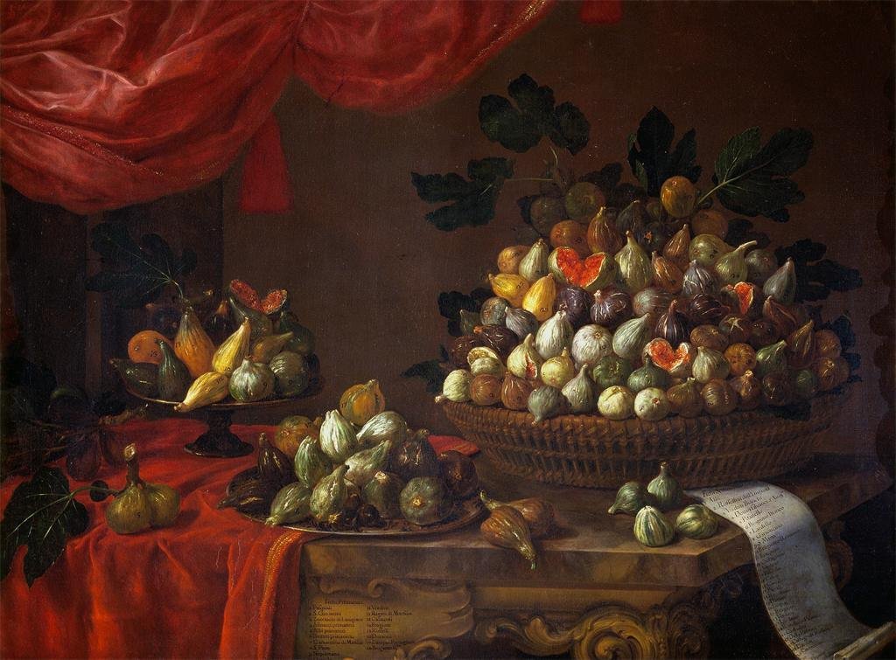
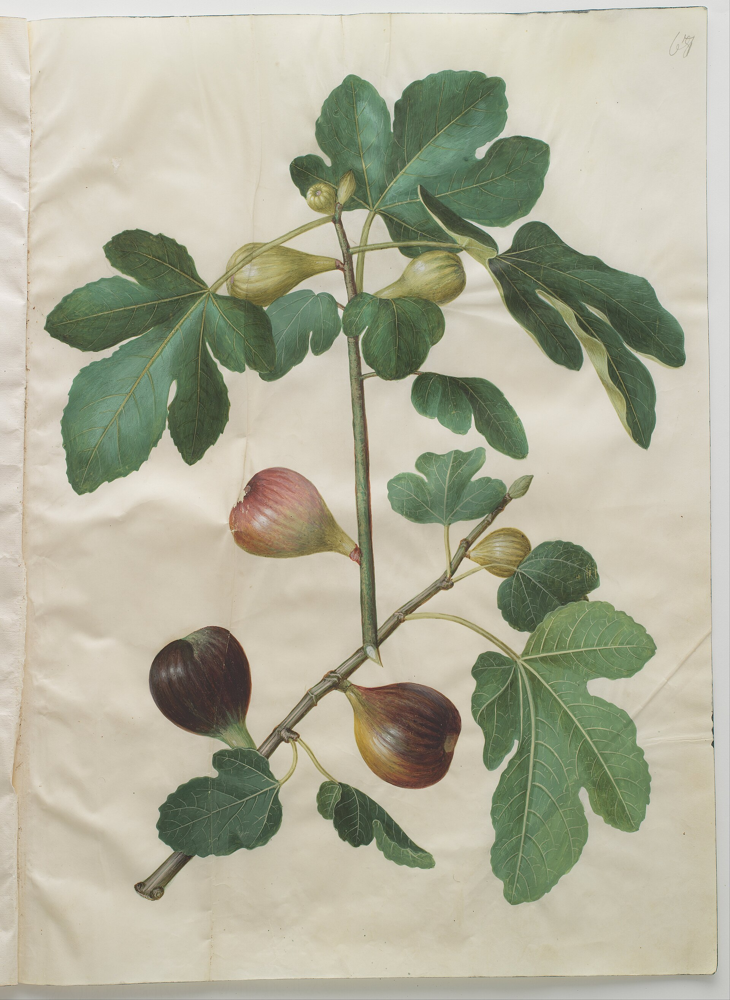

# Named Fruit in Oil

Bartolomeo Bimbi’s 1696 canvas of figs for the Medici at Poggio a Caiano is Pliny in oil: many named fruits, a collector’s appetite, a court that wants the orchard on a wall. It is a painting, not a nursery catalogue you can order from, but it is closer to Condit’s impulse than any tomb offering tray. The Commons file is public domain. Credit Bimbi and the villa. Do not caption it as a photograph of 1696 trees.

G. D. Ehret’s plate in Trew, *Plantae selectae* 8: t. 73 (1771), is the species as a prince’s book wanted it: elegant, complete, a little frozen. Johannes Simon Holtzbecher’s Gottorfer Codex *Ficus carica* is the northern court cousin. Jacques Le Moyne de Morgues’s watercolour is the Atlantic colonial cousin. Köhler’s later medicinal plate is the pharmacy cousin. None of these is a historical photograph. All of them are how Europe learned to see the tree when it could not walk to Aydın.

## The ash still life

MAN Naples 8625 — bread and two figs — is older and poorer and better as a moral. Fourth Style, Herculaneum. The Casa del Frutteto serpent-tree is the garden version. Casa dei Cervi dried-fruit vignettes are the cupboard version. Together they are the Roman half of this article. The Renaissance half is naming. The Roman half is enough.

<!-- figure-id: shared.timeline-master -->

*Figure 1. 79; 1696; 1771. Schematic.*

<!-- figure-id: shared.chart-variety-regions -->

*Figure 2. Bimbi and Pliny share a vice: more names than sure clones. Qualitative.*

<!-- figure-id: shared.botanical-syconium -->

*Figure 3. A sectioned room vs a courtly whole fruit. Pack plate.*

Tissot’s Brooklyn watercolours are biblical reception, not still life; they live in the museum article. Priapus stays off the thumbnail.

<!-- figure-id: renaissance.bimbi -->

*Figure 4. Bartolomeo Bimbi, named figs for the Medici, 1696, Villa di Poggio a Caiano. Public domain. A painting, not a nursery order form.*

<!-- figure-id: renaissance.holtzbecher -->

*Figure 5. Johannes Simon Holtzbecher, *Ficus carica*, Gottorfer Codex. Public domain. Northern court seeing of a southern tree.*

## Naming as a court sport

Bimbi’s canvas is Pliny’s vice in Medici colors. Ehret is a prince’s flora. Holtzbecher is a northern wish. Herculaneum is a lunch. The art article’s job is to keep those registers from stealing each other’s captions. A plate is not a photograph. A still life is not a cultivar ID.

## Registers that steal captions

Bimbi 1696 is Pliny’s naming vice in Medici oil — public domain, a painting, not an order form. Ehret 1771 is a prince’s flora. Holtzbecher is a northern court wish. Le Moyne is Atlantic colonial watercolour. Köhler is pharmacy. MAN 8625 is lunch in ash. Casa del Frutteto is a serpent and a palmate outline. Tissot is biblical reception and belongs in the museum list, not as archaeology.

Caption a plate as a plate. Caption a fresco photo with photographer and licence (ArchaiOptix, CC BY-SA 4.0, museum ask-on-commercial). Priapus stays off the thumbnail. Named fruit in oil is appetite. Two figs and a loaf is enough. Both are history.

## A fig in oil is a season and a class

Bartolomeo Bimbi’s 1696 Medici fruit portraits are not grocery ads. They are
a court inventory painted as still life: named figs, named peaches, the
grand-ducal garden made portable. When this article’s assets include the
Bimbi fig plate, the caption should say *Medici documentation*, not *Tuscan
farm*. The farm is elsewhere — in the estate books, in the *dottato* country
this pack treats under Cilento.

Holtzbecher’s *Ficus carica* (the other raster here) is the northern cabinet
version of the same impulse: a plant portrait for a collector who might
never own an orchard. The leaf is diagnostic; the fruit is a type. Neither
painting is a photograph of a 1696 harvest. Ehret in Trew (1771), sitting in
the syconium article’s assets, is a prince’s flora — the same seeing, a
different court.

## What the painters knew that the manuals also knew

Renaissance and baroque painters put figs in bacchanals, in *natura morta*,
in market scenes, because the fruit reads at a distance — a tear, a
seed-mass, a leaf you cannot confuse with a grape leaf if the painter is any
good. The same centuries produced printed herbals (Mattioli on Dioscorides,
the later copperplate florilegia) that treated the fig as a medical and
garden object. The still life and the herbal are not opposites. They are two
ways a fig enters a room that is not an orchard.

Bimbi’s canvas is Pliny’s vice in Medici colors: naming as a court sport.
Herculaneum’s loaf and two figs is lunch. Keep those registers from stealing
each other’s captions. A plate is not a photograph. A still life is not a
cultivar ID, even when Bimbi writes names on the canvas. Those names are a
court’s nouns. Matching them to Condit is a grief this pack will not fake
in a caption.

## How to use these pictures without lying

Do not write “this is how Renaissance Tuscany harvested.” Write “this is how
a court, or a cabinet, wanted a fig to look.” Then send the reader to the
Dottato GI essay for the living Campanian tree, and to Pliny for the older
Latin variety list the painters were not illustrating one-to-one. The
picture earns the page. It does not earn the harvest date.

Northern courts wanted the species when fruit was a rarity. Southern courts
wanted the names when fruit was ordinary. Both hung pictures. Only one could
eat the August that the picture remembered.

## Two courts, one lunch

Bimbi’s 1696 Medici canvas writes names on oil because a grand duke wanted
an inventory he could hang. That is Pliny’s vice in Tuscan color. Holtzbecher’s
Gottorfer plate is the northern cabinet: a collector who might never own an
orchard, a leaf painted as diagnosis, a fruit as a type. Ehret in Trew, in
the syconium folder, is another prince’s flora. Herculaneum’s loaf and two
figs is lunch. Keep the registers. A court name is not Condit. A still life
is not a harvest date. A plate is not a photograph of a 1696 tree.

Mattioli’s printed Dioscorides and the later florilegia put the same species
in a pharmacy book. Painters put it in bacchanals because a torn fig reads
across a room. Southern courts named what was ordinary. Northern courts
pictured what was rare. Both hung pictures. Only one could eat the August
the picture remembered. Send the reader to Cilento for the living pale
drier, to Pliny for the older list, and do not write “this is how Tuscany
harvested” under a Medici portrait.

## A name on canvas is still a court’s noun

Bimbi writes cultivars because the Medici paid for a memory that would
outlast a season. Matching those nouns to Condit is a grief a caption
must not fake. Holtzbecher’s leaf is a northern diagnosis. Ehret’s
plate, in another folder, is a prince’s flora. Herculaneum is lunch.
Mattioli’s printed simple is a pharmacy. Five rooms. One species. Do
not let the prettiest room steal the harvest date from Cilento or the
list from Pliny.

## Sources for this piece

- Bimbi 1696, Villa di Poggio a Caiano (WC-007).
- Ehret/Trew 1771 (WC-001); Holtzbecher; Le Moyne; Köhler.
- MAN Naples 8625; Casa del Frutteto; Casa dei Cervi.

See `BIBLIOGRAPHY.md`.
