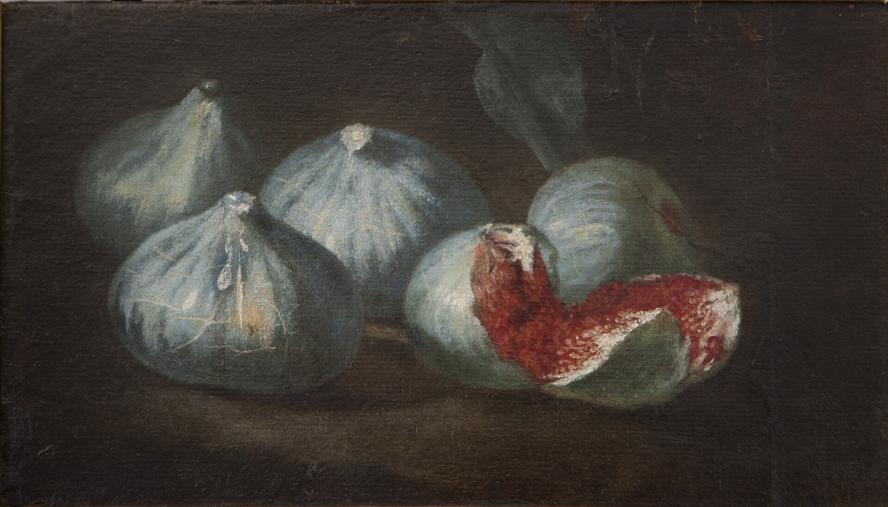

# Named Fruit in Oil

Bartolomeo Bimbi’s 1696 canvas of figs for the Medici at Poggio a Caiano is Pliny in oil: many named fruits, a collector’s appetite, a court that wants the orchard on a wall. It is a painting, not a nursery catalogue you can order from, but it is closer to Condit’s impulse than any tomb offering tray. The Commons file is public domain. Credit Bimbi and the villa. Do not caption it as a photograph of 1696 trees.

G. D. Ehret’s plate in Trew, *Plantae selectae* 8: t. 73 (1771), is the species as a prince’s book wanted it: elegant, complete, a little frozen. Johannes Simon Holtzbecher’s Gottorfer Codex *Ficus carica* is the northern court cousin. Jacques Le Moyne de Morgues’s watercolour is the Atlantic colonial cousin. Köhler’s later medicinal plate is the pharmacy cousin. None of these is a historical photograph. All of them are how Europe learned to see the tree when it could not walk to Aydın.

## The ash still life

MAN Naples 8625 — bread and two figs — is older and poorer and better as a moral. Fourth Style, Herculaneum. The Casa del Frutteto serpent-tree is the garden version. Casa dei Cervi dried-fruit vignettes are the cupboard version. Together they are the Roman half of this article. The Renaissance half is naming. The Roman half is enough.

<!-- figure-id: shared.timeline-master -->

*Figure 1. 79; 1696; 1771. Schematic.*

<!-- figure-id: shared.chart-variety-regions -->

*Figure 2. Bimbi and Pliny share a vice: more names than sure clones. Qualitative.*

<!-- figure-id: shared.botanical-syconium -->

*Figure 3. A sectioned room vs a courtly whole fruit. Pack plate.*

Tissot’s Brooklyn watercolours are biblical reception, not still life; they live in the museum article. Priapus stays off the thumbnail.

<!-- figure-id: renaissance.bimbi -->

*Figure 4. Bartolomeo Bimbi, named figs for the Medici, 1696, Villa di Poggio a Caiano. Public domain. A painting, not a nursery order form.*

<!-- figure-id: renaissance.holtzbecher -->

*Figure 5. Johannes Simon Holtzbecher, *Ficus carica*, Gottorfer Codex. Public domain. Northern court seeing of a southern tree.*

<!-- figure-id: renaissance.melendez -->

*Figure 6. Luis Meléndez, *Still Life with Figs and Bread*, c. 1770. National Gallery of Art, Washington. CC0. A Spanish pantry cousin of MAN 8625: bread, pale and dark figs, a knife. Not a cultivar key.*

<!-- figure-id: renaissance.nationalmuseum -->

*Figure 7. *Still Life with Figs*, unknown artist. Nationalmuseum, Stockholm, inv. 17171. Public domain. Northern table fruit, not a harvest date.*

## How to use these pictures without lying

Bimbi’s 1696 canvas is a court inventory in oil — Medici documentation, not a Tuscan farm. Matching his nouns to Condit is a grief a caption must not fake. Holtzbecher’s Gottorfer plate is the northern cabinet: a leaf as diagnosis, a fruit as a type, a collector who might never own an orchard. Ehret in Trew (1771), in the syconium folder, is another prince’s flora. Le Moyne is the Atlantic colonial cousin. Köhler is pharmacy.

Meléndez, about 1770, brings the lunch back: bread, a plate of pale and dark figs, cellar gear, a knife. It is the Spanish pantry cousin of MAN 8625, painted eighteen centuries later for a different table. The Nationalmuseum still life (inv. 17171) is anonymous northern table fruit. Neither painting is a harvest date.

Do not write “this is how Renaissance Tuscany harvested.” Write “this is how a court, a cabinet, or a pantry wanted a fig to look.” Send the reader to Cilento for the living pale drier and to Pliny for the older Latin list. Painters put figs in *natura morta* because a torn fruit reads across a room. Mattioli’s printed Dioscorides put the same species in a pharmacy book. Southern courts named what was ordinary. Northern courts pictured what was rare. Only one could eat the August the picture remembered.

Priapus stays off the thumbnail. Tissot stays in the biblical essays as reception, not as archaeology. A plate is not a photograph.

## A pantry is a different register

Meléndez’s bread and figs, about 1770, are closer to Herculaneum’s loaf than to Bimbi’s named inventory. The Spanish still life wants weight: a knife, a corked bottle, a barrel, fruit you could eat that afternoon. The Nationalmuseum picture wants the same ordinary table in a northern room. Neither painter is doing Pliny. Neither is doing Condit. They are doing lunch with better linen.

That is why this article keeps so many registers on one page. A Medici name on oil is appetite as documentation. A Gottorfer leaf is diagnosis for a prince who might never taste August. A Wellcome or Köhler plate is a pharmacy seeing. A Fourth-Style pair of figs is a moral and breakfast. Caption theft happens when a writer wants one picture to do all four jobs. PR #275’s cleared rasters let the pantry sit next to the court without scraping a tourist snap.

Send the reader to Cilento for the living pale drier, to the syconium folder for Ehret, to Pompeii for the ash. Keep Priapus off the thumbnail. Keep Tissot in the biblical essays.

Bimbi writes names because a grand duke wanted a memory that would outlast a season. Meléndez paints a plate because a pantry wanted weight. Holtzbecher paints a leaf because a northern cabinet wanted a diagnosis. The Nationalmuseum painter, whoever they were, wanted table fruit in a northern room. Four impulses. One species. Do not let the prettiest impulse steal a harvest date from Cilento or a list from Pliny.

Luis Meléndez painted still lifes for a Spanish court that wanted pantry weight, not Medici names. The National Gallery of Art’s open-access file (NGA 111627) is how that pantry entered this pack: CC0, bread and mixed figs, cellar gear. It is the eighteenth-century cousin of the Herculaneum loaf, not a Tuscan harvest and not a cultivar key. Use it as lunch.

## Schleswig diagnosed; Tuscany remembered August

Holtzbecher’s Gottorfer Codex plate is a Schleswig court book — a northern German cabinet that collected the south as diagnosis. A leaf as a type, a fruit as a specimen, a prince who might never taste a Campanian August. Bimbi’s 1696 hanging at Poggio a Caiano is the opposite weather: a Tuscan court that already ate the fruit and wanted the names to outlast the season. That north/south difference is why one picture looks like a herbarium and the other looks like a harvest memory.

Meléndez, about 1770, and the anonymous Nationalmuseum still life (inv. 17171) sit in a third register: lunch with better linen. Neither is doing Pliny’s twenty-nine. Neither is doing Condit’s 717. Caption theft happens when a writer wants one file to do cabinet, court, and pantry. Keep Priapus off the thumbnail. Send the living pale drier to Cilento. Send the Latin list to *NH* 15.19.

## Sources for this piece

- Bimbi 1696, Villa di Poggio a Caiano (WC-007).
- Ehret/Trew 1771 (WC-001); Holtzbecher; Le Moyne; Köhler.
- Meléndez, NGA 111627 (CC0); Nationalmuseum inv. 17171.
- MAN Naples 8625; Casa del Frutteto; Casa dei Cervi.

See `BIBLIOGRAPHY.md`.
