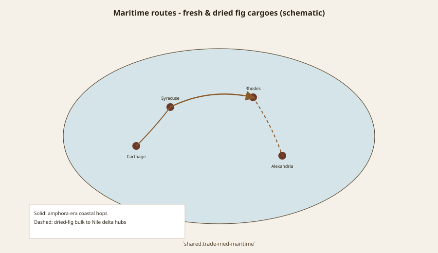
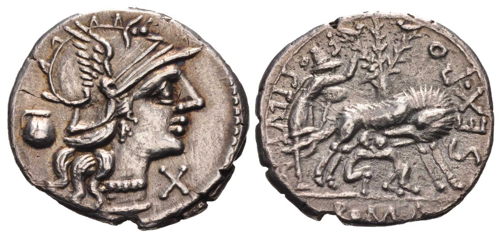

# Cato’s Villa, Rome’s Appetite

Cato the Elder, who liked to pretend he was only a farmer, put the fig in *De Agri Cultura* 8.1 with a soil logic that later Italians still recognize. Marisca on chalky or open ground. African, Herculanean, Saguntine, winter, and the long-stalked black Telanian on richer or manured ground. Pliny quotes the sentence as if from a grandfather who knew dirt. Six types, two soils, no wasp treatise. That is a working orchard talking, not a poet.

Rome’s fig is a villa fruit and a city sweet. It is planted for the household and dried for the year. It is named for places the city has eaten: Saguntum, Africa, Herculaneum. Already the names are doing imperial work. A Saguntine fig in Latium is a memory of a coast. An African fig, Pliny will later smirk, may be a recent immigrant to Africa wearing Africa’s name.

## Columella’s year

Columella’s *De Re Rustica* is the later Roman working book: how to place the tree, how to preserve, how to think about labor. Use him for practice, not for a variety census. He is not trying to beat Pliny at lists. He is trying to keep a staff from ruining a crop. Preservation — drying, packing, the winter table — is where the villa meets the sea. A wet fruit that can be made dry is a fruit that can leave the farm.

<!-- figure-id: roman-orchards.timeline -->

*Figure 1. Classical period band on the pack master timeline. Schematic.*

<!-- figure-id: roman-orchards.med-belt -->

*Figure 2. Western and central Mediterranean orchard zones. Schematic map.*

## What the sea is for

Dried figs move with oil, wine, and grain in the ordinary coastal trade of the Roman Mediterranean. This pack’s maritime schematic is not a bill of lading. It is a reminder that a villa surplus has a quay. Ostia, Puteoli, the North African ports, the Aegean islands — the arrows are teaching arrows. A real *navis* did not sail a diagram.

<!-- figure-id: roman-orchards.orchard -->

*Figure 3. Plan schematic of terraced irrigation and caprifig placement.*

<!-- figure-id: roman-orchards.maritime -->

*Figure 4. Coastal and bulk dried-fig sea routes (schematic). Solid vs dashed legs per legend.*

The next two articles split Pliny’s afternoon: the catalog (*NH* 15.19) and the Senate fig (*NH* 15.20). Pompeii and Herculaneum keep the pictures. This piece’s job is the farm. Cato’s soils are still the right opening, because they refuse the cliché. Rome did not invent the fig. Rome organized it — by ground, by name, by the habit of making a fruit last until the next argument in the city.

## Saguntum, Africa, and a staff

Cato’s list is already a map: Saguntine fruit in Latium is a Spanish coast remembered as a flavor. African fruit is a soil class and a later political insult. Herculanean is a Bay of Naples name that the ash will freeze in paint. A *vilicus* who planted by those words was not doing botany. He was doing risk. Chalky ground gets the marisca or the crop fails in a way the owner can blame on the ground instead of the manager.

Columella’s preservation chapters belong next to the maritime schematic. A villa that only eats fresh figs is a villa that wastes August. Drying, packing in leaves or in jars, the winter table — those are the verbs that turn a Campanian tree into a city sweet. Ostia and Puteoli did not need a “fig fleet.” They needed space in a hold that already carried oil and wine.

Do not invent a *collegium* of fig merchants. Do not print a price edict line you have not read. The Diocletianic prices, when a later editor wants them, can be added from the edict’s fruit chapter with a citation. Until then, the farm books are enough: Rome organized the fig by ground and by keepable surplus.

## A civic tree is not a villa list

The Ficus Ruminalis on a 137 BCE denarius (RRC 235/1c, Sex. Pompeius Fostlus) is another Roman fig entirely: Faustulus, the she-wolf, the twins, a tree in the founding story. CNG’s photograph is CC BY-SA 2.5. Credit the photographer. The coin is not Cato’s marisca and not a Herculanean still life. It is a civic tree the city put on silver. PR #275 found no OA kylix with a documented fig-banquet subject; this denarius is the closest cleared ancient fig-tree object that pass shipped. Do not caption it as an orchard cultivar.

<!-- figure-id: roman-orchards.ficus-ruminalis -->

*Figure 5. Sextus Pompeius Fostlus, AR denarius, Rome, 137 BCE (RRC 235/1c). Reverse: Faustulus, she-wolf and twins, Ficus Ruminalis behind. Photo: CNG. License: CC BY-SA 2.5. Civic myth, not a villa invoice.*

The Pompeii article keeps the lunch. The Pliny article keeps the list. The Carthage article keeps the joke. This one keeps the staff — and one coin that reminds a reader Rome also told a tree as origin, which is a different desk from Cato’s soils.

## What the farm books will not do

Cato will not give you a wasp treatise. Six types and two soils are enough for a manager who needs to blame the ground. Columella will not give you Pliny’s twenty-nine names. He will give you a year of staff work and a reason not to waste August. Pliny will not give you a bill of lading. He will give you an afternoon of appetite and, in 15.20, a Senate with a Carthage fig.

The Ficus Ruminalis coin sits outside those three desks. It is origin-as-story, a tree the city needed for twins and a wolf, struck in silver in 137 BCE. A villa *vilicus* who planted marisca on chalk was not planting that tree. A factor who bought space in a hold at Puteoli was not shipping that tree. Civic myth and surplus fruit shared a species and not a job.

Do not invent a *collegium* of fig merchants. Do not print a Diocletianic fruit price until the edict’s chapter is cited. The maritime schematic remains a teaching drawing. A real *navis* carried oil and wine first. Figs took space that was left, or space a factor had already bought. That is ordinary coastal trade. Rome organized a tree it did not invent.

The denarius is origin-as-story. Cato is soil-as-risk. Columella is staff-as-year. Pliny is appetite-as-afternoon. Four desks. One species. Do not let the wolf steal the villa.

Cato died in 149 BCE. The Ficus Ruminalis denarius is 137 BCE — a generation after the farm book. Ritual tree on silver; marisca on chalk in Latin. Same species. Two desks that never met in a packing house. A *vilicus* who planted Saguntine fruit in Latium was remembering a Spanish coast as a flavor, not founding a city with a wolf. Ostia and Puteoli still needed space in a hold that already carried oil and wine. Figs took what was left, or space a factor had already bought.

## Sources for this piece

- Cato, *De Agri Cultura* 8.1 (via Pliny 15.19).
- Columella, *De Re Rustica* — villa practice and preservation.
- Pliny, *NH* 15.19–20.
- RRC 235/1c (Ficus Ruminalis denarius); photo CNG, CC BY-SA 2.5.

See `BIBLIOGRAPHY.md`.
