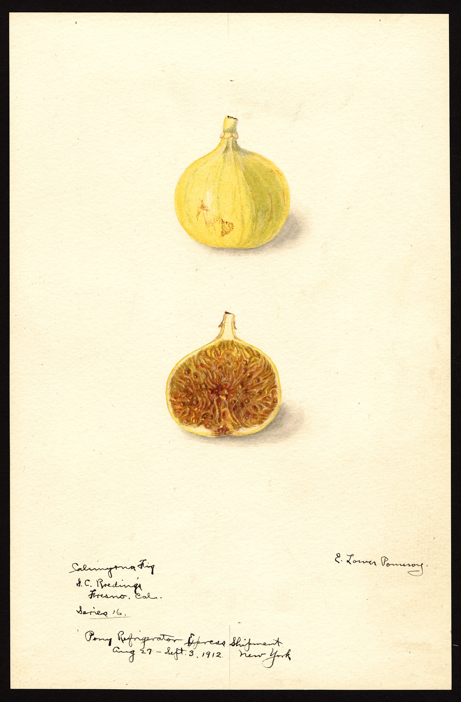

# Aydın İnciri

The specification is not shy. Aydın İnciri is dried Sarılop — a female fig, the drying type of the Aegean, whitish-yellow, thin-shelled, seeds filled, not more than ninety fruits to the kilo. The geography is a lawyer’s mountain walk: slopes of the Aydın Mountains and Bozdağlar, Büyük and Küçük Menderes, towns named as if in a freight book. Elevation 0–900 meters, southwest faces. Registration: EU 17 February 2016; a Turkish GI earlier (2005 in some national summaries). The UK scheme lists it from 31 December 2020 because of the exit paperwork.

This is the clone California named Calimyrna. Lob Injir, Loh Injir, Sari Lop, Sarılop: the same pale, seeded, wasp-needy fruit. Without caprification the crop drops at about an inch. With it, the crate that taught Europe what a dried fig was.

## *Ficus carica* and Caria

The specification’s bow to the botanical name — Caria, the ancient country of the southwest coast — is fair as etymology and risky as a continuous-orchard claim. What is not a tone: the conventional sun-dry, the public Fig Research Station, the fact that Türkiye still leads world production (FAOSTAT 2022: 350,000 tonnes in Helgi’s compilation; 2023 reviews: about 356,000). Re-check the year before you print the table.

<!-- figure-id: shared.map-med-belt -->

*Figure 1. Official maps live in the EU/DEFRA PDF (EU-001). This drawing is a teaching map.*

<!-- figure-id: shared.process-drying-sundry -->

*Figure 2. Sun-dry as the legal process. Schematic.*

<!-- figure-id: shared.chart-variety-regions -->

*Figure 3. Calimyrna is the same cell under a California passport. Qualitative.*

İncirliova means fig-plain. A town that calls itself that is not waiting for a Brussels stamp to know its job. The PDO fixes the lie of the port — or tries to. The fruit may still leave through İzmir. The name on a protected pack is the valley.

## Ninety to the kilo

A count is a law. Pale, thin-shelled, seeded — those are legal adjectives. Caria as etymology is a bow. Caria as unbroken orchard is a tone. FAOSTAT’s Turkish first-place is a year. Print the year.

## Legal adjectives

Dried Sarılop, whitish-yellow, thin-shelled, seeded, not more than ninety to the kilo, southwest faces, 0–900 m, named towns, EU 17 February 2016, Turkish GI earlier, UK scheme 31 December 2020. Condit: Calimyrna is this wood. Without the wasp the crop drops at about an inch. Caria as etymology is fair. Caria as a pollen core is not.

İncirliova — fig-plain — does not wait for Brussels. FAOSTAT’s Turkish first-place is a year (2022: 350 kt class; 2023: 356 kt class). Print the year. The port name was Smyrna. The legal name is the valley. Substitution is why the fence exists.

## A clone with a lawyer and a wasp

The specification’s adjectives are the closest thing this series has to a modern *Natural History* chapter that can be enforced. Dried Sarılop. Whitish-yellow. Thin-shelled. Seeds filled. Not more than ninety fruits to the kilo. Southwest faces, 0–900 meters, Büyük and Küçük Menderes, a freight-book of towns: Sultanhisar, İncirliova, Germencik, Nazilli, Ödemiş, Tire, Selçuk. EU 17 February 2016. A Turkish GI earlier (2005 in some national summaries). UK scheme 31 December 2020 because paperwork follows flags.

Condit: Calimyrna is this wood — Lob Injir, Loh Injir, Sari Lop — introduced to California more than once. Without caprification the crop drops at about an inch. With it, the crate that taught Europe a taste. The specification’s bow to Caria is fair as the botanical name’s folk etymology and risky as a continuous-orchard claim. “Thousands of years” is tone. İncirliova — fig-plain — is not tone.

FAOSTAT’s Turkish first-place is a year. Helgi’s 2022 mirror: 350,000 tonnes. 2023 compilations: about 356,000. Print the year. Do not write “half the world” unless the arithmetic says so (it did not in 2022).

The port was called Smyrna. The legal name is the valley. Substitution — cheaper fruit in an Aegean reputation — is why the fence exists. Whether a supermarket in Düsseldorf honors the fence is a different police. This article’s job is to keep the clone, the insect, and the lawyer in one sentence without letting the quay eat the slope.

## Legal adjectives, a wasp, a year

The specification’s adjectives are the closest thing this series has to a
modern *Natural History* chapter that can be enforced. Dried Sarılop.
Whitish-yellow. Thin-shelled. Seeds filled. Not more than ninety fruits to
the kilo. Southwest faces, 0–900 metres, Büyük and Küçük Menderes, a
freight-book of towns: Sultanhisar, İncirliova, Germencik, Nazilli, Ödemiş,
Tire, Selçuk. EU 17 February 2016. A Turkish GI earlier (2005 in some
national summaries). UK scheme 31 December 2020 because paperwork follows
flags.

Condit: Calimyrna is this wood — Lob Injir, Loh Injir, Sari Lop —
introduced to California more than once. Without caprification the crop
drops at about an inch. With it, the crate that taught Europe a taste. The
specification’s bow to Caria is fair as the botanical name’s folk etymology
and risky as a continuous-orchard claim. “Thousands of years” is tone.
İncirliova — fig-plain — is not tone.

FAOSTAT’s Turkish first-place is a year. Helgi’s 2022 mirror: 350,000
tonnes. 2023 compilations: about 356,000. Print the year. The port was
called Smyrna. The legal name is the valley. Substitution is why the fence
exists. Whether a supermarket in Düsseldorf honors the fence is a different
police.

Elsie Lower Pomeroy painted the same wood after a refrigerated shipment in 1912 and labeled it Calimyrna. That is the freight face of Sarılop under the California stitch: what a lawyer in Aydın later wrote as thin-shelled and seeded, seen on a card after a cold ride. It is not the EU map. It is the clone leaving town.

<!-- figure-id: sarilop.calimyrna-ship-1912 -->

*Figure 4. Elsie Lower Pomeroy, Calimyrna after refrigerated shipment, 1912. USDA NAL POM00007439. Public domain. Freight face of Sarılop; not the Aydın specification map.*

Whitish-yellow and thin-shelled are adjectives a lawyer can enforce and a substitution can fake. Seeds filled is the wasp’s signature — the same biology Heiges painted on Roeding’s Endgere card in 1899. Ninety to the kilo is a count. Southwest faces are a climate. Germencik to Tire in the specification is a freight-book of towns, not a tourist loop. Caria as etymology is a bow. Caria as unbroken orchard is tone. İncirliova — fig-plain — is a place name. Print the FAOSTAT year. Keep Smyrna for the quay. Keep the legal name for the valley.

Pomeroy’s refrigerated-shipment card is the clone after a cold ride, already wearing the California stitch. Aydın’s 2016 adjectives are the clone at home. Same wood. Two faces. Keep Smyrna for the quay.

## Sources for this piece

- Aydın İnciri product specification (DEFRA/EU PDF); GOV.UK listing.
- Condit, Calimyrna / Loh Injir notes.
- FAOSTAT via Helgi 2022 / 2023 compilations (cite the year you print).
- USDA NAL POM00007439 (Calimyrna after refrigerated shipment).

See `BIBLIOGRAPHY.md`.
