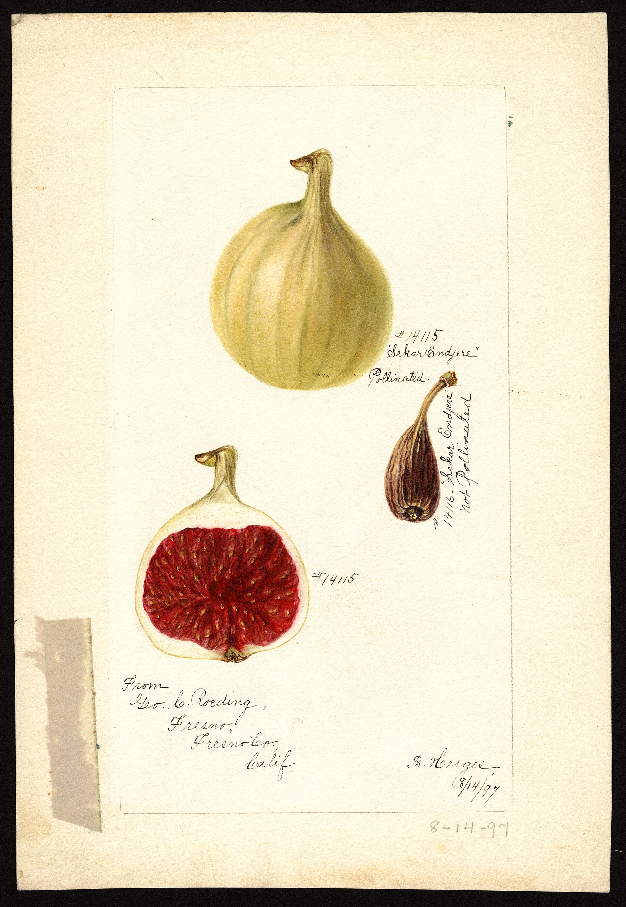
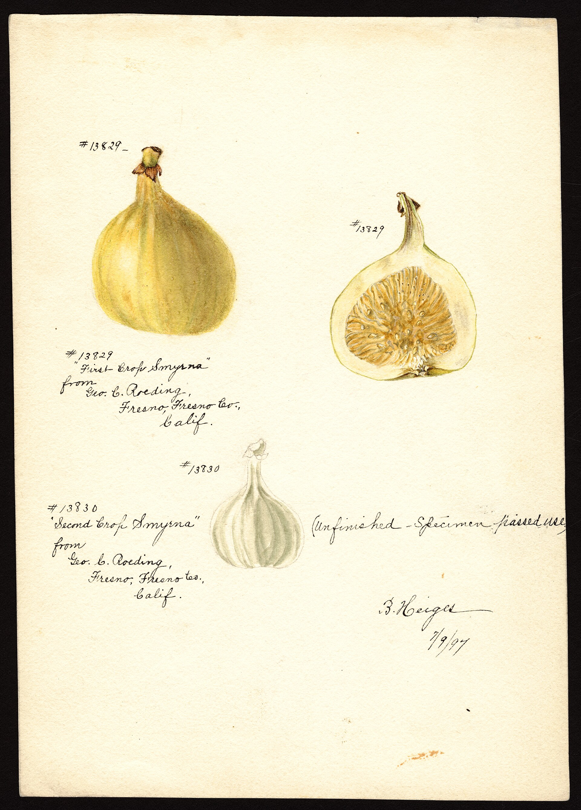

# The Missing Insect, 1899

George C. Roeding of Fresno held, Schwarz says, about 62 acres of Smyrna figs for more than ten years — an expensive faith. Cuttings had come in 1881–82. Fruit had not. Hand pollen and a blowpipe made a curiosity. The rumor about Turkish sterile wood was a consolation. The consolation was wrong.

L. O. Howard and Walter T. Swingle, USDA, introduced *Blastophaga* from Algeria in the spring of 1899. Older summaries sometimes say 1890; Condit 1947 is cited that way in some genetic intros — prefer the 1899 ANR/Schwarz line for the successful establishment. E. A. Schwarz spent the 1900 season on Roeding’s place and called the result the first large crop of real Smyrna figs, seeded, in America, quality equal or superior to the Asia Minor import.

Eisen, who had already written the biology and fought the Gasparrini weather, produced the 1901 USDA bulletin that is still the English book of the moment: history, culture, curing, a catalogue of names. He had seen Mayer in Naples in 1896. He had seen Mexico and California. He was the man who could tell a valley it had been growing navels and wanting Valencias.

## Calimyrna is a stitch

The name is California + Smyrna. The clone is Sarılop. The insect is Algerian by last address, Mediterranean by nature. Packing houses would spend the twentieth century trying to make a San Joaquin crate that did not blush next to an İzmir stencil. Sometimes they managed. Sometimes they sulfur-bleached and hoped. The wasp was the condition of the hope.

<!-- figure-id: shared.caprification-cycle -->

*Figure 1. What 1899 imported. Schematic.*

<!-- figure-id: shared.timeline-master -->

*Figure 2. Dated nodes only. Schematic.*

<!-- figure-id: shared.process-drying-sundry -->

*Figure 3. Eisen’s bulletin is a curing book as much as a wasp book. Schematic.*

Gasparrini’s denial is the villain only if you need a villain. The deeper fact is horticultural type. A Common fig does not teach you a Smyrna fig. A professor who studied the wrong type can be sincere and costly.

## Sixty-two acres of being right

Roeding’s acreage is the number that makes the wait expensive. Schwarz’s 1900 season is the number that ends the rumor of sterile Turkish wood. Howard and Swingle’s Algerian insects are the missing tool. Calimyrna is the advertisement written after the tool worked.

## Blowpipe, then insect

1881–82 cuttings. 1890 hand pollen. 1899 Howard and Swingle, Algeria, *Blastophaga*. 1900 Schwarz on Roeding’s ~62 acres: first large seeded Smyrna crop in America. 1901 Eisen bulletin. Prefer 1899 over “1890” slips for establishment. Calimyrna is the stitch; Sarılop is the wood; the wasp is Mediterranean by nature and Algerian by last address. Gasparrini’s denial was sincere and costly because he studied the wrong horticultural bill.

## The decade the valley bought the wrong theory

George C. Roeding held, Schwarz says, about 62 acres of Smyrna figs for more than ten years. Cuttings 1881–82. Fruit that would not stay. A blowpipe and hand pollen in 1890 made a curiosity. The rumor that Turkish exporters had sent sterile wood was a consolation. The consolation was wrong. The trees were the right clone and the wrong ecology.

L. O. Howard and Walter T. Swingle brought *Blastophaga psenes* from Algeria in spring 1899. Prefer that year for successful establishment. Older summaries print 1890, which is the blowpipe year; some genetic intros repeat Condit 1947’s slip. E. A. Schwarz spent 1900 on Roeding’s place and called the result the first large seeded Smyrna crop in America, quality equal or superior to the Asia Minor import. Eisen’s 1901 USDA bulletin is the English book of the moment — history, culture, curing, a catalogue — written by a man who had already fought Gasparrini’s weather and seen Mayer in Naples in 1896.

Calimyrna is a stitch: California plus Smyrna. The clone is Sarılop. The insect is Algerian by last address, Mediterranean by nature. Packing houses spent a century trying to make a San Joaquin crate that did not blush next to an İzmir stencil. Sometimes they sulfur-bleached and hoped. The wasp was the condition of the hope. A Common-type mission garden could not teach that lesson. A professor who studied the wrong type could not either.

Bertha Heiges’s USDA watercolor of “Endgere” (also written Endyere on the sheet), from Geo. C. Roeding, Fresno, is dated 8/14/99 — August of the year Howard and Swingle brought the wasp. The sheet shows a pollinated fruit, a halved interior, and a small dark fruit labeled not pollinated. It is the biology of this article in government watercolor, painted on the expensive acreage before Schwarz’s 1900 season wrote the English report.

<!-- figure-id: smyrna.usda-endgere -->

*Figure 3. Bertha Heiges, “Endgere,” from Geo. C. Roeding, Fresno. USDA NAL POM00001071. Public domain. Sheet dated 8/14/99. Pollinated versus not-pollinated — the Smyrna bill in one summer.*

Turkish exporters had not sent sterile wood. California had sent the wrong ecology. Eisen had already seen Mayer do the practice right in Naples in 1896 before he wrote the 1901 bulletin for a valley that had done it wrong. Copy no 1890 slip from a genetic intro that followed Condit’s occasional error. The mission garden was the wrong teacher because it never paid the wasp bill.

## What the 1899 sheet is worth

Heiges’s Endgere watercolor is dated mid-August of the introduction year, from the grower who had held the acreage. Pollinated versus not-pollinated is the whole argument of the wasted decade in one card. The small dark fruit is what California had been harvesting without a wasp: a drop, a rumor of sterile Turkish wood. The pale seeded interior is what Schwarz would call, the next year, a real Smyrna crop.

Eisen’s 1901 USDA bulletin is the English book of the moment because he had already seen Mayer in Naples in 1896 and had already fought Gasparrini’s weather in print. A Common-type mission garden — the 1769 corridor, a fruit that persists — could not teach a Smyrna bill. Prefer 1899 for establishment. Copy no 1890 slip. Calimyrna remains a stitch written after the tool worked, not a clone invented in Fresno. The Aydın essay holds the legal wood. This one holds the missing insect.

The Endgere card is from the man who paid for the wait, in the summer the insect arrived. That is enough picture. Schwarz’s 1900 season is the English report. Eisen’s 1901 bulletin is the book. Prefer 1899.

Bertha Heiges painted another Roeding sheet two years earlier. “First Crop Smyrna,” from Geo. C. Roeding, Fresno, dated July 1897: a whole pale fruit, a cut face, and a second-crop outline marked unfinished because the specimen passed. That is the expensive wait in watercolor — cuttings since 1881–82, still no established wasp. Do not read the 1897 cut face as Schwarz’s 1900 seeded crop. The Endgere card of August 1899 sits on the other side of Howard and Swingle’s spring. This one sits on the near side.

<!-- figure-id: smyrna.usda-first-crop-1897 -->

*Figure 4. Bertha Heiges, “First Crop Smyrna,” from Geo. C. Roeding, Fresno. USDA NAL POM00001166. Public domain. Sheet dated 7/97. Second crop unfinished. The wait, not the 1900 report.*

## Sources for this piece

- Schwarz, “A Season’s Experience…” (1900; 62 acres; 1899 introduction).
- UC ANR circular (Howard, Swingle, Roeding, 1900–01).
- Eisen 1901; Condit 1947 (Gasparrini; navel/Valencia).
- USDA NAL POM00001071 (Heiges, Endgere, Roeding, 8/14/99); POM00001166 (Heiges, First Crop Smyrna, 7/97).

See `BIBLIOGRAPHY.md`.
