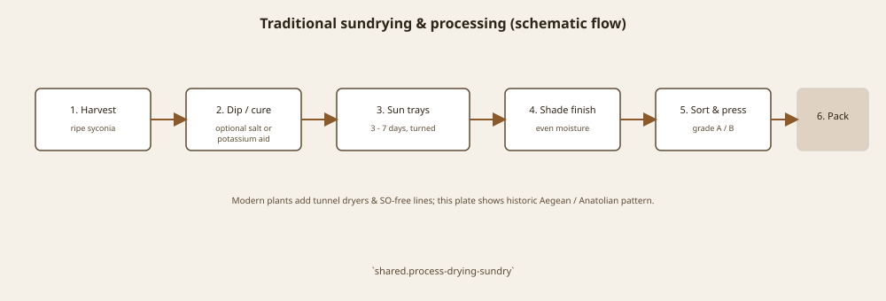

# The Missing Insect, 1899

George C. Roeding of Fresno held, Schwarz says, about 62 acres of Smyrna figs for more than ten years — an expensive faith. Cuttings had come in 1881–82. Fruit had not. Hand pollen and a blowpipe made a curiosity. The rumor about Turkish sterile wood was a consolation. The consolation was wrong.

L. O. Howard and Walter T. Swingle, USDA, introduced *Blastophaga* from Algeria in the spring of 1899. Older summaries sometimes say 1890; Condit 1947 is cited that way in some genetic intros — prefer the 1899 ANR/Schwarz line for the successful establishment. E. A. Schwarz spent the 1900 season on Roeding’s place and called the result the first large crop of real Smyrna figs, seeded, in America, quality equal or superior to the Asia Minor import.

Eisen, who had already written the biology and fought the Gasparrini weather, produced the 1901 USDA bulletin that is still the English book of the moment: history, culture, curing, a catalogue of names. He had seen Mayer in Naples in 1896. He had seen Mexico and California. He was the man who could tell a valley it had been growing navels and wanting Valencias.

## Calimyrna is a stitch

The name is California + Smyrna. The clone is Sarılop. The insect is Algerian by last address, Mediterranean by nature. Packing houses would spend the twentieth century trying to make a San Joaquin crate that did not blush next to an İzmir stencil. Sometimes they managed. Sometimes they sulfur-bleached and hoped. The wasp was the condition of the hope.

<!-- figure-id: shared.caprification-cycle -->

*Figure 1. What 1899 imported. Schematic.*

<!-- figure-id: shared.timeline-master -->

*Figure 2. Dated nodes only. Schematic.*

<!-- figure-id: shared.process-drying-sundry -->

*Figure 3. Eisen’s bulletin is a curing book as much as a wasp book. Schematic.*

Gasparrini’s denial is the villain only if you need a villain. The deeper fact is horticultural type. A Common fig does not teach you a Smyrna fig. A professor who studied the wrong type can be sincere and costly.

## Sixty-two acres of being right

Roeding’s acreage is the number that makes the wait expensive. Schwarz’s 1900 season is the number that ends the rumor of sterile Turkish wood. Howard and Swingle’s Algerian insects are the missing tool. Calimyrna is the advertisement written after the tool worked.

## Blowpipe, then insect

1881–82 cuttings. 1890 hand pollen. 1899 Howard and Swingle, Algeria, *Blastophaga*. 1900 Schwarz on Roeding’s ~62 acres: first large seeded Smyrna crop in America. 1901 Eisen bulletin. Prefer 1899 over “1890” slips for establishment. Calimyrna is the stitch; Sarılop is the wood; the wasp is Mediterranean by nature and Algerian by last address. Gasparrini’s denial was sincere and costly because he studied the wrong horticultural bill.

## The decade the valley bought the wrong theory

George C. Roeding held, Schwarz says, about 62 acres of Smyrna figs for more than ten years. Cuttings 1881–82. Fruit that would not stay. A blowpipe and hand pollen in 1890 made a curiosity. The rumor that Turkish exporters had sent sterile wood was a consolation. The consolation was wrong. The trees were the right clone and the wrong ecology.

L. O. Howard and Walter T. Swingle brought *Blastophaga psenes* from Algeria in spring 1899. Prefer that year for successful establishment. Older summaries print 1890, which is the blowpipe year; some genetic intros repeat Condit 1947’s slip. E. A. Schwarz spent 1900 on Roeding’s place and called the result the first large seeded Smyrna crop in America, quality equal or superior to the Asia Minor import. Eisen’s 1901 USDA bulletin is the English book of the moment — history, culture, curing, a catalogue — written by a man who had already fought Gasparrini’s weather and seen Mayer in Naples in 1896.

Calimyrna is a stitch: California plus Smyrna. The clone is Sarılop. The insect is Algerian by last address, Mediterranean by nature. Packing houses spent a century trying to make a San Joaquin crate that did not blush next to an İzmir stencil. Sometimes they sulfur-bleached and hoped. The wasp was the condition of the hope. A Common-type mission garden could not teach that lesson. A professor who studied the wrong type could not either.

## Sixty-two acres of being right

George C. Roeding held, Schwarz says, about 62 acres of Smyrna figs for
more than ten years. Cuttings 1881–82. Fruit that would not stay. A
blowpipe and hand pollen in 1890 made a curiosity. L. O. Howard and Walter
T. Swingle brought *Blastophaga psenes* from Algeria in spring 1899. Prefer
that year for successful establishment. Older summaries print 1890, which
is the blowpipe year; some genetic intros repeat Condit 1947’s slip. E. A.
Schwarz spent 1900 on Roeding’s place and called the result the first large
seeded Smyrna crop in America, quality equal or superior to the Asia Minor
import.

Calimyrna is a stitch: California plus Smyrna. The clone is Sarılop. The
insect is Algerian by last address, Mediterranean by nature. Packing houses
spent a century trying to make a San Joaquin crate that did not blush next
to an İzmir stencil. Sometimes they sulfur-bleached and hoped. The wasp was
the condition of the hope. A Common-type mission garden could not teach that
lesson. A professor who studied the wrong type could not either. Eisen’s
1901 USDA bulletin is the English book of the moment — history, culture,
curing, a catalogue — written by a man who had already fought Gasparrini’s
weather.

## The advertisement after the tool worked

Calimyrna is a stitch written after 1900, not a clone invented in Fresno.
Sarılop is the wood. *Blastophaga* from Algeria is the tool. Roeding’s
sixty-two acres were the expensive wait. Schwarz called the 1900 season
the first large seeded Smyrna crop in America, equal or better than the
import. Packing houses then spent a century blushing next to an İzmir
stencil and sometimes sulfur-bleaching the blush.

Gasparrini’s denial and the 1881–82 cuttings are the wasted decade. 1890
is hand pollen. 1899 is the insect. Condit 1947’s occasional 1890 slip
should not be copied. A mission garden could not teach the lesson because
it never paid the bill. Eisen’s 1901 bulletin is the book of the moment,
written by a man who had already seen Mayer in Naples. The wasp was the
condition of the hope, not a curiosity in a jar.

## Mayer in Naples, then Fresno

Eisen had already seen the practice done right before he wrote the 1901
bulletin for a valley that had done it wrong. Mayer, Naples, 1896: a
seeing. Roeding’s acreage: a cost. Schwarz 1900: an end to the sterile-
wood rumor. Calimyrna: the advertisement after the tool worked. Prefer
1899. Copy no 1890 slip. The mission garden was the wrong teacher
because it never paid.

## Sterile wood was a consolation

Turkish exporters had not sent duds. California had sent the wrong
ecology. Schwarz’s 1900 season ended the rumor. Roeding’s acreage made
the wait expensive. 1899 remains the insect year. Calimyrna remains
advertising after the fact. Copy no 1890 slip from a genetic intro that
followed Condit’s occasional error.

## Sources for this piece

- Schwarz, “A Season’s Experience…” (1900; 62 acres; 1899 introduction).
- UC ANR circular (Howard, Swingle, Roeding, 1900–01).
- Eisen 1901; Condit 1947 (Gasparrini; navel/Valencia).

See `BIBLIOGRAPHY.md`.
