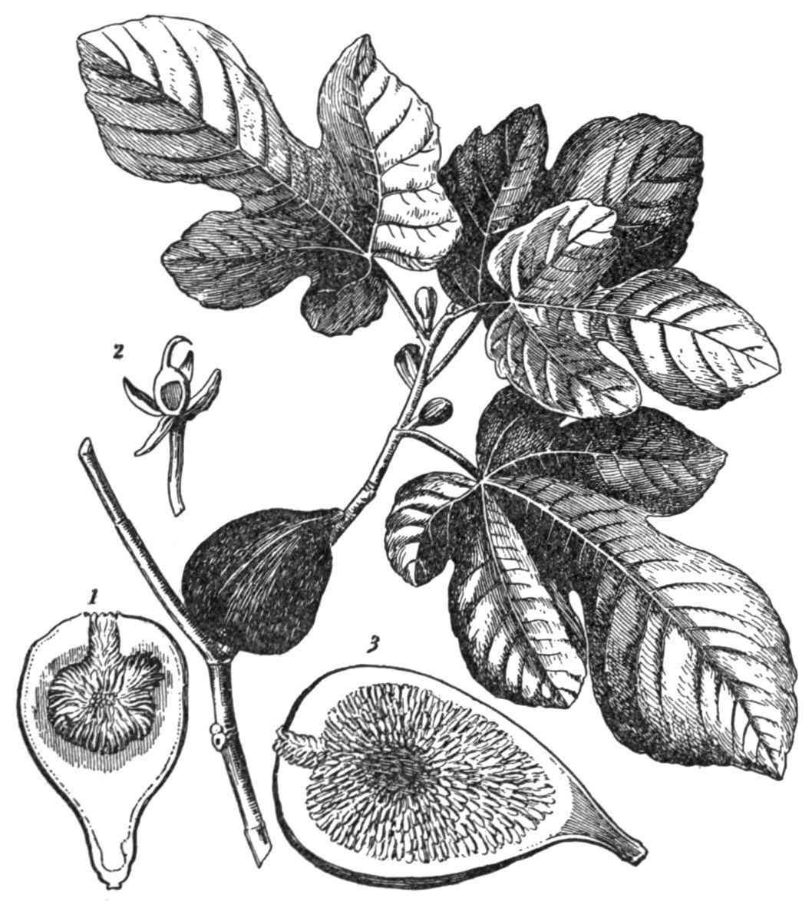

# The Fig Is a Room

Cut a ripe fig the way a cook does and you get a jammy interior and a story about seeds. Cut it the way a botanist does and you get a room. The syconium is a hollow receptacle lined with hundreds of tiny flowers. The door is the ostiole, a scale-guarded mouth at the far end. Wasps, when they come, come through that mouth. Pollen, when it comes, comes on a wasp. What we eat is the swollen wall of the room plus the matured flowers inside it. Call it a fruit in the kitchen. Call it an infructescence in the lab. Do not call it a simple berry and then wonder why the rest of the history sounds like folklore.

Theophrastus, who did not have the word *syconium* in our sense, still knew he was not looking at an apple. *Historia Plantarum* treats the fig as a tree that grows from a piece of itself and as a plant whose “fruit” behaves unlike other fruits. The 1911 *Encyclopaedia Britannica* floral diagram — a public-domain plate this pack uses as a teaching still — is late and stiff, but it is honest about the inversion. Ehret’s 1771 plate in Trew’s *Plantae selectae* is prettier and still not a photograph of a Neolithic tree. Both belong here because they show the structure, not because they prove an origin.

<!-- figure-id: syconium-botany.morphology-plate -->

*Figure 1. Whole syconium and longitudinal section with numbered callouts. Pack ink schematic.*

## Long styles and short

*Ficus carica* is functionally split. The edible fig — the one markets call female — has long-styled flowers. The caprifig has short-styled flowers that can house the wasp *Blastophaga psenes*, and, in the right crop, a ring of male flowers near the ostiole. Galil and Ne’eman, writing in *New Phytologist* in 1977 and 1978, mapped pollen transfer and seed set without romance. The wasp is not a metaphor. She is a small hymenopteran with a job and a grave. She enters, she lays or she fails to lay, she often dies in the room. If she carried pollen, some long-styled flowers set seed. The syconium answers with hormones and swell. If she did not, some clones swell anyway. Those are the parthenocarpic types — Common figs in the California horticultural slang — and they are why a mission garden can have fruit without an insectary.

San Pedro types do a split: the breba crop (the early fruit on old wood) can persist without pollination; the main crop often will not. Smyrna types — Sarılop, Calimyrna, the drying figs that taught Europe a taste — drop unless they are pollinated. Caprifigs are the fourth box. Condit’s 1947 book and the 1955 *Hilgardia* monograph are still the English places where those four boxes are nailed to the wall. They are horticultural boxes, not Linnaean ranks. People argue the edges. The edges are real.

<!-- figure-id: syconium-botany.caprification -->

*Figure 2. Caprification cycle linking caprifig, *Blastophaga psenes*, and pollinated common fig. Schematic.*

## What the leaf is doing

The leaf is the other public face of the tree, and it is a liar if you ask it for a cultivar name. Palmate, usually three- to five-lobed, scabrous above, a variable sinus — Condit spent pages on leaf characters and still warned that the same clone will throw different leaves in shade, in water, in youth. Identification by leaf is a field habit, not a court. This pack’s lobing plate is a teaching set, not a key to “Brown Turkey,” a name that already means too many clones.

<!-- figure-id: syconium-botany.leaf-lobing -->

*Figure 3. Generalized leaf lobing patterns used in field identification. Cultivar names vary by region.*

<!-- figure-id: shared.botanical-syconium -->

*Figure 4. Reference plate (same asset as Figure 1) for readers jumping from other articles.*

## Why the room matters to history

Every later argument in this series hangs on the room. Gilgal’s parthenocarpy claim is a claim about rooms that swelled without wasps. Theophrastus watching fruit “swell” is a man watching rooms answer insects. Gasparrini in the nineteenth century denying caprification is a professor walking into the room and declaring the furniture imaginary. California in the 1880s planting thousands of Smyrna cuttings is a valley full of empty rooms. Roeding hanging profichi in 1900 is a man restocking the door.

A history that only photographs split fruit on linen has already left the structure. The syconium is why dried figs have crunch (seeds), why some do not (parthenocarpy), why a crate from Aydın tastes like a populated room and a backyard Mission tastes like a room that closed its own door.

<!-- orchard_slot: ORCH-03 ostiole close, not a beauty shot -->

<!-- figure-id: syconium-botany.ehret-1771 -->

*Figure 5. G. D. Ehret in C. J. Trew, *Plantae selectae* 8: t. 73 (1771). Plate, not a photograph of a living eighteenth-century tree. Wikimedia Commons; public domain. Credit: Trew / Ehret.*

<!-- figure-id: syconium-botany.eb1911 -->

*Figure 6. *Encyclopaedia Britannica* 1911 floral diagram. Public domain. A late, stiff, honest inversion.*

## Kitchen fruit, lab room

Ostiole, long style, short style, four horticultural boxes, a leaf that lies. Ehret and the 1911 diagram are late seeings of the inversion. History that only photographs split pulp has left the structure that makes Gilgal, Theophrastus, and Roeding one story.

## Sources for this piece

- Theophrastus, *Historia Plantarum* (Hort), propagation and wild/cultivated figs.
- Galil and Ne’eman, *New Phytologist* 79 (1977) and 81 (1978).
- Condit, *The Fig* (1947); “Fig Varieties: A Monograph,” *Hilgardia* 23 (1955).
- *Encyclopaedia Britannica* 1911 floral diagram (WC-009).

See `BIBLIOGRAPHY.md`.
