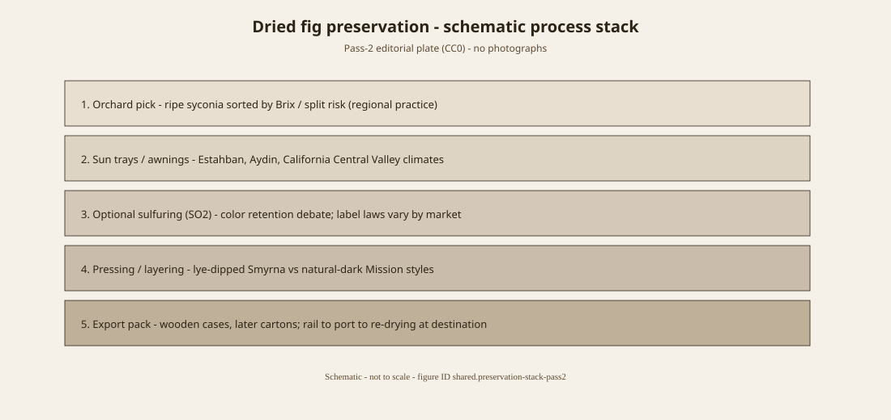

<!-- graphics-pass: 2 | source: articles/_staging/silk-road-dried-fig-economy/index.md -->
---
title: "A Fruit That Travels Dry"
slug: silk-road-dried-fig-economy
series: History of the Fig
series_no: 22
dek: "Dried figs moved as dense cargo beside dates and nuts. The arrows are reconstructed. The dryness is not."
mix: C
region: West and Central Asia
era: Medieval
status: staging
voice_check: human
author: FigRoots Editorial
canonical_site: figroots.com
wp_type: post
wp_status: draft
figures:
  - silk-road-dried-figs.route-map
  - silk-road-dried-figs.drying-flow
  - silk-road-dried-figs.variety-chart
  - shared.map-silk-road-figs
categories:
  - History of the Fig
tags:
  - Silk Road
  - dried figs
  - caravan
  - Fars
sources_key:
  - Iranica Fig
  - Laufer Sino-Iranica
  - Alam
---
# A Fruit That Travels Dry

A fresh fig is a week of work and a day of ruin. A dried fig is freight. That physics, not a romance of caravanserais, is why the fruit shows up on long roads. Dates travel farther and older. Nuts travel harder. Figs travel when a slope has a dry month and a person willing to turn fruit on a tray.

“Silk Road” in this pack is a teaching phrase for overland and combined sea–land corridors between the Mediterranean, Iran, Central Asia, and, thinner, China. It is not a single highway and not a single empire’s project. Dried figs do not need to reach Chang’an to matter. They need to reach the next city that will pay for a sweet that will not rot in a saddlebag.

## Iran as a hinge

Encyclopaedia Iranica’s “Fig” (Alam) is the hinge text: *anjīr* in Middle Persian (Bundahišn 16.26 — a fruit edible outside and inside), medieval geographers on Fārs and the Jibāl, later Estahban as a living rainfed district. Al-Muqaddasī, Ibn Ḥawqal, al-Masʿūdī, Ibn al-Balkhī notice fig country the way they notice other taxes. Strabo’s Hyrcanian yields, via Iranica, remain a topos. Use the geographers for reputation. Use GIAHS for living slopes, not for deep time.

<!-- figure-id: silk-road-dried-figs.route-map -->

*Figure 1. Overland caravan segments (solid) and maritime legs (dashed) for dried-fig traffic. Schematic.*

China’s *wúhuāguǒ* is a guest (extra article). Laufer’s *Sino-Iranica* hangs names on Iranian and Babylonian pegs. That is philology. It is not a packing list from Samarkand.

<!-- figure-id: silk-road-dried-figs.drying-flow -->

*Figure 2. Traditional sundrying and sorting flow (Aegean / Anatolian pattern as a teaching cousin). Schematic.*

<!-- figure-id: silk-road-dried-figs.variety-chart -->

*Figure 3. Qualitative index of representative cultivar roles — not production tonnage.*

<!-- figure-id: shared.map-silk-road-figs -->

*Figure 4. Regional staging view of the same corridor map.*

Do not invent a Tang imperial orchard you can walk. Do not print a caravan invoice that is not in a manual. Do not treat every dried fruit on a Chinese table as *F. carica*. The corridor’s honest sentence: dryness made a Mediterranean and Iranian tree portable, and portability made it a trade good wherever a clerk already had a word for it.

## Dryness as the only accurate romance

A saddlebag will forgive a date before it forgives a fresh fig. That is why the overland story is a dried-fruit story or it is nothing. Fārs and the Jibāl have reputations in the geographers. Estahban has slopes. Chang’an has a name-history. Do not draw a solid arrow through all three and call it a shipment.

## Portable because dry

Fresh figs ruin a saddlebag. Dates and nuts are the older long-road sweets. Figs travel when a slope has a dry month. Iranica’s Fārs and Jibāl notices are reputation. Estahban GIAHS is living slope. Laufer is philology. China is a guest with a seam of dates. No Tang orchard ticket. No forged Samarkand invoice. The corridor’s honest sentence is dryness, not silk.

## A fig on a caravan is a dried fig

Fresh figs do not survive a Pamir. Dried figs do. Every “Silk Road fig”
claim that does not specify the *state* of the fruit is selling a postcard.
The inland caravan trade — Persian *anjīr*, Transoxianan loads, the dried
fruit in a Kashgar or Bukhara inventory — is a trade in water already
removed. That is why Estahban and the Iranian plateau belong on this map more
than a Roman seaside orchard does.

The map in this pack (`shared.map-silk-road-figs`) is a schematic, not a
caravan diary. It marks the possibility of movement: Mediterranean ports,
Iranian plateau, the Tarim, the Chinese garden seam. It does not prove a
specific camel carried Sarılop. No such invoice is in the bibliography, and
this series will not invent one.

## What the documents actually say

Persian and Arabic geographers list figs among the fruits of named towns.
Al-Muqaddasī and Ibn Ḥawqal notice Fārs and the Jibāl the way they notice
other taxes — reputation, not a yield table. That is a production note, not
a bill of lading. Chinese *wúhuāguǒ* notices (see the East Asia essay) put
the tree in gardens by the Ming, with a Tang-or-earlier literary seam this
pack refuses to close. Between those two poles — Iranian orchards and Chinese
garden trees — the caravan is the plausible carrier of dried fruit and, more
rarely, of cuttings wrapped against desiccation. Cuttings are heavier to
prove. A living tree in a new town can also be a later Portuguese or British
introduction misremembered as ancient.

Laufer’s *Sino-Iranica* pages on fig names are a trail of sounds: Babylonian
*tittu*, Iranian *anjīr*, Chinese *a-ži*. Word-history is not a packing list.
A saddlebag will forgive a date before it forgives a fresh fig. That is why
the overland story is a dried-fruit story or it is nothing. Do not draw a
solid arrow through Fārs, the Tarim, and Chang’an and call it a shipment.

## How to read the map without lying

Use the Silk Road figure to show geography, then walk the reader to the
essays that have documents: Estahban and Iranica for the plateau, Ibn Sīnā
for the medical fig that traveled as text, *Flora of China* for the garden
seam, Morton for the 1550 date that is actually a date. The map is a table of
contents. It is not a primary source. Dryness is the only accurate romance.

## Word-history is not a camel

Laufer’s sounds — *tittu*, *anjīr*, *a-ži* — travel farther on a page than
a fresh fig travels on a saddle. A date will forgive a Pamir. A wet syconium
will not. Estahban and the Iranian plateau belong on the teaching map
because they make dryness. Chinese garden notices belong because a guest
tree acquired a name that saw the room. Between them the caravan is
plausible for dried fruit and harder for cuttings. A living tree in a new
town can also be a later Portuguese or British stick misremembered as Han.

Al-Muqaddasī’s town lists are production notes, not bills of lading. *Flora
of China*’s Tang and Morton’s 1550 remain a seam, not a shipment. The
schematic’s arrows fade for a reason. Do not draw a solid line through Fārs,
Kashgar, and Chang’an and call it an invoice. Use the map as a table of
contents: Iranica, Ibn Sīnā as text, the East Asia essay as the garden
seam. Dryness is the only accurate romance.

## A cutting is the harder proof

Dried fruit in a saddlebag is plausible. A living tree in a new town
is a later stick until a date says otherwise. Portuguese and British
introductions get misremembered as ancient because people like arrows.
Laufer’s sounds are not arrows. *Flora of China* and Morton remain a
seam. Estahban remains a slope. The schematic remains a table of
contents. Fade the eastern end on purpose.

## Sources for this piece

- Alam, “Fig,” *Encyclopaedia Iranica*.
- Laufer, *Sino-Iranica* (1919), pp. 410–12.
- Bundahišn 16.26 (Anklesaria) via Iranica.
- FAO / GIAHS Estahban file — living agronomy only.

See `BIBLIOGRAPHY.md`.

<!-- figure-id: silk-road-dried-fig-economy.preservation-stack-pass2 -->

*Figure (pass 2). Dried-fig preservation stack — editorial schematic (CC0). No AI imagery.*

*Rights: original SVG only; rasters elsewhere must match IMAGE_SOURCES.md (PD/CC).*
