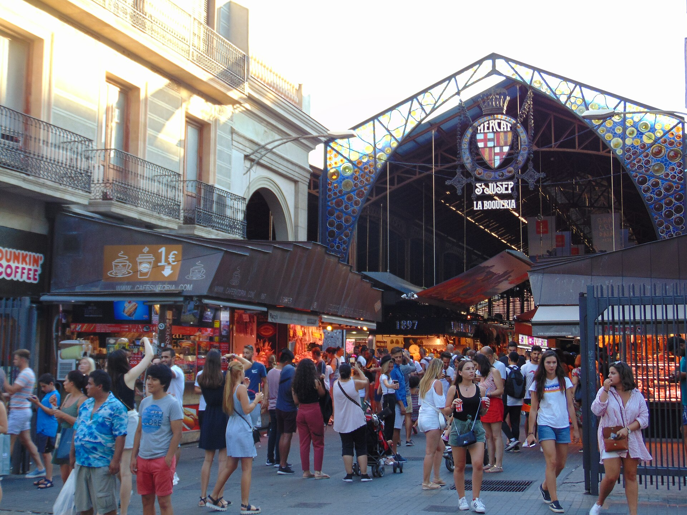

<!-- figure-id: fig-med-16.la-boqueria-barcelona -->
<figure>

<figcaption>Figure 1. Athens laiki August tables want open-air crates of fresh figs — this Barcelona market aisle is illustrative Mediterranean market furniture, not Varvakios Agora. Credit: See Commons file page. License: See Commons — see RIGHTS.md.</figcaption>
</figure>

A dried fig is a document. A fresh fig on a Tuesday *laiki* is a rumor that happens to be true.

Athens still runs the weekly street markets that make the city edible in a way supermarkets cannot fake. In August the fig woman — it is often a woman — has a corner that smells like a green wound. The fruit is stacked in shallow crates, leaves still attached if she likes you, a split one on top as a confession: this is what they look like inside, decide.

You do not squeeze. You look at the neck. You look at the eye. You take them home as if you had adopted something with a pulse. By night they will have started to sulk. By tomorrow they are jam if you were lucky and a mess if you were proud and left them in a bowl for the photograph.

This is a different market from Aydın’s drying economy, and it belongs in the same series because the Mediterranean eater lives in both clocks. The dried fig is the winter citizen. The *laiki* fig is the August guest. People who only write about the dried one miss the way a city eats when the islands send the first flats across on the night boat.

Evia’s names show up on cardboard signs, sometimes honestly. Kalamata’s do. Anonymous “figs” do, which means a peri-urban orchard and a man who drove before dawn. The PDO dried fruit of Kymi will not be on this stall. It is in a shop with air-conditioning, paired and proud. The *laiki* is for the fruit that refused to be a product long enough to reach you wet.

Bargaining is light. Everyone knows the clock. A seller who still has volume at noon will cut a price rather than eat her own inventory. A buyer who waits for that cut is playing a game the fruit may not survive. I have lost that game. The figs became a pan of something I called compote so I would not have to call it defeat.

Eat one in the street if the seller’s eyes allow it. Juice on a wrist is a kind of receipt. Then buy more than you need and call someone. A fresh fig is a social fruit. It does not want to be stored. It wants to be a reason.

If you are writing the *laiki* as a charm bracelet of “real Athens,” stop. Write the crate, the hour, the bus that will bruise what you bought. The dried PDO fruit can wait in a shop. This stall is a clock. Miss it and you will buy a lesser crate at a supermarket and call it the same week. It will not be.
