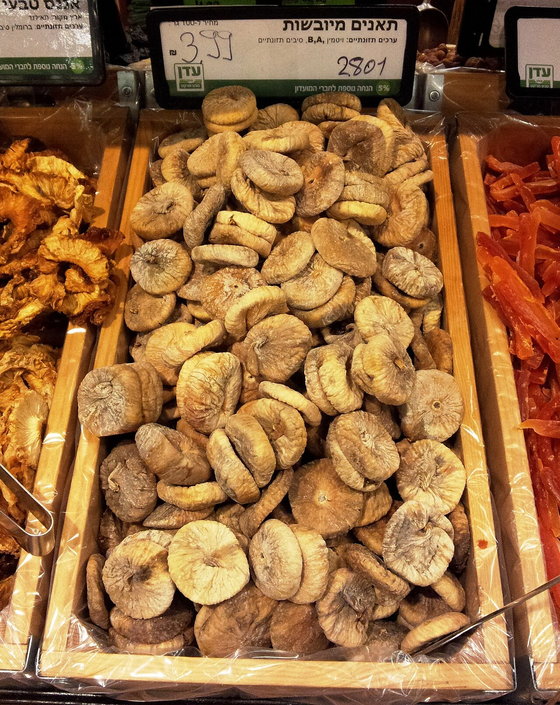

<!-- figure-id: fig-med-17.dreid-figs-string -->
<figure>

<figcaption>Figure 1. Ballarò first figs arrive as crates and calls — southern Italian dried fig handling stands in until a Palermo stall photo is cleared. Credit: See RIGHTS.md. License: See RIGHTS.md — see RIGHTS.md.</figcaption>
</figure>

In Palermo you must ask which fig.

*Fico* is the common fig, the one this series is about, green or purple, a bag that will stain. *Fico d’India* is the prickly pear, the immigrant that became a landscape, pads and thorns and a summer that belongs to a different essay. Sellers will shorten both. Tourists will photograph both. Your mouth will not confuse them if you are paying attention, and will if you are hungry and proud.

Ballarò in the early hour is a grammar of shouts. The fig stall, when the common fruit is in, is quieter than the fish and louder than the spices. The first figs of the season are a small scandal of price. People pay it anyway, because the first ones are a message: the year turned. Later the price falls and the fruit gets better, which is a market lesson nobody likes.

Sicily dries figs too, in the interior, in the places that still have the patience. Those are not what you are holding at Ballarò at eight in the morning. You are holding a breakfast that will not last the tram ride if you are clumsy. Eat over the paper. Give the stained paper back to the city; it has seen worse.

The Arab and Norman layers of the market get used as wallpaper in every article about Palermo. Fine; the wallpaper is real. What I want in the caption is the plastic crate and the wet leaf, the man who cuts one open with a knife that has cut a thousand, the older woman who will not buy from him because she knows his brother’s orchard is better and his brother is at Capo today. That is a market: not heritage, preference.

If you only have one morning, walk Ballarò and then walk away before the cruise people arrive with the wish to be delighted. Delight is a tax on a stall. Buy figs, buy a bun, stand in a shade that is not picturesque. The foodway here is urban and unsentimental. The island grows a fruit that cannot wait. The city invented a morning in which it does not have to.

Capo will tell you it is better. Ballarò will tell you Capo is theater. Both will sell you a fig that will not survive a museum visit. Eat before the mosaics. That is the correct order of a Palermo day.
