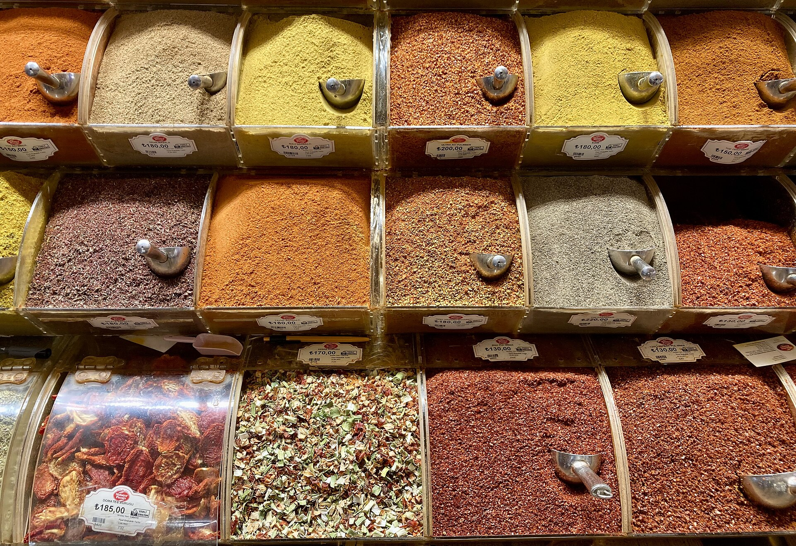

<!-- figure-id: fig-med-21.spice-bazaar-istanbul -->
<figure>

<figcaption>Figure 1. Fez and western Maghreb figs often reached Europe through Levantine ports — Istanbul spice-hall furniture illustrates that trade rim. Credit: See Commons file page. License: See Commons — see RIGHTS.md.</figcaption>
</figure>

The Mediterranean has a southern shore that does not ask permission of the tourist map.

Fez sells figs the way it sells everything that keeps: in a pile, in a cone of paper, in a quantity that assumes a household and not a hotel minibar. The fruit may be local, from the hills toward Meknès that still have old trees, or from a wetter pocket in the Rif, or from a crate that came farther than the seller will say. The eater is not doing terroir. The eater is doing February. A kilo is a serious sentence. A hundred grams is a tourist sentence.

Fresh figs exist here too, in their short week, eaten out of hand in a courtyard, cooked with meat in a pot that also understands prune and apricot and the patience of a lid. The dried ones are the citizens. They go into a tagine when a cook wants a sweet that is not a pour of sugar. They go onto a tray with tea when a guest has stayed long enough to be fed and not only poured for. They go into a pocket for a walk that will be longer than the walker’s pride, up a hill that the map calls a medina and the knees call a fact.

Writers from the north sometimes treat Maghrebi dried fruit as a spice-route prop, a cone in a photograph next to a lamp. It is a farm product. Morocco is not a footnote to Aydın; it is a producer the FAO tables have known for years, a country that can stand beside Egypt and Algeria in the fresh column and still keep a drying habit in the mountains where a plastic tunnel would look like a rumor. The medina stall is the end of that habit, not a decoration hung for you.

I watch the seller’s hand more than the architecture. The hand knows a soft one from a stiff one and will put the stiff one in your bag if you are only looking at the tiles. The architecture knows how to take your money for a photograph. Both are Fez. Only one will feed you after dark, when the lanes change their mind about you.

If you buy, buy for a kitchen, not a suitcase. Take them to a room and eat them with walnuts the way the tray intended, with tea that is too sweet because that is the other half of the grammar. Leave the “exotic” adjective at the gate. It is a fruit. It has been a fruit here longer than your adjective has been in print, and longer than the word Mediterranean has been a brand.
