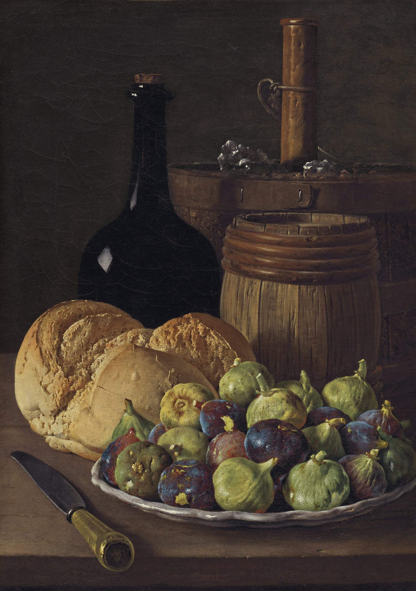

<!-- figure-id: fig-med-29.melendez-figs-bread-nga -->
<figure>

<figcaption>Figure 1. Wedding trays of sugared figs share the still-life grammar of bread and fruit — Meléndez pantry painting, not a live ceremony. Credit: Luis Meléndez, c. 1770; National Gallery of Art 111627. License: CC0 (NGA Open Access, as tagged on Commons) — see RIGHTS.md.</figcaption>
</figure>

A wedding tray is a market stall that has been told to behave.

Nuts in their shells or already broken so a dress will not suffer, baklava if the budget says so, lokum, dates, and the figs that will not embarrass anyone: intact, pale or dark on purpose, sometimes rolled in sugar until they look like a confectioner’s idea of a pebble. The sugar is a costume. Under it the fruit is the same winter citizen as always, the one that sat on a *kerevet* or a string and waited for a night with music.

Why figs? Because they keep on a warm night when cream would sulk. Because they can be eaten with one hand while the other holds a glass or a cousin. Because they photograph as abundance without the collapse of a cake in heat. Because a dried fruit says the house planned, which is what a wedding is pretending to be: a plan that held. Fresh figs at a wedding are a flex and a risk. I have seen the risk. It looks like a stain on a rented cloth and a bride who will remember the stain longer than the toast.

Anatolian halls will put the tray where the *henna* night can reach it. Levantine *zaffeh* tables will have their own height and their own insistence that you eat before you leave. Island engagements sometimes send a box of the local dried fruit as a marker, the way other places send sweets from a named bakery. The box is a map. If the fruit is Kymi’s paired *askades*, you know which slope. If it is a string from Samos, you know which aunt. If it is a supermarket bag with a ribbon, you know something else, and you will be polite, and the map will still be readable.

I am not going to invent a single “Mediterranean wedding fig ritual” and print it as anthropology. The region is a quarrel of rituals, of faiths, of budgets, of aunts. What repeats is the tray, the reach, the need for a sweet that does not melt and does not require a plate. Figs win that job in the places that grow them. In the places that do not, dates win, or sugar wins, or a pastry from a shop that delivered. The foodway is the winning, not a secret dance we can sell as “ancient.”

After the dancing, the leftover figs go home in napkins and in the fists of children who were not supposed to take that many. That is the honest end of feast food. The jewelry becomes Tuesday again, which is a compliment. A fruit that cannot become Tuesday was only a prop. Tuesday will eat it with tea and no music, and that is how you know the marriage of fruit and feast was real.
