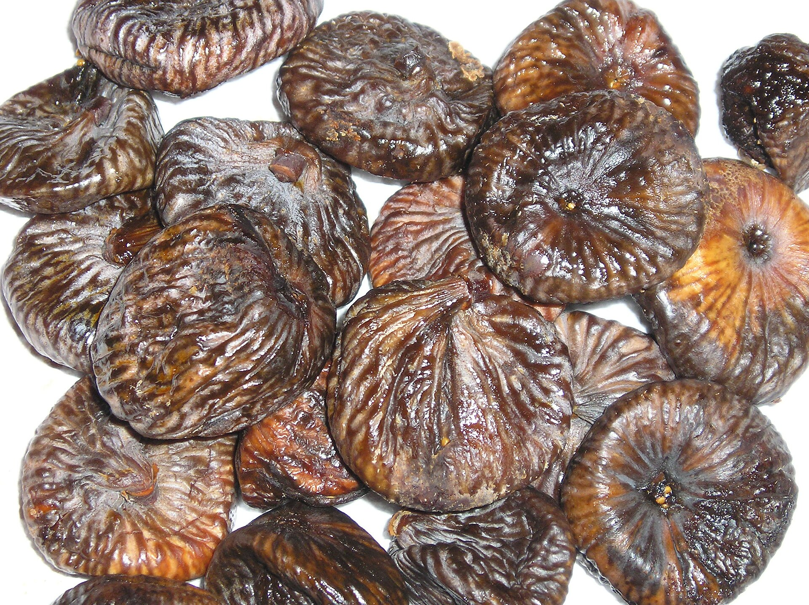

<!-- figure-id: fig-med-30.dried-figs-tray -->
<figure>

<figcaption>Figure 1. Orthodox dried-fruit bowls at fast-breaking want honest dried common fig — export-sorted tray as stand-in. Credit: See RIGHTS.md. License: See RIGHTS.md — see RIGHTS.md.</figcaption>
</figure>

There is a bowl that does not get a name in the cookbook because it is not a dish. It is a climate.

Dried figs, dried apricots, walnuts still in their shells or already broken, maybe a date, maybe a spoon sweet on a saucer for the people who want syrup and a spoon that is not the serving spoon. The bowl goes out when the house starts receiving — the day before if the house is anxious, the morning of if the house is proud. It stays out while people come back from church with cold hands and while people who did not go pretend they did by talking about the traffic. Children hunt the figs first because they are the most obviously a candy. Old men hunt the walnuts because they like a tool and a delay.

On some tables the dried fruit sits near the *vasilopita* or the other New Year breads, a sweet republic with a coin hiding in the loaf. On others it is the fasting-adjacent option, the thing you can eat when the house is keeping a rule and also keeping a guest who did not keep it. I will not adjudicate the rules. Parishes disagree; aunts disagree louder. I will say the fig is useful to a rule because it is already a food, already done. No oil to argue about in the fruit itself. The argument, if there is one, is about the company it keeps.

Cyprus will add its own glyka and a glass of water that is part of the law of the house. Antiochian tables will add pistachios that make the bowl look richer than the month. A Thessaloniki apartment may add nothing except a better fig than you expected, because someone has a cousin in Evia who still sends a box that looks like homework and tastes like August. The bowl is a system that accepts local amendments and rejects the idea of a plated “dessert course” as the only festivity.

What I like is the duration. A plated dessert is an event with a start. A bowl is a duration. You pass it. You forget it. You pass it again when the conversation has changed languages. The feast is long. The fig is patient. That pairing is older than the apartment and older than the radiator it sits on.

If you write this as “traditional Christmas figs,” add a year and a street. Tradition without an address is a catalog. A bowl on a radiator in a fifth-floor flat in January, next to a remote and a bill, is an address. Take the picture after someone has already stolen the best fig. That theft is the rite.
