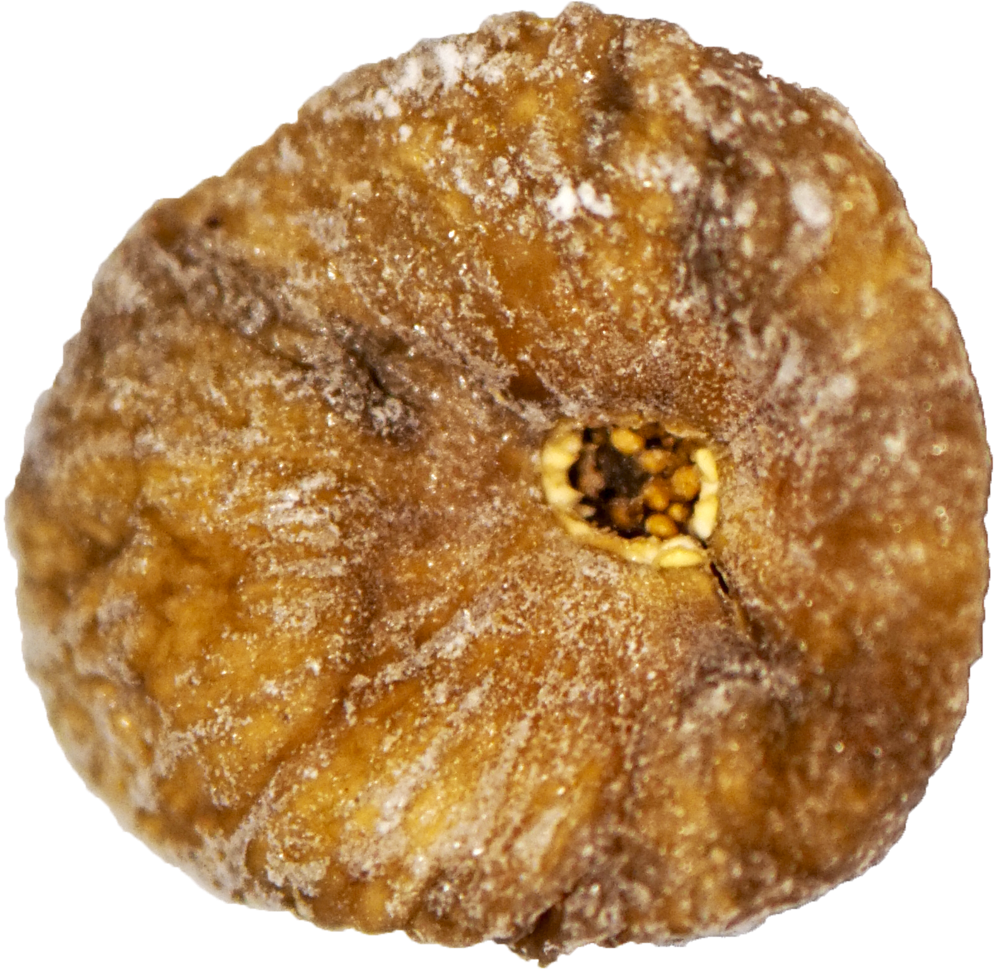

<!-- figure-id: fig-med-33.dried-fig-cut-tiia-monto -->
<figure>

<figcaption>Figure 1. Charoset with figs needs chopped dried common fig — halved fruit shows texture, not a medical benefit. Credit: Tiia Monto. License: CC BY-SA 4.0 — see RIGHTS.md.</figcaption>
</figure>

*Charoset* is a paste that has a job: to look like mortar and taste like a reason to stay at the table.

The famous versions lean on apple or date, wine, nut, spice. Fig versions exist wherever the cook’s memory is a hillside rather than a palm: chopped dried figs, wine, walnuts, a little something sharp — vinegar, lemon, a ginger that does not belong to the grocery jar. Italian Jewish kitchens, especially the ones that still talk about Rome and the south, have known a fig-heavy mix that reads as brown and serious. Some Sephardi tables fold fig in with date so the mortar has two browns and two chews. Some North African tables will not hear of it; the date is the mortar and the fig can stay on Tu Bishvat. Israeli grocery Seders will sell you a ready jar that may or may not have met a fig. The homemade ones have. You can tell by whether a seed stops a child’s spoon.

I like the fig in this dish because it is already a pressed history. *Develah* was a cake that traveled as a gift and a wage. *Charoset* is a cake that got a liturgy. You do not have to force the rhyme. You can just chop. The wine is the part that makes it a Seder and not a breakfast paste. Use one you would drink. The paste will tell on a wine that was only for cooking.

The Seder plate is a crowded neighborhood. The fig does not need a new symbol assigned by a magazine. It already sits among the seven species; it already has a winter new year. Here it is only a texture: sticky, seeded if you used the eastern fruit, a sweetness that can stand next to horseradish without apologizing. If your charoset is only sweet, you made dessert and the bitter herb will have to do all the work. If it has a grit and a wine and a nut that is not dust, you made the mortar.

There will be an argument about cinnamon. There is always an argument about cinnamon. Let the person who cooked last year win, unless last year was a jar.

Write the recipe if you must. Then write who taught it, and whether they used the good figs or the ones from the back of the cupboard. A Seder paste without a teacher is a blog. A Seder paste with an aunt — even an aunt who is tired and measuring with her hand — is a foodway. Pass it. Do not plate it. The mortar is for building the next bite, not for a photograph.
