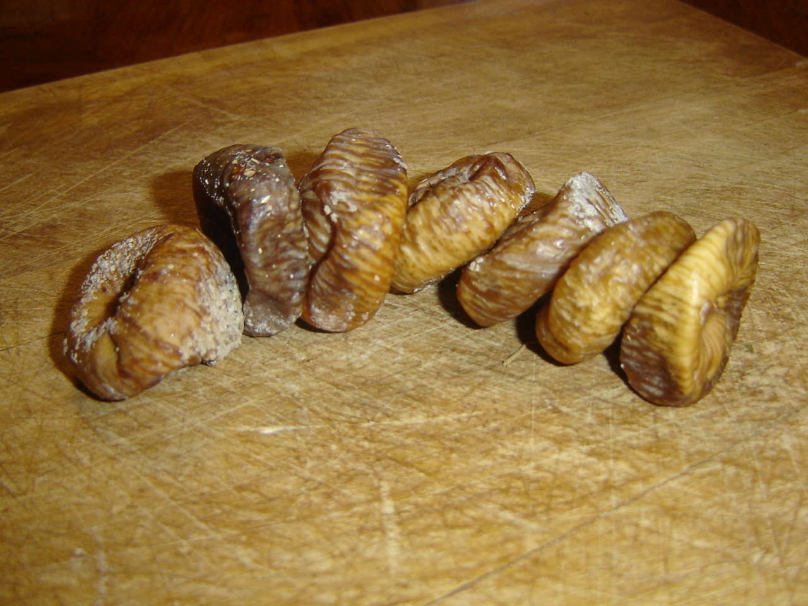

<!-- figure-id: fig-med-35.dried-figs-pd-still -->
<figure>

<figcaption>Figure 1. Málaga pan de higo presses dried common fig into a loaf — storage-grade fruit before the mold. Credit: See RIGHTS.md. License: See RIGHTS.md — see RIGHTS.md.</figcaption>
</figure>

The name is a tease. *Pan de higo* is not bread. It is what happens when a surplus of dried figs meets a mortar and a weight, and a household decides that leftover fruit will not be allowed to become a smell.

El Borge, in the Málaga hills, has the reputation the tourist office likes. Coín and a string of other Andalusian towns have the recipe and the argument that theirs is less sweet, or more anise, or more honest. Extremadura’s La Vera and pockets of Aragón and Catalonia have cousins that will not thank you for calling them Andalusian. The method is stable anyway: grind or pound the figs, add toasted almond — Marcona if you are showing off, ordinary if you are feeding a table — a weather of anise, cinnamon, clove, sometimes sesame, a splash of anisette. Press under a board and something heavy. Wait a day or two. The alcohol goes. The cake remains.

Al-Andalus gets named in the origin stories, the way it gets named for marzipan and *arrope* and a dozen sweets that like a nut. The naming is not empty. A pressed fruit cake is a reasonable object in a sugar-and-nut grammar the peninsula did not invent last century. Whether a specific village recipe is “Arab” is a fight for someone with more documents and less hunger. The eater can taste spice and oil-rich nut and a fig that was a *pajarero* — calabacita, the thin-skinned one — or whatever the orchard had the year the grandmother got tired of whole fruit.

Christmas still buys it, which is how a peasant cake learned a ribbon. Cheese shops still slice it beside Manchego or a sheep that has opinions. The pairing is not cute; it is salt teaching sugar manners. A glass of something dry helps. A glass of something sweet is a crowd that has already decided to be a crowd.

I like the versions that show the almonds like stones in a river, not the ones ground to a paste so smooth it could be sold as a bar with a number on the wrapper. The stones are the point. You chew a landscape. You find a clove and think, for a second, that you have found a mistake. You have found a year.

If you make it, press harder than you think. The weight is the cook. A loose *pan de higo* is a fig pile that will crumble in a bag. A tight one is a loaf you can travel with, which is how it earned the fake word *pan* in the first place. Take it to a table that also has cheese. Do not call it bread when you pass it. Call it what it is: the orchard, condensed, refusing to be only August.
