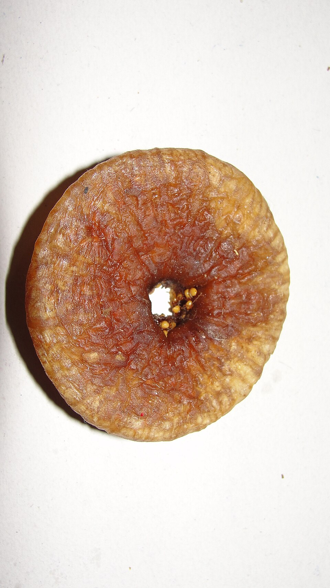

<!-- figure-id: fig-med-42.fig-syconium-closeup -->
<figure>

<figcaption>Figure 1. Cypriot spoon sweet starts from whole syconia in syrup — fresh common fig, not candied wellness. Credit: See RIGHTS.md. License: See RIGHTS.md — see RIGHTS.md.</figcaption>
</figure>

The ritual is older than your visit: a small plate, a spoon, a glass of cold water. The guest takes one sweet. Not three. The lid goes back. This is *glyko tou koutaliou*, and it is a test of whether you were raised or whether you will be forgiven for having been raised elsewhere.

Fig glyko is made with fruit that is still itself — often slightly underripe, so the shape holds and does not dissolve into a brown weather — simmered in a syrup that may carry lemon, a piece of vanilla, a leaf of rose geranium if the house is that house. The fig swells and shines. It looks preserved in the museum sense and tastes like a kitchen that has been hot since morning. A whole fig in syrup is a small animal. You meet its eye. You do not cut it on the hospitality plate; you manage it in two polite bites or you are a child.

Cyprus keeps the ritual with a stubbornness I admire. The tray comes out for the person who “just dropped by,” which is never just. The fig is a conversation pause. You eat, you drink the water, you talk about the heat or a cousin. The water is not a palate cleanser from a restaurant. It is how you do not choke on courtesy, and how the host knows you understood the offering. Refuse the sweet and you have refused more than sugar. Take four and you have refused manners.

Athenian cousins do the same ritual with a slightly faster lid, as if the city were in a hurry. Mountain villages on the island do it as if time were a guest too. Both are the same grammar.

Whole green walnuts, bergamot, baby eggplant: the other glyka get the essays because they look like a dare. The fig one is quieter and more perishable in the jar if the seal is lazy or the syrup was thin. A good jar is a year. A great jar is the one you open when the person who made it is in the room and can tell you which tree, which week, which mistake they will not repeat.

I will not give you a ratio. Ratios belong to people who did not grow up watching a pot. I will give you the lid. If the lid is sticky, the house is alive. If the lid is tourist-tight and the label is in three languages, you are in a shop, which is also fine, and a different sentence. Buy the shop jar if you must. Eat it at home with a glass of water, one spoon, as if someone had just sat down. That is how you steal the ritual without stealing the house.
