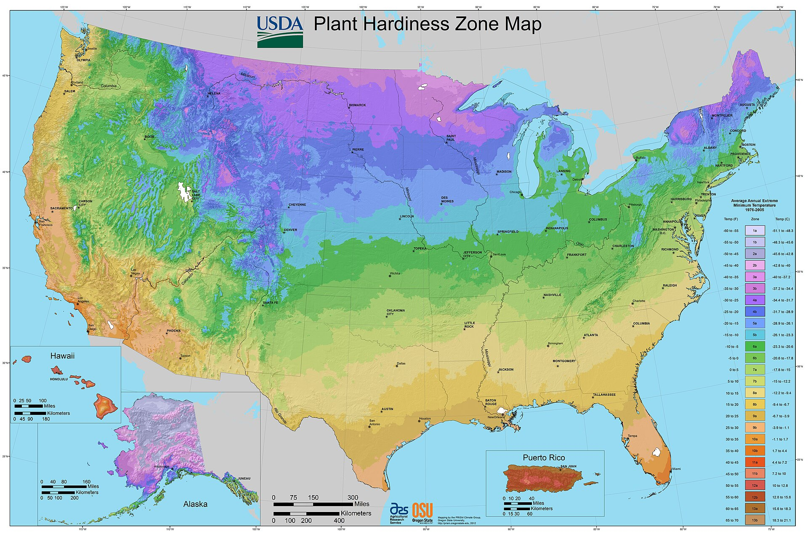

<!-- figure-id: d30.usda-phzm-2012 -->
<!-- orchard_slot: D:\FIGS\Greenhouse photos — hero still before publish -->
<figure>

<figcaption>Figure 1. 36–40°F is a reading, not a sticker — map bands remind you why a drawer thermometer beats a logo on the door. Historic plate — not our pack bench. Credit: USDA Agricultural Research Service. License: Public domain (U.S. government work) — see RIGHTS.md.</figcaption>
</figure>

36 to 40°F is a thermometer reading, not a sticker on the
door. I have believed a sticker. The sticker was optimistic.
The wood was waking in the back of the box like it had
heard March.

I put a cheap min-max in the actual air the bags sit in.
Not on the compressor. Not on the door. In the tote zone.
I look at it when I open the door, which is often during
ship week and should still be often during a hold week.
A cooler you never open is a rumor.

Too cold is ice. Frozen cuttings can look fine until they
thaw into a sock. I have watched a proud mailbox that rode
below freezing collapse at room temperature. Firm after a
thaw can still go in a cup. Mush is trash. The freezer is
not “extra dormant.” It is ice.

Too warm is a greenhouse that thinks it is a fridge. Buds
move. Bags sweat. Mold gets a head start. If the reading
is 48°F I do not shrug because “it is still winter
outside.” Outside is not the tote.

Crisper drawers on household fridges are a scatter. Some
run wet. Some run near freezing on the back wall. Jack
already said: crisper, not the freezer wall, and
**[VERIFY]** with a thermometer. Wholesale just means
more bags to lose if you skip that.

I write the reading on the cooler card a few times a week
in season. Not a science paper. A habit. If the min-max
says we kissed 30°F, I inspect for ice damage before I
ship. If it says we lived at 46°F, I inspect for movement
and I shorten the hold.

Do not pack a heat pack in a cooler. I have to write that
because I did something that stupid in my head once and
caught myself. Heat packs are a ship tool, and a bad one
if they kiss bark. They are not a thermostat.

Keith will unplug a failing unit before he will “just
keep using it this week.” A failing cooler is a ship
stop. We root what we can. We do not mail a week of
unknown temperatures as if the sticker still mattered.

If you cannot measure it, you are not holding dormant
wood. You are storing a wish at grocery-fridge weather.
Sometimes that works. I do not build a wholesale week
on sometimes.

I keep a second thermometer I do not trust yet next to
the one I do, for a week, when I buy a new unit. If they
disagree by more than a couple of degrees, I do not pick
the number I like. I pick the colder one until I know.
Picking the number I like is how wood wakes.

I write min and max on the card, not just “fine.” Fine
is a mood. 33–39 is a sentence I can ship on. 33–48 is
a sentence I inspect on. The card does not get to say
fine.

If I cannot see the thermometer without moving three totes, I moved the thermometer. Hidden readings are how 48°F lives in the back and 36°F lives on the door.
