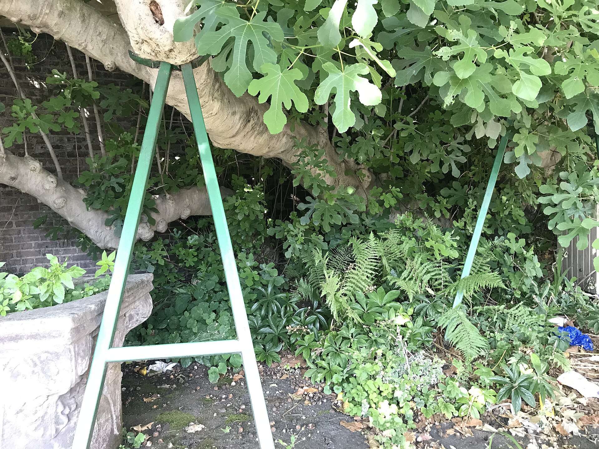

<!-- figure-id: d38.amwell-fig-tree -->
<!-- orchard_slot: D:\FIGS\FigRoots — hero still before publish -->
<figure>

<figcaption>Figure 1. Tracking is not care; the porch is care — a scanned label does not unwrap a box on the other bench. Historic plate — not our pack bench. Credit: Hopefully Acceptable Use (Wikimedia Commons). License: CC BY-SA 4.0 — see RIGHTS.md.</figcaption>
</figure>

Tracking is not care. The porch at 12°F is care. I can
send a number that moves across a map and still kill a
box at the last ten feet. I have done the map. I prefer
the ten feet.

We send the tracking when the box is actually in the
system, not when I taped it and felt finished. A taped
box in my truck is not a shipped box. A scanned box is
closer. I do not make a receiver take a day off for a
box that is still next to my boots.

I ask where the box will live when it arrives. A staffed
nursery, a garage that is not a freezer, a person who
will get an email. If the answer is “porch, we’re at
work, it’s fine,” I look at the week again. Fine is a
feeling. 12°F is a number.

Signature is a tool. It can save a freeze. It can also
bounce a box back into a truck that then sits. I do not
default signature on every three-cutting retail. I do
default a conversation on wholesale. The conversation
is: who will pick this up, and what is their weather.

Carriers lose boxes. Carriers crush boxes. Carriers are
not villains in a story about my bad pack. If I shipped
a rattle carton, the crush is mine. If they held a box
in a freezer warehouse over a weekend I chose, the
weekend is mine. I assign blame the way I assign grade:
to the person who could have stopped it.

I will not shout at a driver in a draft. I will shout
at my Friday. See the Friday draft.

Insurance declared value is a money tool. It does not
rehydrate mush. I use it on a heavy plant, not as a
personality on every stick. A claim still wants a
photo. The photo habit from pack-out meets the photo
habit from landing. Two photos, one week.

Keith answers the “where is my box” mail. I answer the
“how was it packed” mail. If we mix those, we write
novels. Novels do not warm a porch.

If you are the receiver, give the carrier a place that
is not a dare. A shop. A neighbor. A hold for pickup.
Then open it on a bench, not in a snowbank. The snowbank
is a third weather you did not budget.

Care is a location. Tracking is a story about a
location. Do not confuse them.

I do not text a tracking number from the shop stool
because I want the thread to look alive. Alive is the
scan. If I cannot scan today, I say `taped, not gone`
and I give a real day. People can plan a porch around
a real day. They cannot plan around my stool.

If the porch is a dare, I offer hold-for-pickup or a
delay. I do not offer a pep talk about how Priority
is fast. Fast to a dare is still a dare. The ten feet
are still the ten feet.

If tracking says delivered and the buyer is silent, I still do not assume care happened. I assume a porch. I ask. Asking is cheaper than a May surprise.
