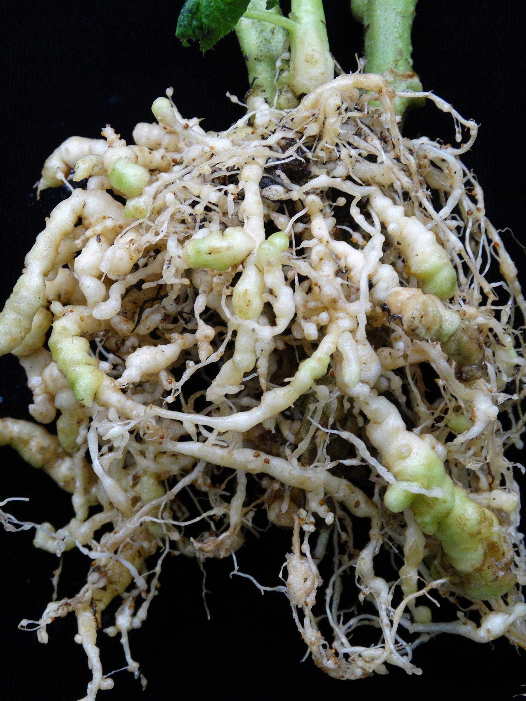

I have in-ground figs that are not clean. I also have names I will not put in that dirt. Those two facts can sit on the same place without a product in the middle.

<!-- orchard_slot: D:\FIGS\Figs — hero still before publish -->
<figure>

<figcaption>Figure 1. Galled roots on a living tree — management is cultural, not a single soil drench. PD/CC fill for staging. Replace with a Keith still from PHOTO_NOTES (`D:\FIGS` first) before publish. Full credits: RIGHTS.md.</figcaption>
</figure>

Once root-knot is in a hole, the honest project is **tolerance**, not a funeral for every worm. LSU AgCenter Pub. 1802 says keep plants in good health, fertilizer as needed, moisture around the roots. TAMU’s handbook, after the stale fumigant aside I will not copy, says the same grown-up thing: if they were there at the start, the fig will meet them, and a well-started root system lives with it better. UF/IFAS (Noling, ENY-055) says young plants take the hit hardest. That split — baby versus established — is the whole management plan I actually run.

I walked a keeper Celeste at 2 p.m. last August. The air had weight. The top had that slight sag you get when a tree is working damaged pipe and the sand has gone to oven. I put a finger in the mulch. Cooler than the bare patch I had left by the mower wheel. I ran water slow at the drip, not a spray on the leaves. I did not walk to the shed for a jug. There is no jug for this.

## The tree that gets to stay

An old Celeste or a Brown Turkey type that still leaves you jam in July can carry galls and not be a crisis. I do not knock that tree out of the ground for a photo. I do not solarize her. I do not ring her with marigolds like a charm.

I water for depth. In 8a sand that means a slow drink that gets below the dust, not a daily sprinkle that trains roots to live in the hottest, most occupied inch. In clay it means do not add a lake. A knotted root in a puddle is a rot story on top of a worm story.

University of Georgia’s fig circular (C 945) is mostly water, fertility, and spacing. That is not a nematode chapter. It is still the chapter a galled keeper can use. A tree that is already paying rent does better if you do not also starve it of a drink.

I mulch two to four inches and I keep it off the trunk. Pine straw, shredded leaves, bark — what I have. Bare sand in August is a skillet. Mulch is not a nematicide. It is a calmer room.

I do not pile nitrogen on a tired top hoping the leaf will forgive the root. A soil test talks fertilizer. A galled root talks uptake. I will feed an in-ground tool tree in spring the way I feed a healthy one, then stop using fertilizer as a personality. Figs in this climate do not want a lawn program.

I keep the weeds down because weeds are a cafeteria. I do not pretend a clean circle erased the population.

If that tree stops earning — three years of poor crop, a top that never comes back after a drought, a trunk that is also rotting — I retire it. I do not plant the replacement in the same spoonful.

Winter is part of the stay. We still see teens. A rust-stripped, galled tree that pushed a late October flush will take a March hit it did not need. I do not force that flush with a September fertilizer bump so I can feel like I “brought her back.” I let her shut up. I keep the mulch. I water if a dry winter wind is cooking the sand.

## The tree that does not get to stay in that hole

A rooted cutting with a name I care about is not a tool tree. It does not “toughen up” in infested sand. It stalls. It yellows. You decide it was a bad cutting. It was a bad room.

Those plants live in pots or in a bed I built with mix I trust. [Pick The Right Fig](https://figroots.com/2025/07/02/pick-the-right-fig-for-you/) already used the short sentence. I am using the long one: **the collection and the occupied hole are two properties.** They can be thirty feet apart. They are still two properties.

If I take a piece off an in-ground tree I suspect is galled, the wood can be clean of nematodes — they are a root tenant — but the *dirt on the stool* is not. I wash. I do not stick that wood in a tray of yard soil.

I learned that the cheap way. Overflow cuttings in a tray of “just a little garden dirt” because I ran out of mix on a Saturday. Half of them rooted. I knocked one in winter. Beads. The tray had been a hotel. The wood was not the villain.

## Fertilizer, micronutrients, and the hungry look

A nematode tree looks hungry. Chlorosis, small leaves, “mouse-ear” in UF’s wording on fruit crops. People reach for iron and a foliar cocktail. Sometimes the leaf greens for a week and you feel clever. The root is still a knot.

I will correct a real pH or a real deficiency if a test said so. I will not foliar-feed my way out of *Meloidogyne*. If the tree is a keeper, water and mulch do more than a mystery micronutrient blend from a catalog.

Virginia Tech’s backyard fig guide mentions nematodes without handing you a fertilizer spell. That is the right size of claim. I will match it.

## Containers are not magic. They are a fence.

A pot sitting on infested ground can still meet trouble if you set it in a saucer of yard dirt or you let roots escape through the drain hole into the sand. I have seen a “potted” fig become an in-ground fig through the bottom of a cheap plastic can.

Use a pot that does not explode into the soil. Raise it on a brick if you are paranoid. Do not refill that pot with the same yard dirt you just escaped. Mix is cheaper than a rare stick.

[Outdoor](https://figroots.com/outdoor/) is how we already talk pots and beds. I am only adding the fence rule: the pot is a fence if you keep the dirt on the two sides from becoming one dirt.

Pot culture has its own pests — winter scale in a warm shop, salt, a pot that cooks on black plastic in a 98° week. Those are different drafts. They are still better problems than donating a name to a necklace of galls.

## What living with it looks like in August

Noon wilt on a keeper tree: I check the water first, then the drainage, then I remember the roots may be working damaged pipe. I do not start a spray. There is no spray.

A keeper tree that strips from rust *and* sits on galled roots is having a bad year. That is a vigor pile-up, not a reason to invent a combo product. Rake the rust. Water the dirt. Leave the mosaic alone. Do not add drought.

A baby that does that in sand: I lift it when I can do it without cooking the plant, and I change the room. Cool morning. Shade cloth. Not a 2 p.m. autopsy on a black pot.

I will not tell you I eradicated anything. I will tell you which tree still paid rent, and which tree I moved.

## What I will not do for a “maybe”

I will not solarize a living keeper. I will not write a Vapam hole. I will not decorate the drip with marigolds and call it a program. I will not knock an old producer in July for a picture. I will not promise a count went down because the leaf looked better after rain.

**[VERIFY]** with your county if you want a number on a site you have not planted yet. Living with a tree you already have is a hose-and-mulch decision. Sampling a future hole is a different job.

## The split I will keep saying

Established and still feeding you: stay, water, mulch, no theater.

Young, rare, or already declining: new room or goodbye.

The aisle wants a third option that smells like a cure. I do not have one. I have a hose, a pile of straw, and a rule about who gets the hole.
