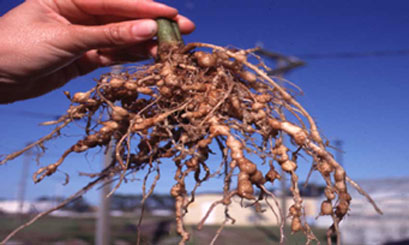

People retire a vegetable corner and feel virtuous. The tomatoes got blight. The okra got tired. The kids left. The spot still gets sun. A fig is “easy.” They plant the fig in the same dirt that fed three crops a year for a decade.

<!-- orchard_slot: D:\FIGS\Figs — hero still before publish -->
<figure>

<figcaption>Figure 1. Nematode galls — why old tomato and okra ground is a bad fig hole in zone 8a. PD/CC fill for staging. Replace with a Keith still from PHOTO_NOTES (`D:\FIGS` first) before publish. Full credits: RIGHTS.md.</figcaption>
</figure>

I pulled a tomato for a neighbor in July so he could see what he was about to donate a fig to. The vine came up easy. The feeders were a string of beads. He had never looked. He had tilled that row every March and called it clean. He left the cafeteria open.

LSU AgCenter’s 2025 fig disease note (Pub. 1802) is not poetry. It says choose a site where root-knot-susceptible plants such as **tomato, okra, or tobacco** have not been recently grown. That is a crop-history warning, not a vibe. *Meloidogyne* does not read your retirement announcement. The eggs are already in that hole.

I have watched this movie on 8a ground that “drains real good.” That phrase is sand. Sand plus a vegetable history is how a two-year fig looks like a six-year fig that never ate.

## Why those crops show up on the list

Tomatoes, okra, tobacco — and a long tail of other garden plants — are root-knot hotels. You can see galls on a pulled tomato in July if you bother to look. Most people do not look. They pull the vine, leave the roots, till the top, and call it clean.

Figs are not a cleansing crop. They are another host. UF/IFAS lists figs with the fruit crops that take root-knot hard, especially as young plants. You did not break a cycle. You handed the tenant a woody perennial with a deeper calendar.

Weeds keep the lease warm in the off months. A winter of henbit is not a fallow. I have walked that “retired” corner in February. Green lace on the dirt. Pretty. Not a rest. A summer of nutsedge is not a rest either.

Texas A&M’s handbook puts root-knot on the fig list and sandy ground in the same breath. NC State puts nematodes next to cold as a limit. None of them said “plant the fig where the garden used to be because the sun is already there.”

## What “recently” means when nobody sampled

LSU did not hand me a year count I trust as a law. “Recently” is the word they used. I treat a decade of garden as recent until a sample or a clean grass sod says otherwise. A year of weeds after tomatoes is still recent. A hole that was lawn for twenty years and never a garden is a different conversation — still not a promise, better odds.

**[VERIFY]** with your county whether they will run a nematode assay on a future fig site. If they will, that is worth more than my guess. If they will not, I default to pots for names I cannot replace, and I use the old garden for a tool tree I can lose.

I will not invent a “wait three years and it is fine” rule because a forum needed a number. I do not have that trial.

## The raised-bed version of the same mistake

Lumber does not launder soil. I have seen a pretty box filled with the same tomato horizon, plus a bag of potting mix on top like icing. The fig roots go down. The galls are downstairs.

If I use a retired garden as a fig site at all, the dirt I want in the root zone is not the dirt I scraped off the old row. Grass sod from a place that was grass. Mix I bought. A mound of something that did not just grow okra. Even then, I start a rare name in a pot so I can see the roots before I commit the hole.

A tiller is not a reset. Tillage without a sample is how you spread a population evenly across the corner you were about to call a fig orchard. I have watched a man proud of a smooth seedbed. He had made one hotel out of three.

## Tobacco is not only a field

Most backyard 8a growers are not coming off burley. LSU listed it because the crop is a host and Louisiana remembers fields. If your “fig site” is an old dip-spit fence line, I would not overthink tobacco. If your site is a century farm with a real tobacco memory, listen to the PDF.

Tomato and okra are the ones I see. Peppers. Sometimes beans. A crowded Southern garden is a nematode buffet with a fig planned as dessert.

## 8a weather on a retired row

That corner gets the same sticky August as the rest of the yard. It also gets the memory of how you watered vegetables: frequent, shallow, a hose in your hand at dusk. A fig in sand wants a deeper drink. A knotted fig in that sand wants it more. If you treat the retired garden like a tomato row — a little water every evening on the leaves — you are renting rust a night and still not reaching the pipe.

Winter does not cancel the lease. We get cold enough to kill a late flush. We do not get cold enough to pasteurize a hole.

## What I plant in a retired garden, if I plant anything

A Celeste I can get again. A Brown Turkey type that already lives here. Something I will not mourn if it stalls.

I water it like the roots might be damaged pipe. I mulch. I do not add the collection around it as a nursery row. Overflow cuttings stay in mix. [An Introduction to Figs](https://figroots.com/an-introduction-to-figs/) already told you not to root in mystery local soil. The retired garden is mystery soil with a known last name.

If that tool tree grows like a weed, good. Maybe the hole is kinder than I thought. I still will not donate a mailbox name to it on a feeling.

If that tool tree yellows and wilts with wet dirt, I lift a spare and look. Galls end the debate. No second fig in that spoonful.

[Pick The Right Fig](https://figroots.com/2025/07/02/pick-the-right-fig-for-you/) already said pots when nematodes are the room. I am saying the old garden is how a lot of 8a yards *get* that room.

## What I will not do with a neighbor’s offer

Neighbors offer you “the old garden, full sun, I’ll even till it.” I say thank you and I bring pots. I am not too proud for pots. I am too proud to spend a year on a stick that died of someone else’s tomatoes.

I will not till “to air it out” as a kindness. I will not fill a raised box with the same horizon. I will not write a marigold ring as a laundering. I will not fumigate the corner from a blog. Older TAMU Vapam talk is not a homeowner recipe, and it was never a living-tree recipe.

I will not call the dirt clean because the okra stalks are gone and the henbit looks like a cover crop.

## The polite no

Last year’s okra row is a memory. It is not a fig hole until something besides hope says so.
