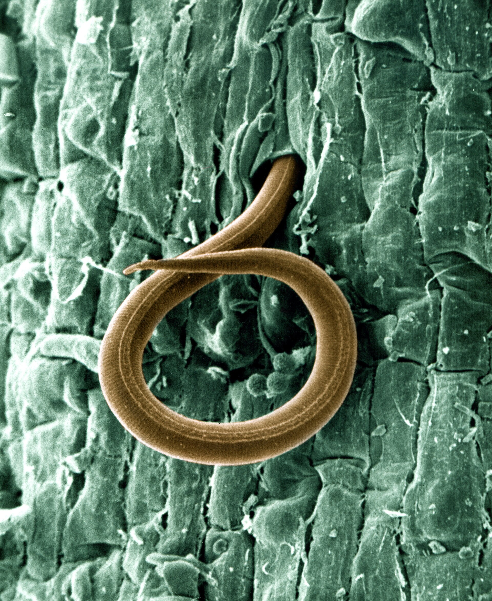

I can tell you when a root is a necklace. I cannot tell you the species count in the next thirty feet of sand from a cropped photo. Those are different jobs. The first is a grower job. The second is a clinic job. Facebook will do both for free and be wrong about the one that matters for a whole row.

<!-- orchard_slot: D:\FIGS\Greenhouse photos — hero still before publish -->
<figure>

<figcaption>Figure 1. Root-knot nematode on a root — what a county soil sample is actually looking for. PD/CC fill for staging. Replace with a Keith still from PHOTO_NOTES (`D:\FIGS` first) before publish. Full credits: RIGHTS.md.</figcaption>
</figure>

UF/IFAS is clear that root-knot galls are a visual. LSU AgCenter Pub. 1802 is clear that eggs sit in soil and juveniles enter roots. A group thread is clear about nothing except that somebody’s uncle used cinnamon.

If you are deciding whether to put a collection in a hole, I want a better witness than a stranger zooming in on your knuckle.

I have sat in a county parking lot with a plastic bag in a small cooler on a June afternoon. The truck cab was already an oven. Nematodes are animals. Heat cooks a count. The form on the clipboard asked for crop history. I wrote tomato and okra, not “lawn,” because lawn sounded cleaner and would have been a lie.

## What I will call from a pot in my hand

Galls on feeder roots. Not a thick healthy shank. Not a single odd swelling on old wood. A pattern of beads. A tired top that matches. That plant is occupied. Treat the dirt on that plant as dirty. Do not argue species in the comments. *Meloidogyne* is the working name. A lab can split *incognita* from *arenaria* from something else. Your next hour does not need that split to decide “this mix does not go on the clean bench.”

Noling’s Florida fruit-crop note (ENY-055) is the nursery version of the same call: look before the hole is open. Galled stock does not get a speech. It gets returned or trashed.

I will also call “I do not know” when the roots are brown and rotten and the plant sat in a lake. Rot eats the evidence. Wet feet and nematodes can share a corpse. The lake is still a reason not to replant in that dish.

## What I will not call from your phone

“How bad is my yard.”

A yard is a mosaic of holes. The tomato corner is not the fescue. The sand ridge is not the ditch. One galled pot tells you about that pot. It does not tell you about the east fence.

A yellow leaf tells you even less. Mosaic, rust, mites, fertilizer, wet feet — the leaf is a rumor. People post a leaf, the thread says nematodes, and somebody digs a healthy tree to confirm a story that started wrong.

Do not sacrifice a rare name to satisfy a thread.

I will not name a species from a thumb photo. I will not read a “resistant variety” off a listing. I will not bless a cinnamon drench because the comments liked it. I will not tell you the whole county is clean because your one pot looked fibrous.

The University of Arkansas plant clinic exists so you do not have to guess from a porch. UF, LSU, TAMU — same idea in other states. A dry paper towel, a few leaves, a bag of soil, a note about when it started and what grew there. That is a real ID. A cropped story is not.

## What a county sample is for

It is for a **site you have not planted yet**, or a site you are about to retire. It is for the question: is this hole a fig hole.

I am not going to invent your state’s bag color, fee, or form. Arkansas, Louisiana, Texas, Mississippi — the desks are not the same. **[VERIFY]** with the office you actually use:

- Do they still run plant-parasitic nematode assays for homeowners this year?
- How many cores, from what depth, from how wide an area?
- Do they want the soil moist, in a plastic bag, out of the dashboard?
- Do they want roots too, or only soil?
- How do they want the crop history written down?

If the answer is “we do not run that for homeowners anymore,” that is an answer. Then you fall back to pots for the names you cannot replace, and you treat old garden sand as guilty.

If the answer is a kit and a form, write the truth on the form. Tomato ten years. Okra. A fig that died. Do not write “lawn” because it sounds cleaner.

I will not paste another county’s instructions over yours. Desks change what they run. Dates move. That is what **[VERIFY]** is for.

## How people ruin a good sample

They take one scoop from the top inch next to the driveway.

They leave the bag in a hot truck. 8a June will do in twenty minutes what a bad lab cannot fix.

They mix five pretty corners and one ugly corner into a blender sample and call it science. Sometimes you want a composite of the future fig row. Sometimes you want the ugly corner named so you can avoid it. Decide which question you are asking.

They send a cup of potting mix and ask about the yard. Those are different dirt.

They want a product name on the results sheet. A good sheet gives you numbers and a host range, not a checkout aisle.

They sample after they already planted the rare name, then want the lab to undo the hole. The lab can name the room. It cannot unplant the stick.

## What I do with a number if I get one

I do not pretend I am a nematologist. I ask the agent to say it in grower English: plant figs here, or do not. If the answer is “high root-knot, sand, vegetable history,” the collection stays in pots. If the answer is “low, long-term grass,” I might put a tool tree in the ground and still pot the mailbox names for a year because I am stubborn.

A low count is not a lifetime warranty. You can import galls on a pretty nursery plant tomorrow. Look at the roots before the hole is open.

I will not invent a threshold number in this draft. Thresholds belong to the sheet and the person who reads it with you.

NC State’s stance on established infested plants still sits behind the sample: even a named count does not hand a homeowner a chemical reset. Pots. Site. Clean stock. Vigor. Not a weekend drench.

## 8a is why I bother

We have sand pockets and clay holes in the same county. We have old vegetable ground. We have enough summer to show a noon wilt and enough winter to punish a late flush. A Facebook ID flattens all of that into one leaf. A sample, if the desk still runs it, at least talks about the hole you are about to pay rent on.

I like a loupe. I like a knocked pot. I like knowing my own dirt. I also like not spending three years on a story a bag of soil could have shortened.

## The clinic is not an insult

Facebook will still be there at midnight with a cure. The county is there on a weekday with a form. I know which one I want writing my hole.
