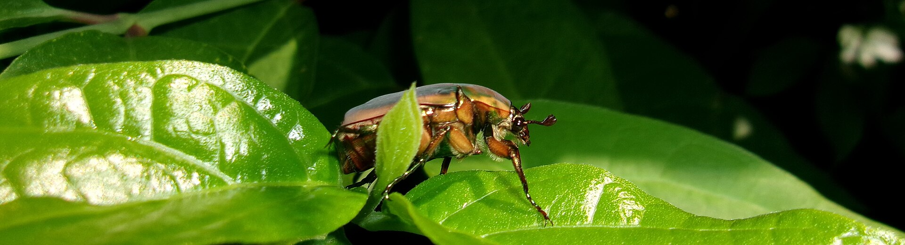

I kicked a fruit dump last March and the dirt moved. Not worms. Fat white grubs the size of a thumb joint, on their backs, working a mattress of last August’s figs I had “fed the soil” with. Zone **8a** South Arkansas will grow a compost pile whether you mean to or not. A two-inch rain in late summer, then heat that steams the drip line, then a necklace you were too tired to pick — that is a nursery with a street address.

<!-- orchard_slot: D:\FIGS\Outdoor — hero still before publish -->
<figure>

<figcaption>Figure 1. Green June beetle adult — compost and organic matter feed the grub cycle. PD/CC fill for staging. Replace with a Keith still from PHOTO_NOTES (`D:\FIGS` first) before publish. Full credits: RIGHTS.md.</figcaption>
</figure>

NC State said green June beetle females like moist organic soil for eggs. UC said fig-beetle larvae eat organic matter on the surface and that a dry, hard surface makes adult life harder. Those are different species and different states. The backyard rhyme is the same: **a wet, sweet pile under the fig is a nursery.**

I compost. I will not pretend I do not. I compost away from the drip line. I do not bury a necklace of sour figs against the trunk and call it feeding the tree.

## What I walked into

The pile was not a bin. It was a habit. Soft figs I did not want in the kitchen, a peach that split after a Gulf-ish storm, grass I dumped because the bag was heavy. All of it in the shade of a turkey that already had rust starting on the older leaves. The surface stayed wet for days after rain. You could smell sweetness and then a sour edge. That is chafer weather even when the county is “humid” on paper.

I turned a fork through it. The grubs were not mining the fig the way a root-knot nematode mines a fig. They were eating rot. They had a room I built.

People want to treat grubs as the fig pest because they can buy a grub product. The pest you eat around in July is the adult on the fruit. The grub is last year’s pile and last year’s lawn. A green June adult does not need my pile to exist. It can fly from the neighbor’s manure. Sanitation lowers the home team. It does not close the county.

## What the grubs are doing

Green June beetle, *Cotinis nitida*, is the loud Eastern / Southern animal I meet. NC State’s green June note is the one I keep: grubs in organic soil, crawl on their backs, push little turrets in turf. Adults chew fruit in midsummer. In some counties people call them fig-eaters. That common name is not a passport to import a California orchard PDF.

The Southwestern cousin — figeater, *Cotinis mutabilis*, handled as *C. texana* in UC’s fig chapter — is a detritivore larva first. UC wrote about a moist organic skin on the soil surface. Different dirt. Same temptation: a sweet wet blanket.

Japanese beetle grubs are a third story. Milky spore is a slow, incomplete, regional Japanese-beetle talk. It is not a fig-orchard fix, and it is not a green June program I will write onto a South Arkansas jam tree. I will not mash three beetles into one bag of “grub killer.”

I will not write a chlorantraniliprole calendar onto a fig root. I will not write a lawn product onto fruit I plan to eat. I will move the pile.

## What I will not leave under a tree

Whole rotten fruit. That is the loud one. A sour necklace is beetle bait on the branch and grub bait on the ground.

A wet blanket of grass clippings that stays anaerobic and sweet. Fresh clippings in our August will cook and then stay wet in the shade. That is not mulch. That is a mattress.

Kitchen scraps in an open bucket by the trunk. I have done the lazy version. Ants clock in. Then the bigger mouths.

A “sheet compost” of sour figs because the kitchen was tired. If the pile is not a real pile — turned, hot, away from the canopy — it is a dump.

Mulch is allowed. Mulch is dry-ish, off the trunk, not a fruit dump. Pine straw is not a necklace. A thin chip layer I can still rake through is not a compost skin. I want to see dirt when I kick. I do not want a humid fruit cake.

## UC’s harden-and-dry sentence

In a California orchard they talked about letting the soil surface dry and harden to hold adults, and about flood irrigation killing young larvae that cannot sit in a lake. I grow in 8a clay and sand, not a Fresno schedule. I will not flood a fig to drown a grub and then write a root-rot chapter as a surprise.

Clay that already holds a lake after a two-inch rain does not need my help becoming a swamp. Sand that never holds a drink does not need me to strip every chip in a 98° week so the roots cook for a theory.

I will let a bare path stay bare if I am fighting a surface-larva story I have actually seen. I will not strip mulch off a sand hill in August.

Translate, do not copy. Their sentence is: do not keep the surface a moist compost skin if that is the insect you have. My sentence is: do not keep a compost skin *under the fig*.

## Where the pile lives on this place

I want compost I can turn without walking under fruit. Downwind of the kitchen. Not in the lowest clay hole. Not against a pot block. A bin with sides beats an open sweet mound in a wet year. Temperature and turning are a compost chapter. They are not a fig spray.

If you want a hotter pile so the fruit cooks, run it like compost. Layer. Turn. Keep it off the drip line. A pile that never heats and always smells like a brewery is a beetle letter.

I still put fig leaves that rusted in a bag, not in that pile against the trunk. Rust sanitation and chafer sanitation can share a walk. They do not share a “feed the soil” speech.

Peaches, tomatoes, and melon rinds in the same garden do not read crop labels. UC’s sour-rot chapter said remove fallen and overripe fruit of any kind. That sentence helps the adult taxi and the grub room at the same time.

## Chickens and the pile

Chickens will work a pile and eat grubs. They will also eat every fig they can reach and scratch a crater against a trunk. I like chickens. I do not list them as a chafer program on a tree I have not fenced. A hen under a ripe turkey is a harvest tax, not IPM.

If the flock already has a run, put the compost where they can work it *there*. Do not invent a free-range fig cure.

## The adult still has wings

A clean drip line will not stop a green June that flew from the neighbor’s manure. July in 8a is loud fruit week. The beetles show up when the neck drops. I still pick. I still handpick what I can reach. I still take the necklace off so sap beetles do not clock in behind the big mouths.

Bird pecks, mammal grabs, and sap-beetle holes are different doors. A mockingbird leaves a triangular punch. A squirrel wastes green fruit on the ground. A raccoon shops at night and takes a lot. The little nitidulids walk into an open eye and bring yeast. The chafer is the clumsy green one on a ripe shoulder. Do not write one “bug spray” for all four. The pile is only the grub vote.

A frame of bird netting can keep some of the big fliers off a crop tree. It will not keep a 3-millimeter sap beetle off if the mesh is bird mesh. It will not forgive a fruit dump at the skirt. Check the net daily if you use one. Wildlife in a fold is your problem. That is the netting draft. This draft is the dirt under it.

## What I will not write

I will not write milky spore onto a chafer that may not even be Japanese beetle.

I will not write a weekend drench that “clears grubs naturally.” Cinnamon and dish soap are Facebook, not a fig program.

I will not write poison for wildlife that also like the pile. No peanut stories. No glue.

I will not blame mosaic for a grub I invited.

I will not flood clay.

## Next July

If this July was loud, look at where you left sweetness last August. I have met that person in the mirror. The necklace I did not pick is a letter I write to next year’s beetle. I can throw the letter away. I cannot spray it unwritten.

Walk the drip line after the first heavy rain week. Kick the chips. If the fork finds a mattress of fruit skins, move it. If the lawn next to the fig is pushing turrets, that is a turf conversation with the county, not a reason to fog ripe fruit.

The pile is one vote. It is a vote I can cast without a jug. Compost. Just not there.
