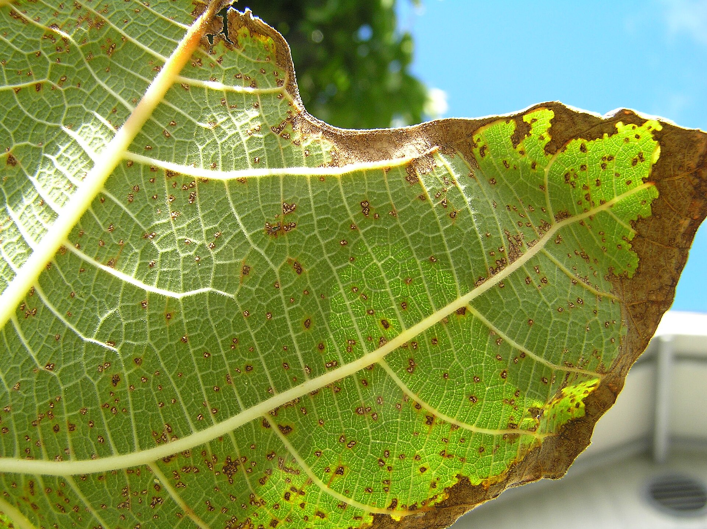

A rust year ends in a pile you can still pick up in January. I have stepped over that pile because I was tired. Then May arrived and I acted surprised.

<!-- orchard_slot: D:\FIGS\Figs — hero still before publish -->
<figure>

<figcaption>Figure 1. Rusty fig leaves — winter sanitation is next year's rust program. PD/CC fill for staging. Replace with a Keith still from PHOTO_NOTES (`D:\FIGS` first) before publish. Full credits: RIGHTS.md.</figcaption>
</figure>

The tree stripped in August. I meant to bag the skirt. A rain flattened it into the grass. October threw a second spring. I cheered like a person who had not read the clinic note. January took the soft wood. March handed me a longer saw walk. The leaves I skipped were still in the crown, under the grass, in the pot saucers. LSU said that is next year’s starting lineup. I had voted for it with my feet.

LSU: spores on fallen leaves. Do not compost them into the drip. UAEX: a late flush can take cold. Those two sentences are the winter program after rust. Rake what is left. Do not feed a second spring. Protect wood if the forecast is stupid. Do not build a plastic lodge.

This is not a cure. The leaf that already dropped is not coming back. This is a smaller starting lineup for the next August, and a harder wood for the next teen night.

## The last rake

Fig leaves that rust-stripped in August are brittle by Thanksgiving. They still count. *Cerotelium fici* — older papers say *Physopella fici* — spends the off season on what you left. Wind and rain put it back to work. I pull them off the crown and out of the pot saucers. I do not till them. Tillage is burial. Burial is not sanitation.

I do not need the lawn perfect. Grass can grow through a rust quilt and hide it. I still want the fig leaves out. A tarp and a bag I will not open against the trunk. LSU said collect and destroy. I will compost a lot of things. I will not build next year’s inoculum on purpose.

Mummies and sour rags are beetle hotels. They come off even if I have to wait for a freeze to drop them. They are not rust. They are still porches for TAMU’s limb-blight talk and for sap beetles that will find June without my help. One walk. Two buckets.

Pots on gravel hold a humidistat of old leaves. I pick the saucers. I pick the gravel. I do not wash that grit into the in-ground drip and call it a rinse.

I do not obsess over the neighbor’s ditch. I obsess over the drip line I control.

If I missed the first heavy drop, January is not too late. It is later than I wanted. It is still cheaper than a jug I will not write.

## Wood, not leaves

I wait to saw. Live or dead is a spring truth. A fig in February will lie to you. Buds sit. Bark looks tired. A stool you wrote off will push from the base. January mood pruning is how you cut sleeping wood or leave a wet stub for the next freeze.

I take what I already know is a mummy twig. I take a strap that broke in a storm. I do not sculpt a silhouette for a Christmas card.

If October flushed, I do not wrap that flush like a gift. UAEX warned that rust defoliation can push tender foliage into winter. Zone **8a** still sees teens. That wood is a bill. Breathable wrap if I wrap at all — the other pack already wrote Arkansas winter. Plastic sweats. Sweat plus a wound is a fungus porch. I will not build a sweat lodge and then act shocked at a canker.

I do not fertilize in October or November “to help them recover.” Recovery is lignified wood and a quiet top. Lawn food is a tender tip. The late-flush draft already said that. A rust year needs that sentence more, not less.

Mulch after the soil cools, off the trunk. Two to four inches of what I have. A volcano is how you hide a collar problem and invite rot. Armillaria is a different funeral. Ordinary wet collar is enough. I want to see the flare.

Pots move. In-ground wood does not. I do not pretend a sheet and a prayer is a pot.

## Shop door

Pots that come inside get a bump look. Scale you carry in is a January farm. Spider mites in a dry warm room are a February farm. I would rather trash a crusted cheap plant than oil a jungle in February.

I do not carry a gravel of yard dirt into the shop “for weight.” That is nematode and fungus taxi service. [An Introduction to Figs](https://figroots.com/an-introduction-to-figs/) already said do not root in mystery dirt. Do not import it into the room either.

I do not oil a heat-stressed leaf because I am bored in January. I do not write a mosaic worry because the paint is quiet. Leave it.

Saucers that held a rain week still get dumped. A shop swamp is not a drought. The irrigation draft owns the hose. This page owns the door.

A collection is not an excuse to skip the look. Two hundred pots is two hundred chances to gift the room a farm. The kids-and-dogs page said I will not fog a property because I have a lot of labels. The winter look is the other half of that sentence.

## What I will not do in January

A dormant copper as a personality unless a label and a reason exist. Most rust programs that even mention copper wanted May — UAEX: first leaves full size, then three to four weeks. That is not a January fog on bare wood because I feel behind.

LSU Pub. 1802 in 2025 said no fungicides labeled for figs in Louisiana. A rust year does not print a new label. **[VERIFY]** your own paper if you even have a legal use. The rake still comes first.

A bleach walk. A lime dust. A sulfur bomb. Those are how you write a different problem.

A mosaic protocol. The paint is quiet. There is no kitchen heat-therapy. UC IPM already closed that door.

A nematode drench because I read a forum in the dark. Cinnamon, molasses, dish soap, a weekend jug — this pack will not write them. Established galled trees do not get a homeowner chemical reset from this site.

A plastic wrap on a late flush. A tar paint on every cut I have not even made yet.

A January funeral for a multi-stool bush that has not shown green. Wait. Then cut. Then decide if the hole still earns. The pull draft is for a bucket you can name. Brown tips after a rust year are often weather, not a grave.

## The point of the winter walk

You are buying next August a smaller starting lineup. You are buying March a tree that hardened. You are buying the shop a cleaner room. None of that is a cure. All of it is cheaper than a jug and more honest than a resolution.

8a winter is short enough that people skip it. We get a freeze, then a shirt-sleeve week, then a surprise. Rust years are the years you should not skip. The pile will wait. It will also start without you.

I put the walk on a day I can feel my fingers. I take a bag, a rake, a look at the collars, a look at the pot wood. I do not take a backpack sprayer. I do not take a speech about eradicate.

If I find a limb that wilted from a point and stayed wilted, I wait for green and I cut below. If I find a tree that died standing last summer and I never scraped the collar, I scrape it before I plant hope in the hole. If I find last year’s okra sand still sitting empty, I do not give it a rare name in March because I am optimistic.

[Pick The Right Fig](https://figroots.com/2025/07/02/pick-the-right-fig-for-you/) already told you pots, tight eyes, green fruit. Winter after rust is how those sentences survive a loud year. The rake is still the rust program. The saw is still the wood program. The shop door is still the scale program. January is allowed to be all three. It is not allowed to be a bottle I invented because I was ashamed of the pile.
