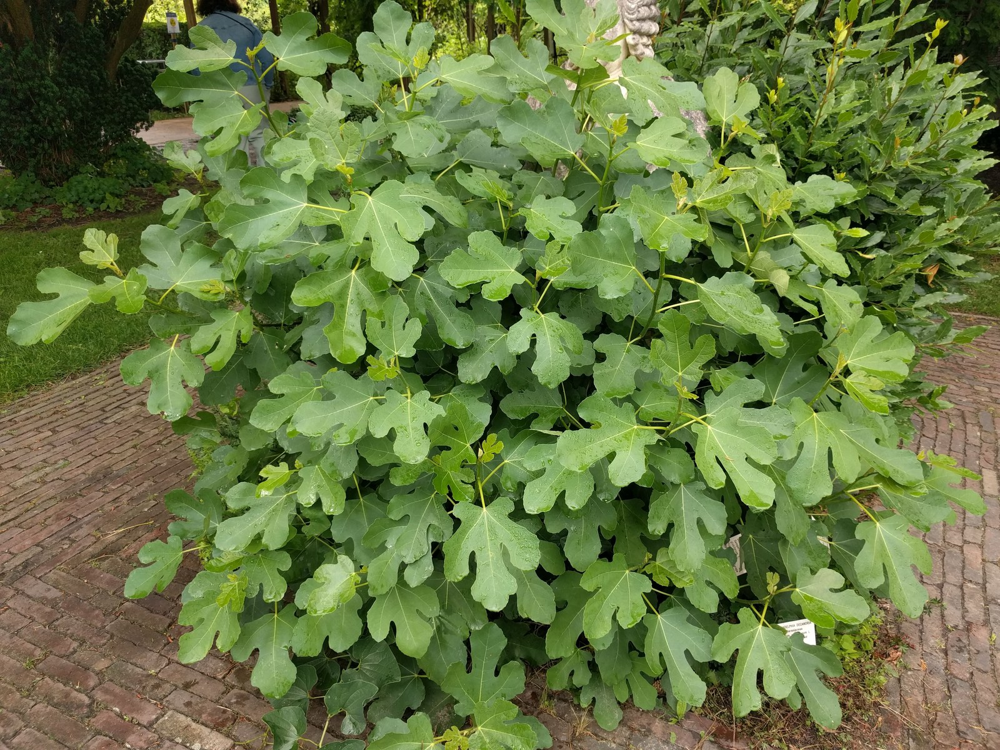

<!-- hero: stand-in until D:\FIGS pick -->
<figure class="fig-hero fig-stand-in" id="hero-green-fig-cuttings-root-now" itemscope itemtype="https://schema.org/ImageObject">
  
  <figcaption>
    Soft or cooked green wood. Do not file it. If the folder is only dormant sticks, grab a summer flush from Figs-summer-23. This is a Wikimedia Commons stand-in—not our tree, not our bench. License: CC BY-SA 4.0.
    Wikimedia Commons — Hortus botanicus Leiden; not our tree. <a href="https://commons.wikimedia.org/wiki/File%3A20210731_Hortus_botanicus_Leiden_-_Ficus_carica.jpg" rel="license noopener" itemprop="license">Source</a>.
  </figcaption>
</figure>

Green wood is a Tuesday problem. It is not a February problem you get to postpone.

If the bark is green, the tree was growing when someone cut it. The stick is still a leaf factory without a leaf. It is using water it cannot replace. Every hour in a hot mailbox or a sealed wet bag is a vote for slime.

I will root green wood. I will not store it. The fridge is for dormant lignified sticks, double-bagged, ideally parafilmed if they have to sit a long time. Green wood in the crisper is how you invent a science-fair smell.

What I do instead: wash, recut, stick the same day. Coir that is damp, not wet. A 1–2 inch gap under the base so the wound is not in a puddle. Low light. If I use a mat, it has a thermostat and the probe is in the mix, about **75–78°F**. I do not give green wood a south window on day one. It will leaf, then fold.

Water jars are the party trick people reach for with green wood because they can see something happen. I have done it. I do not build a tray on it. A jar grows water roots that hate mix. If the wood is rare and already soft, a jar can tell you it is alive. Then you still have to pot it, gently, before 8a heat arrives.

Strip most of the leaf. A green cutting with a full sail is a wick. Leave a stub if you want a little photosynthesis. Do not leave a dinner plate.

8a summer green wood has a second clock: pot-up. A pop that roots in June still has to face July in a tiny bag. That is why outdoor bulk starts — yard dirt, shade, wood we can replace — exist. Named wood stays in a cup I can watch. Replaceable wood can go in a bed. Do not mix those two piles because you ran out of bags.

Zone 9 can get away with green wood later in the year because November is still a growing month. Zone 7 cannot. 8a is closer to 9 in September than people admit, and closer to 7 in a polar-vortex January. If you take green wood after Labor Day here, you are betting the fall stays open. Some years it does. I would not bet a name we only have one of.

Cooked green wood from a truck looks wrinkled and feels light. A soak can help if the cambium is still cream. Then dry the bark and stick. If it is translucent or smells like a compost pile, it is done. Do not “cut above the rot” into a one-node leftover and call it a save unless that node is the last of the name.

If a cane snaps while I am already watering, that stick is a Tuesday job at the hose. Wash, strip the sail, recut, stick the same hour in coir I have squeezed and cut with about 30% dry. I do not walk it into the shop and leave it on the bench while I fertigate the #3s. That bench is warm. That bag will slime. The hose is right there. Use it, then use the cups.

I already cooked a bundle the truck way without a truck. Green wood in a sandwich bag on a South Arkansas dashboard while I ran one more errand. Translucent by supper. A soak does not fix cooked. That was not wilt. That was heat. Shop glass will do the same thing to a wet bag you set in the sun stripe at noon.

A late green start here still has to live in the shop through the dimmer. I only take that wood if I have bench space and a cup I can watch. I do not stick a mailbox name in July clay and hope August is kind. Replaceable extras can go in a shaded bed I can reach with the hose twice a week if the clay is not a puddle. Zone 9 can leave a late start outside into November. Zone 7 cannot start that clock at all. 8a is the shop-or-nothing months after the first freeze.

The cuttings post already said it: non-lignified wood does not store and rots the fastest. I am repeating it because the inbox does not read. Green is a now problem. Treat it like milk, not like firewood.
