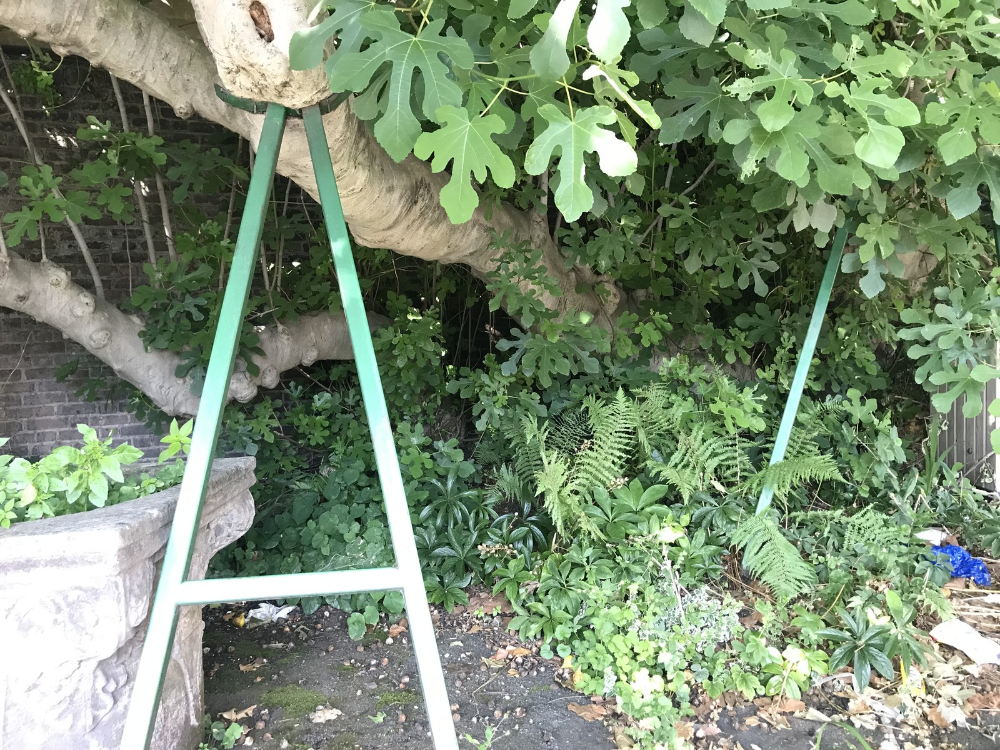

<!-- hero: stand-in until D:\FIGS pick -->
<figure class="fig-hero fig-stand-in" id="hero-which-fig-cane-to-cut" itemscope itemtype="https://schema.org/ImageObject">
  
  <figcaption>
    Last year’s wood with a swell. Do not strip every breba cane for a tray. This is a Wikimedia Commons stand-in—not our tree, not our bench. License: CC BY-SA 4.0.
    Wikimedia Commons — Amwell Fig canopy; not our tree. <a href="https://commons.wikimedia.org/wiki/File%3AAmwell_Fig_%281%29.jpg" rel="license noopener" itemprop="license">Source</a>.
  </figcaption>
</figure>

A fig is not a pile of free sticks. Some wood is this year’s fruit. Some wood is next year’s breba. Some wood is the stool you will need after a bad night.

I take 1-year wood that is pencil-thick to a little thicker, lignified, from a cane I was going to shorten anyway. LSU likes ½ to ¾ inch and 6–10 inches. That is a nursery stick. Our industry floor is thinner than that on purpose because pops and cups work on pencil wood. I will take the thicker piece for an outdoor bed. I will not take a three-year trunk slab and call it a cutting.

Where on the tree matters. Tips of a long summer cane can be still green at the end and brown at the base. Cut the brown. Leave the whip if you need the tree to keep a leader. Interior wood that never saw sun is often weak and shaded-out. It roots like weak wood — sometimes, slowly, then it sulks.

Breba wood is last year’s growth. If you strip every last-year cane in December, you stripped the breba crop. For a Celeste-type that is mostly main crop, I care less. For a tree we keep because it gives an early plate, I leave wood. The prune-for-cuttings draft is a different argument. This one is simpler: do not steal the meal to make a tray of maybes.

Suckers from the crown are fair game if the variety is true on its own roots. Most of our commons are. A sucker is already a plant with a head start if you wait and dig it. As a cutting, it is just wood. I would rather dig a rooted sucker in late winter than cut ten sucker tips in June.

Diseased wood is not a bargain. Rusty leaves can stay on a cane you still use if the wood itself is firm. Canker, split bark, and a node that is already mush — skip it. You are not being generous to the tray. You are inoculating it.

8a winter dieback changes the map. After a 12°F night, the pretty tips may be brown inside. Scratch before you bag. Come down the cane until the cambium is cream. That lower wood is often the best cutting on the plant that year, and it is the wood people skip because it looks boring.

I do not cut the only nice cane on a first-year stick we just potted. That plant has not earned a donation. Take wood from a plant that has extra, or do not take it.

Zone 7 growers sometimes cut harder because the top is going to die anyway. Zone 9 growers can be greedy because the tree replaces wood in a month. We are in the middle. A hard prune in 8a February is often correct for shape. A hard prune of every fruiting cane so you can mail a group buy is how you eat fewer figs in July.

I walk the stools with the hose still in my hand after a Saturday water. Wet clay shows you which crowns are pushing suckers. Those shoots are next year’s wood if I leave them, or this year’s cuttings if I already have a spare #3 behind the shop. I do not cut the only east-side cane that actually sees 6–8 hours. UAEX has been saying sun and an east wall for years. I try not to steal the wall.

I already stripped a first-year in-ground Celeste for a trade. The plant was still a pot-shaped ball learning the clay. Next July we ate nothing and the stool sulked no matter how long I stood there with the hose. Two cuttings from wood I was shortening would have been plenty. Ten cuttings was a raid. The trade got sticks. We got a tag on a bush that had not earned a donation.

I flag the keepers before I open the pruners. Paint pen or a strip of tape on last-year wood I want for an early plate, and on the low stool I want after a bad night. Then I cut. If I sort after the tarp is full, I have already taken the meal. On wet clay I have walked past a flagged cane and still cut it because I was counting sticks for a trade. The flag is only useful if I honor it. Common figs on their own roots. A first-year hole in this clay is still a pot you cannot pick up — I do not harvest that plant.

Steal from abundance. Leave the tree a job. If you cannot tell which cane is which, do not cut until you can. The stick will wait a week. The breba will not grow back in May.
