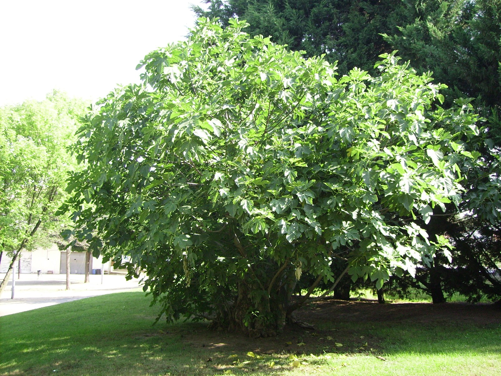

<!-- hero: stand-in until D:\FIGS pick -->
<figure class="fig-hero fig-stand-in" id="hero-how-many-cuttings-from-one-fig" itemscope itemtype="https://schema.org/ImageObject">
  
  <figcaption>
    One named tree, one tag. The tray is not allowed to empty the mother. This is a Wikimedia Commons stand-in—not our tree, not our bench. License: CC BY-SA 3.0.
    Wikimedia Commons — La figuera; not our tree. <a href="https://commons.wikimedia.org/wiki/File%3ALa_figuera.JPG" rel="license noopener" itemprop="license">Source</a>.
  </figcaption>
</figure>

We have hundreds of pots. That sentence makes people think every tree is a woodlot.

Most of those pots are #3s and 5-gallons. A #3 is not a donor. It is a plant that still needs every cane it has if we want fruit this year and wood next year. I will take two cuttings from a pot that has extra pencil wood. I will not strip it for a sale.

An in-ground stool that has been in the clay three summers can spare more. That is the plant I prune for shape and come away with a bundle. Even then I leave the low wood and I leave last year’s fruiting wood if the variety earns a breba plate.

A number I will say out loud: from a healthy in-ground bush, a modest winter prune might give me a dozen honest sticks without changing the tree’s job. From a pot, two to four. From a first-year stick we just moved, zero. If you need a hundred cuttings of one name, you need more mothers, or you need to wait a year, or you need to air-layer a bigger piece instead of raiding every tip.

Collectors get this backwards. The rare name is the one they cut hardest. That is how a rare name becomes a rare dead name. Take two, root them clean, pot them before June. Next winter you have three donors. Greed is how you have zero.

Mail-order culture trains the opposite muscle. People want a box of twenty. Twenty honest sticks is a lot of tree. If the seller has a real block, fine. If the seller has one pot in a garage, you are buying their plant’s future. I would rather buy two good sticks than twenty chips.

8a heat makes replacement wood fast — we have seen a foot or three of growth in a spring when we fertigate. That is not a license to cut in May like the tree is a willow. May wood is often still working. Let it brown.

I count sticks against next year’s fruit. If the tree is a yard fig we eat, the plate wins. If the tree is a trial name in a pot, two cuttings and a label win. If the tree is a dud we will graft over, the wood can be scion or the tree can be a rootstock. Do not confuse those piles.

Zone 7 dieback sometimes “harvests” for you. The dead tips are not cuttings. The live wood below might be. Zone 9 can cut twice a year and the tree shrugs. We can cut once, well, and then stop touching it.

Dad’s line on losing names: the dead-outs at inventory still sting. Taking too much wood is a way to schedule a dead-out. I would rather explain why I have fewer sticks than why I have a tag and a bare pot.

I write a number on the pot with the paint pen before I cut: how many I will take. Two. Maybe four on a fat 5-gallon. Zero on a first-year. Then I stop when the number is gone, even if the trade is standing in the shop talking. I have already kept cutting because the conversation was still going. The pot did not agree.

I already took eight from a #3 for a trade. The plant pushed one weak shoot and sulked through July. The hose could not replace the canopy I had stolen. Next winter I had one tired donor instead of three. Two clean sticks, washed, stuck, potted before June, would have been a second plant and a living mother. Eight sticks was a scheduled dead-out with better manners.

In-ground stools on clay get a different math after a 12°F night. I wait to see what is alive below the burn before I take a dozen. Dead tips are not a harvest. Live wood below might be, and that live wood is also the stool’s spring. I take the middle extras. I leave the crown. Zone 7 dieback does this wait for you. Zone 9 never has to. We have to look. The hose siphon will put a foot back on a plant I left a job. It will not rescue a pot I robbed while I was being friendly.

Spare means spare. If you have to ask whether the tree can take it, it cannot.
