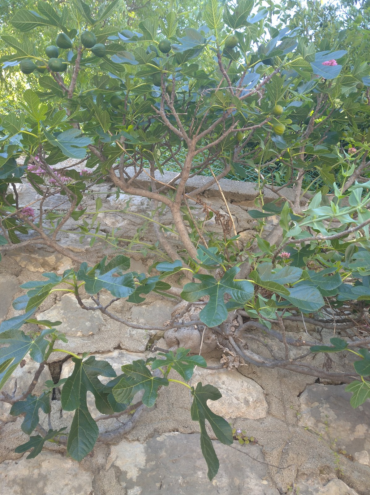

<!-- hero: stand-in until D:\FIGS pick -->
<figure class="fig-hero fig-stand-in" id="hero-labeling-fig-cuttings" itemscope itemtype="https://schema.org/ImageObject">
  
  <figcaption>
    Paint pen on black plastic, tag that still matches. Two sides if we have the still. This is a Wikimedia Commons stand-in—not our tree, not our bench. License: CC BY-SA 4.0.
    Wikimedia Commons — 11-Figuier-Ficus carica; not our tree. <a href="https://commons.wikimedia.org/wiki/File%3A11-Figuier-Ficus_carica.jpg" rel="license noopener" itemprop="license">Source</a>.
  </figcaption>
</figure>

The name walks off the pot before the fruit ever shows. I have watched it.

A cutting tray is forty brown sticks. After two weeks they still look like forty brown sticks. After you pot up, they look like forty green plants. The only difference you can sell or eat is the writing.

We label three times if the name matters. Bag the day we cut or open the box. Cup or pop the day we stick. Pot the day we move it, **paint pen on black plastic**, two sides if I remember. Posca stays. A nursery tag on a rubber band becomes a bird toy.

I write the name we were sold, not the name we hope. If it is unknown, it says unknown. If it is “Black Madeira” from a person I do not know, it says that plus a source note. The plate will argue later. The pen does not get to upgrade the tag.

Sharpie on a wet bag fades in 8a humidity and in a shop window. I have a graveyard of ghosts that say “Blk” or nothing. Date the cup. Fast varieties and slow varieties look the same on day twelve. The date is how you know you are waiting, not failing.

Do not label after you stick “when you get to it.” You will not get to it. You will remember the first two and invent the rest.

If I split a long cane into two cuttings, both get the name. If I stick two clones of the same name in coir and DE, they get the name plus the mix. That is how the 2023 test stayed honest. A tray without a mix mark is how you remember the winner wrong.

8a sun cooks cheap ink. Outdoor bulk beds need a stake that can take rain, or a map in a notebook that survives the bed getting weedy. I have lost a row to “I will remember the order.” The order remembers nothing.

Dad labels pots because we move them. A wagon of #3s is a shuffle. The ones that lose a name become eating figs if they fruit, and they stay unknown until they do. That is honest. It is also how a collection turns into a rumor.

I do not make art of the label. I make it readable from three feet. Variety, source if it matters, date. If I am being good, a note: yard / box / prune.

Zone 7 garage pots sit in the dark and the labels still fail from damp. Zone 9 outdoor pots fail from sun. We fail both ways. Write it twice.

I photograph the labeled tray the day I stick. Phone, whole block, names readable if I zoom. That picture is the backup when a paint pen smears or a cup walks to a different bench. I have matched a mystery pot to a January photo more than once. I do not trust my memory of the left-to-right order. The camera does not care that I was in a hurry. If I am splitting wood into coir and DE the same hour, both cups are in the frame with the mix mark showing.

At pot-up the label job happens again, before the old cup goes in the trash. I write the same name on the #3 that was on the cup. If the cup said unknown, the pot says unknown. If the cup said a source, the pot keeps the source. That is the hour people “clean up” a tag and promote a maybe into a sure thing. I have eaten fruit off a plant that was sold as one name and plated as another. The pot still says what we were sold until the plate settles it.

When a tag and a fruit disagree, I do not peel the pot and write the famous name. I write a second line: fruit note, year, and I leave the sold name. Collections turn into rumors when you edit history on plastic. Dad will graft over a tree he does not like. He will not relabel a rumor into a trophy.

If I am loading a wagon for a Saturday, every pot that leaves the bench has a name I can read from the seat of the truck. A buyer who asks “which one is this?” should get an answer from the pot, not from me pointing at a row I think I remember. The ones that lose a name at the sale table come home as eating figs. That is honest. It is also how I stopped putting rubber-band tags on anything I cared about. The paint pen lives in the prune bucket and on the potting bench. The one in the truck dries out. The one in the shop window cooks. When the pen skips, I do not finish later.

The roots will come or they will not. The name only comes if you wrote it down.
