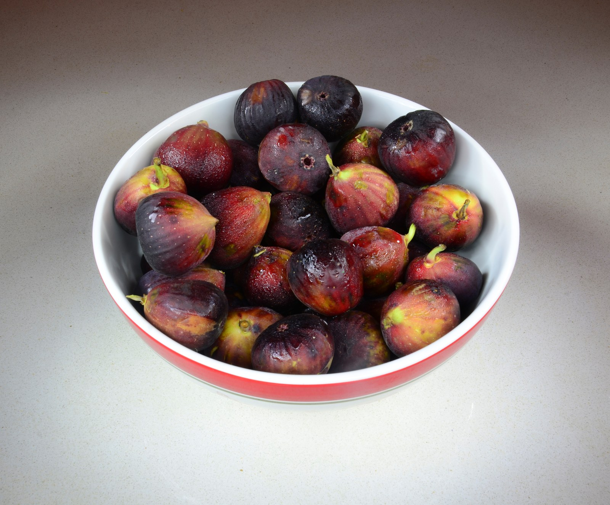

<!-- hero: stand-in until D:\FIGS pick -->
<figure class="fig-hero fig-stand-in" id="hero-fig-variety-cutting-behavior" itemscope itemtype="https://schema.org/ImageObject">
  
  <figcaption>
    Tags, not fruit. Do not caption a plate as proof of how the wood roots. This is a Wikimedia Commons stand-in—not our tree, not our bench. License: CC BY-SA 3.0.
    Wikimedia Commons — Bowl of Figs; not our fruit. <a href="https://commons.wikimedia.org/wiki/File%3ABowl_of_Figs.jpg" rel="license noopener" itemprop="license">Source</a>.
  </figcaption>
</figure>

Some names root while you are still labeling the cup. Some names sit there like they are thinking about it. The A/B writeup even named a slow one in coir. Fast and slow is real. Waiting is part of it.

I do not treat Celeste wood like Black Madeira wood like an LSU gold fig. The bark, the internodes, the way they wrinkle in a bag — different. A tight-internode berry fig can give you three nodes on a short stick and still be honest. A long-jointed fig can look generous and still be two nodes of nothing if you cut wrong.

We are not fans of Brown Turkey or Celeste on the plate so far. We still trial them, and we still root them when we prune, because a long trial means you do not throw wood you might graft over later. Wood from a variety you do not love is still wood. It is also how people mail “Brown Turkey” as if that were one plant. Commerce is a crowd. Your stick is one tree.

LSU figs in the humid South often make usable canes. That does not mean they are “easy” as a religion. It means the breeding was for this air. A desert fig that sulks in 8a humidity can still root in a cup and then hate the yard. Rooting success is not a climate match. Do not confuse a white root with a tree that will finish fruit here.

Chicago Hardy wood is a winter story more than a cup story. People cut it because the catalog said hardy. The cutting still needs damp mix and a thermostat like everybody else. Hardiness is for the night in January. It is not a rooting hormone.

I watch caliper and internodes more than I watch fame. A famous name on thin green wood is a thin green stick. An unknown on a pencil of brown yard wood is a better bet in the cup. The unknown still gets an honest label.

In the 2023 test we had 64 names, two cuttings each, same basement. Coir was faster as a *media* result. Inside that, varieties still straggled. I will not reprint a ranking here and pretend it is law. I will say: if your famous fig is slow, check the wood and the mix before you check the myth.

8a does not make every fig a South Arkansas fig. It makes the calendar generous enough that a slow rooter still has May. Use that. Do not throw a firm, dated cup at week three because a forum said “should have roots by now.”

Zone 7 wood of a hardy fig can be better lignified. Zone 9 wood of a flavor fig can be fatter and greener. We get whatever the winter gave us. Sort the stick, not the catalog.

I sort a prune tarp before I sort a catalog. Pencil-thick brown in one pile. Thin green in another. Fat water-sprouts in a third if I even keep them. Then I bag by name. A famous desert fig on a green whip does not get a VIP cup. An unknown yard fig on honest brown wood does. Fame does not change the internodes. I have thrown a catalog star in the compost pile because the cane was a soda straw, and I have rooted a nameless yard fig because the wood was a pencil and the date was mine.

When a name sits past the week I get bored, I do not invent a new mix to punish it. I check the date, the weight, and the wood. If I recut, it is because the base went soft, not because a forum said the variety is “easy.” A slow famous fig and a fast yard fig in the same tray is two woods, not a moral. I take notes. I do not reprint a ranking.

After a cup roots, the climate match is a different job. A desert fig that rooted clean can still sulk in our humidity once it is a tree. An LSU gold that was ordinary in the cup can look at home in the yard. I do not call a white root a South Arkansas fig. I call it a rooted stick. The yard gets a year before I talk about climate. The Saturday after pot-up is where people forget that and start ranking names off a cup wall.

I keep slow names on the same mat as fast ones. I do not build a “VIP heat” corner for a catalog star. Extra heat without a thermostat is how you cook the one you cared about. Extra light because a name is famous is how you get leaves that lie. Same damp mix, same probe, same date on the cup. The variety can take its time. I take notes, not sides.

If I could only keep three kinds of wood in a tray, I would keep: pencil-thick brown, three nodes, a name I wrote myself. Variety is the fourth line on the tag. It is not the first cut.
