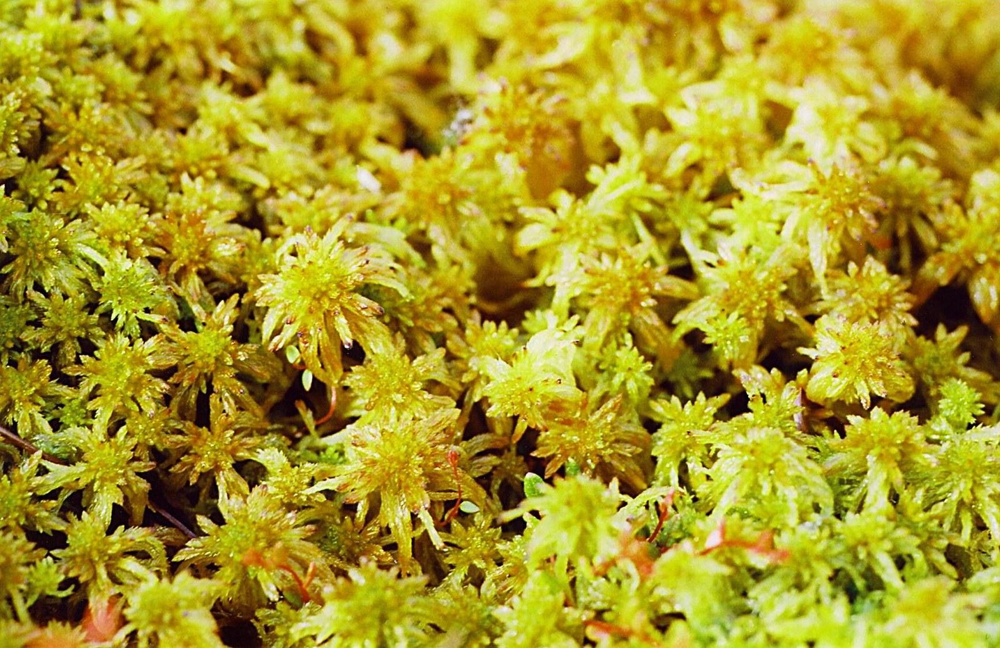

<!-- hero: stand-in until D:\FIGS pick -->
<figure class="fig-hero fig-stand-in" id="hero-fig-rooting-mix-squeeze-test" itemscope itemtype="https://schema.org/ImageObject">
  
  <figcaption>
    Mix you can squeeze without a stream. Hands in the frame if we have it. This is a Wikimedia Commons stand-in—not our tree, not our bench. License: CC BY-SA 3.0.
    Wikimedia Commons — Sphagnum moss; not our air-layer wrap. <a href="https://commons.wikimedia.org/wiki/File%3ASphagnum.jpg" rel="license noopener" itemprop="license">Source</a>.
  </figcaption>
</figure>

Dad’s line is the one I would print on the wall: **do not overwater the rooting mix.** Figs are easy. The mix is where people get clever and kill them.

The Fig Pop recipe is not a vibe. Hydrate the coir. Dump the extra. Squeeze until **no water comes out** and it still clumps. Then add about **30% dry coir** and mix. That is damp. That is not wet. If a stream runs down your wrist, you are not done.

The 2023 cups said the same thing with numbers. A handful at field capacity may lose a drop or two. After the dry DE went in, they wanted it noticeably drier — about **70% field capacity**, no free water. Average cup weight on those 32-ounce cups was about **450 grams**. I am not asking you to buy a scale. I am telling you they weighed it because “feels fine” lies.

I check later by weight, not by peeking at the wound. A light cup is thirsty. A heavy cup that stays heavy and warm for a week is how rot starts while you are still proud of the leaves.

8a air is already wet. A covered cup in our March is not a Colorado covered cup. People copy a sealed bag method from a dry basement video and then grow mushrooms. If the plastic is raining on the leaves, vent it or take it off. Condensation on the wall is one thing. A leaf lying in a puddle is another.

DE dries faster and is harder to wet from the top. Coir holds even. That is why I reach for coir when I want fewer surprises. DE is not the enemy. Dry DE is. Wet coir is the other enemy. Both media worked in that test when they were managed. Both fail when you water a schedule instead of a cup.

I do not mist “for humidity” on a mix that is already right. Misting is how you wet the bark and leave the core dry, or wet everything and call it love.

Pack the pop so the mix stays against the wood. Leave a **1–2 inch gap** under the cutting. The Pop page is blunt: if the bottom sits on the floor of the bag, it rots more. Depth is a moisture problem wearing a geometry hat.

Zone 7 heated basements dry mix. Zone 9 lanais cook it and then afternoon rain soaks it. We do both in one week in a shop with a glass front. Check the cup, not the weather app.

The part people skip on Saturday is the second dry charge. They hydrate the brick, they squeeze once, the handful clumps, and they call it done. That handful is still wet. I add the dry coir and mix again until my hand changes its mind. If I mix a tub the night before and leave it covered, I squeeze again in the morning. Overnight in our shop is how “damp” turns back into a sponge.

A helper who just watered the citrus will “top off” the cutting tray because the hose is already in his hand. I have thrown a week of cups to that kindness. The cutting block is not on the fertigate route. If someone needs a job, they can lift cups and set the light ones aside. They do not get to rain on the whole block.

DE that crusted on top does not get a flood to “catch up.” I wet it before it is a brick, a little at a time, and I still will not pour a stream that collects under the wound. The window side of a tray dries first in a shop with glass. The back row stays heavy. I do not treat those two rows as one cup. I move the light ones, I leave the heavy ones alone, and I refuse a calendar that says “Wednesday is water day.”

If you get the water right at the start, the Pop page says you may not water again until pot-up. That is the prize. It is not a dare to ignore a cup that went light. It is a reason to do the squeeze on Saturday and then leave it alone.

Damp. Not wet. Your hand knows before your hope does.
