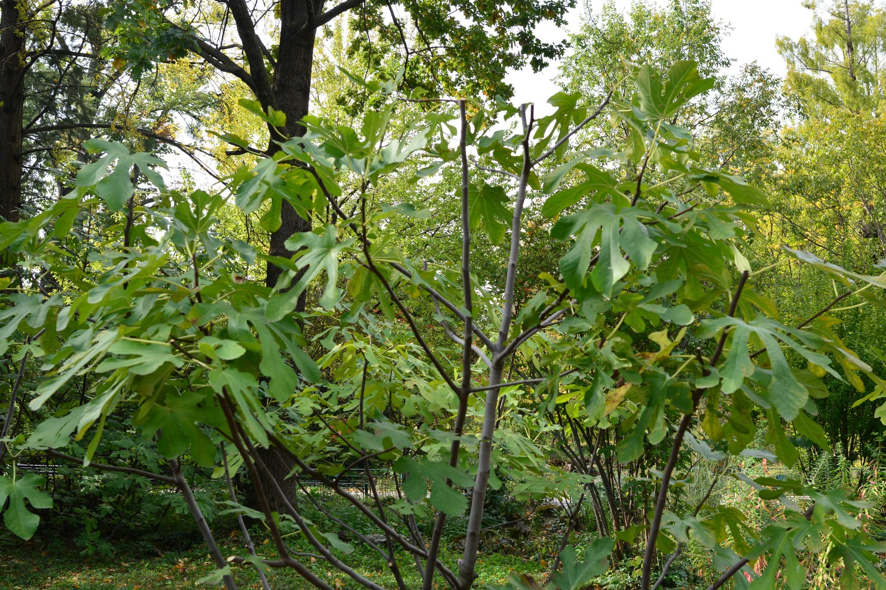

<!-- hero: stand-in until D:\FIGS pick -->
<figure class="fig-hero fig-stand-in" id="hero-water-rooting-fig-cuttings" itemscope itemtype="https://schema.org/ImageObject">
  
  <figcaption>
    A jar only if we actually shot one. Otherwise lignified wood that belongs in mix. This is a Wikimedia Commons stand-in—not our tree, not our bench. License: CC BY-SA 4.0.
    Wikimedia Commons — Joe Mabel; not our tree. <a href="https://commons.wikimedia.org/wiki/File%3ABucharest_Botanical_Garden_-_Fig_tree.jpg" rel="license noopener" itemprop="license">Source</a>.
  </figcaption>
</figure>

A jar on a windowsill is how you get a kid — or a grown person — to watch roots. I have done it. I still would not build a collection on it.

Water roots are lazy roots. They are fat, brittle, and used to drinking from a lake. Mix is air and a film of water. When you move a jar plant into coir or dirt, those roots often stall or rot while they try to become a different kind of root. The plant wilts and you say water-rooting failed at pot-up. It failed at the jar. The pot-up was the bill.

When I will use a jar: a rare green stick that is already soft, and I want to know if it is alive. A classroom. A single name I have no mix for tonight. Then I pot it as soon as I see threads, into damp mix, gentle, and I keep it dim for a week. I do not wait for a full beard in the jar. The longer it stays, the ruder the move.

Change the water. Stale water plus 8a warmth is a bacterial soup. Opaque jars hide the soup. Clear jars on a sunny sill cook it.

The cuttings post said you could try water-rooting on non-lignified wood you have to deal with immediately. That is a rescue sentence. It is not the method page.

When I pot out of a jar I dump the water first and slide the stick out. I do not yank a beard through a narrow neck. Those fat roots snap and then everyone blames the mix. The cup I go into is damp, not a lake — squeeze, then about 30% dry coir if it is a pop — and I leave a 1–2 inch gap under the base the same as any other stick. Dim for a week. No south sill “so it can recover.” Recovery is air around a film of water, not a tan.

I have watched people park a brown three-node stick in a mason jar “until it shows something.” What it shows is time you could have spent on a cup. Lignified dormant wood does not need a lake to wake up. A jar delays the roots you actually want. If a kid wants to watch a thread, I give them one green rescue and I keep the collection in mix.

I will not run a windowsill of jars as a second tray. One rescue, pot it early, then the block of cups gets the Saturday. A collection built on water roots is a collection that wilts at pot-up and then gets blamed on the coir. The mix was fine. The roots learned the wrong job. Moving that same limp plant straight into outdoor dirt is a worse idea than a cup. Dirt is for replaceable wood that already knows how to drink from a film, not from a jar.

I do not set a jar on a heat mat. Warm water plus our air is soup with a view. The mat belongs under mix, on a thermostat, probe in the cup. A jar on a mat is how you cook a beard and then act surprised when it smells.

If a water-rooted name arrives in a baggie, I photograph it, I pot it that day into damp mix, and I keep it dim. I do not stand it back in a glass “to recover from shipping.” Shipping already did the rude move. A second lake will not apologize. I would rather lose a week to a sulk in coir than grow a longer beard I cannot transplant.

Zone 7 jars in a cold kitchen are slower and sometimes cleaner. Zone 9 jars are aquariums. We are closer to the aquarium. If you need the trick, use it once, pot it early, and then go back to mix.

I would not buy a name that only arrived as a water-rooted limp thing in a baggie. Those roots traveled wrong. Mix-rooted, shipped bare-root, or a dormant stick — those I understand. A party trick in the mail is a party in the trash.
