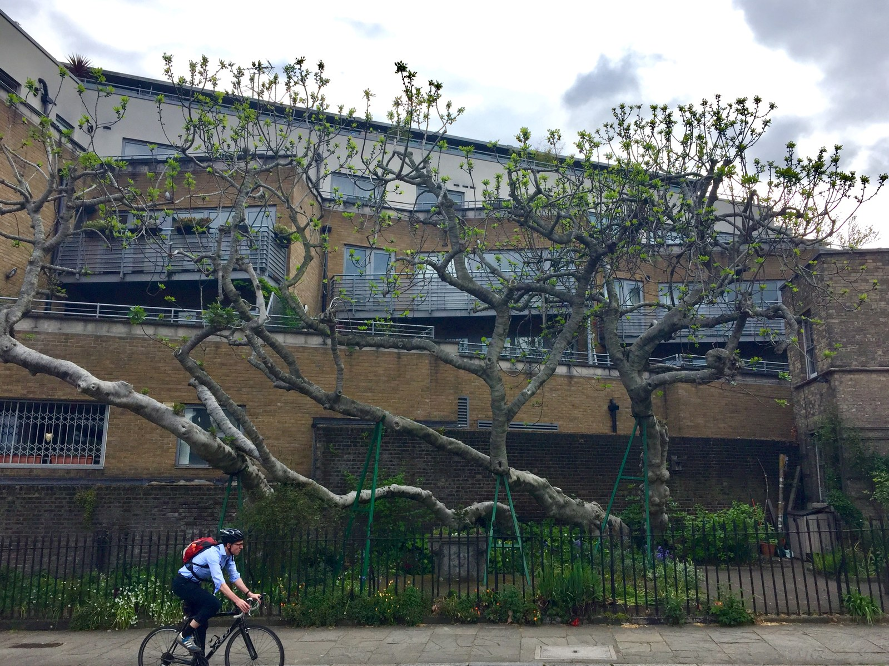

<!-- hero: stand-in until D:\FIGS pick -->
<figure class="fig-hero fig-stand-in" id="hero-fig-rooting-hormone-optional" itemscope itemtype="https://schema.org/ImageObject">
  
  <figcaption>
    Clean three-node wood. Do not photograph a gel bottle as the hero. This is a Wikimedia Commons stand-in—not our tree, not our bench. License: CC BY-SA 4.0.
    Wikimedia Commons — Amwell Fig (London); not our tree. <a href="https://commons.wikimedia.org/wiki/File%3AAmwell_Fig.jpg" rel="license noopener" itemprop="license">Source</a>.
  </figcaption>
</figure>

We have used Dip’n Grow, Clonex, Schultz powder, Hormadin. Dad will list them if you ask. He will also tell you the bed of dirt did not get any of that.

The Pop page says you could dip. The A/B used Dip’n Grow at the **softwood (weakest)** mix, three seconds, after a score. That is a protocol for a basement comparison, not a commandment. Hormone is optional. Pencil-thick, three-node, clean, lignified wood is not.

I have watched people drown a whip in gel and then blame the brand. The whip was the problem. Gel on a soda straw is jewelry on a corpse.

If I hormone, I do it on stick day, on a fresh cut, on wood that already deserved a cup. I do not redip at week four as a rescue. I do not mix three brands. I do not use a leftover soup of unknown strength from last year without [VERIFY]ing the label.

Figs root without help more often than the catalog wants you to think. The industry exists to sell bottles. We still keep a bottle because we also keep names we do not want to lose, and a controlled dip is cheap insurance on good wood. Insurance is not a substitute for the squeeze test.

On prune extras headed for outdoor dirt, I skip the dip. On a mailbox name going into a cup, I may take the three-second Dip’n Grow at the softwood — weakest — mix after a score, the way the A/B did. That is insurance on good wood. It is not a rescue for a soda-straw whip. I do not build a “VIP dip” station for a catalog star and then skip the wash. Wash first. Dry the bark. Recut. Then, if I am dipping, I dip.

Leftover soup from last year is not a protocol. If I cannot read the dilution, I mix fresh or I skip. I dip a fresh cut on stick day. I tap the extra off. I do not leave a coated wound sitting in a puddle at the bottom of a cup. 8a heat plus wet chemistry on the bark is just more wet. Dry the extra. Stick. Pack the mix against the wood. Leave a 1–2 inch gap under the cutting so the juice and the extra water do not pool on the wound.

I would rather wash well than hormone poorly. Grime plus gel is a paste. If a seller ships “pre-treated,” I still wash. I do not know what they used. I want bark I can name, then a damp mix — squeeze until no free water, then about 30% dry coir if I am in a pop. I do not redip at week four because a knob is slow. Optional hormone belongs at the start. Junk wood belongs in the trash before the bottle comes out.

Outdoor dirt has rooted replaceable wood with nothing on it. That sentence sits next to every brand we have tried. Zone 7 people hormone more because they have fewer warm weeks. Zone 9 people hormone less because the tree was never empty. We have weeks. I go with the wood. Good wood, optional dip. Bad wood, no dip will save it.

I write “dip” or “none” on the cup if I am running both in one tray. Otherwise I will remember the winner wrong, same as a missing mix mark. I score, then dip, then stick. Dip then score wipes the dose off and opens a wet wound I just washed. Powder cakes in our humidity. I do not leave an open tub on the potting bench for a month. Liquid I mix the morning I stick. I do not leave a ramekin of dip on the table for a helper to dunk every leftover whip.

Junk wood is the only non-optional. Soft, moldy, one-node, crushed, brown-through. Hormone does not resurrect it. The trash can is the right product.
