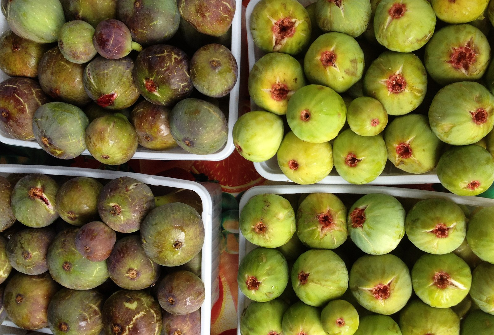

<!-- hero: stand-in until D:\FIGS pick -->
<figure class="fig-hero fig-stand-in" id="hero-transplanting-a-fruiting-fig" itemscope itemtype="https://schema.org/ImageObject">
  
  <figcaption>
    Fruit on a pot you are about to move. The plate can wait. This is a Wikimedia Commons stand-in—not our tree, not our bench. License: CC BY-SA 4.0.
    Wikimedia Commons — İncir fruit; not our tree. <a href="https://commons.wikimedia.org/wiki/File%3ACommon_fig_-_Ficus_carica_-_%C4%B0ncir_2.JPG" rel="license noopener" itemprop="license">Source</a>.
  </figcaption>
</figure>

Fruit is a bill the plant already wrote. A move is a second bill. I try not to send both in the same week.

If I must move a pot that is carrying, I pick a cool morning, I keep the root ball intact, I do not step up a size and a sun exposure on the same day, and I accept dropped figs as the tax. Green fruit on the ground after a move is not a mystery. It is accounting.

I do not strip every fig “to help it.” I will thin a ridiculous load. I will not bald a plant that was happy yesterday because I read that fruit steals energy. Of course it steals energy. That was the point of the plant. A reasonable load on a reasonable pot can survive a gentle slide into a bigger pot. A move from a #3 to a hole in July with a full crop is how you buy a stick by August.

In-ground moves of a fruiting bush are a different foolishness. I do those in the dormant window if I do them at all. A bearing in-ground fig is a root system you will not get in the tarp. You will leave the best parts in the clay. Expect dieback. Expect no crop worth naming the next year. Sometimes I would rather graft the name onto a plant I am not moving.

8a June fruit plus a pot-up is the conflict Jack’s calendar already named. Pot-up before June when you can, so the plant is not carrying and moving in the same heat. If a cup rooted late and also set a baby fig, I pick the fig off. A cup is not a orchard.

Bird-pecked fruit is not a reason to move the pot into the open for “airflow.” It is a reason for a net. Moves do not solve birds.

Zone 7 people move less in fruit because they have less fruit on young plants. Zone 9 people move in fruit because they never stop. We should act like we have a winter, even when the pot is still chewing on a late fig in November.

If the plant is a name I love — Nuestra Señora, a Red Sicilian Jack ranks, a dark unknown that earned a plate — I wait. The fruit this year is worth more than a tidier row. If the plant is a shuffle problem, I move the pot a few feet, not a climate.

Write down what you did. Next July you will remember the dropped fruit and forget that you also changed mix, sun, and pot size in one Saturday. One change. Then wait.

The slide I will actually do: cool morning, root ball left in the shape it had. I do not wash it. I do not step a fruiting #3 into a 5-gallon and a west wall on the same Saturday. Shade for a week. Water once to settle, then the pick-up test. Our mix — perlite and castings — should go light. If it stays swamp-heavy, I overwatered a plant that was already paying a fruit bill. Fruit that drops is the tax. I pick up the drops so I do not count them as a variety fault next July. Paint pen if the pot is new. The old name stays. I do not upgrade a tag because the fruit looked like something I wanted.

A cup that set a baby fig loses the fig. A cup is not an orchard. A #3 that is carrying can keep a reasonable load through a gentle slide. An in-ground bush with fruit does not get a summer move. Dormant window, or a graft onto a plant I am not moving. We have twenty-five to thirty in the ground because a bearing bush in clay leaves its best roots behind when you pull it. Hundreds of pots is how I shuffle names without pretending I can transplant a crop. Common figs. Long trials. One dropped plate does not retire a name and one pretty week does not make it established.

No salt the week of the move. Fertigate later, when the top is firm and the mix is going light. Pot-up before June so you are not moving and ripening in the same heat. August is hold. A fruiting pot in August stays a fruiting pot. The row can look unfinished. Company does not eat a cooked root ball, and a clay mound is not a grave I dig in a 98°F week to tidy a fruiting #3. Established is two summers in the hole. A Saturday of figs on the ground is accounting, not a diploma.

The plate can wait a week. The root cannot wait a bad move.
