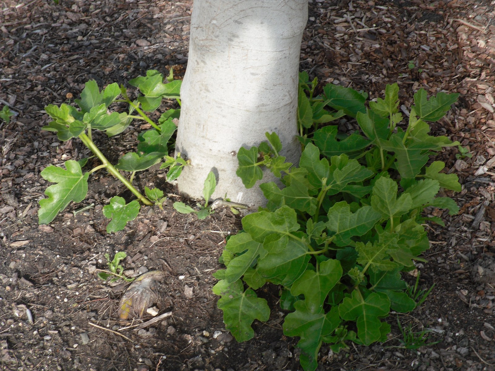

<!-- hero: stand-in until D:\FIGS pick -->
<figure class="fig-hero fig-stand-in" id="hero-transplanting-fig-suckers" itemscope itemtype="https://schema.org/ImageObject">
  
  <figcaption>
    Shoots at the crown of an in-ground stool. A free plant if it has roots. This is a Wikimedia Commons stand-in—not our tree, not our bench. License: CC BY-SA 3.0.
    Wikimedia Commons — basal shoots example; not our sucker patch. <a href="https://commons.wikimedia.org/wiki/File%3ABlackjack_basal_shoots.jpg" rel="license noopener" itemprop="license">Source</a>.
  </figcaption>
</figure>

A sucker with its own roots is a plant. A sucker you ripped and stuck like a cutting is a cutting. Do not confuse them because they came from the same stool.

I wait until late winter or a cool spring day. I fork, I do not yank. I want a piece of root. I pot it like a pot-up: damp mix, shade, no feed for a week. I label it the mother’s name plus “sucker” and a date. If the mother was misnamed, the sucker is too. Own-root commons stay true. A grafted tree’s sucker is the rootstock. We are mostly own-root. Still, know which you have.

A stool I keep in bush form throws extras. That is the cold form in the Southeast and it is how I get replacements after a bad night. I do not let it become a thicket I cannot walk through or wrap. I harvest a few. I leave the rest.

First-year pots throw weak shoots that are not worth digging. Leave them. An in-ground plant that has been in the clay two or three summers is the donor.

8a heat will cook a freshly dug sucker in an open 1-gallon on the gravel. Same shade rule as the cup. Same “before June” preference if you want it to face July as a pot.

I have used suckers as insurance on a name I was putting in the ground. One in the hole, one in a #3 behind the shop. If the hole fails, the shop plant is the name. If both live, I have a spare or I have a gift.

Do not sell a sucker as a cutting. Do not sell a cutting as a rooted plant. The difference is a fork and a week of honesty.

Zone 7 suckers are often the plant that comes back after dieback — take them after you know what lived. Zone 9 suckers are a jungle. We get a winter that decides. Wait until you see cream cambium on the stool, then dig.

The fork work is slower than people think. I work from the drip line in, lift, and look before I cut anything. A shoot with its own wad keeps the wad. I pot that wad into a #3 of damp mix — perlite and castings — the same hour, shade, no feed for a week. Paint pen: mother’s name, sucker, date. Two sides. The hole I leave in the stool gets the crown pressed back and a drink, not a crater I forget until July. If it comes up as a stick with a white heel and no roots, it is a cutting. I stick it like a cutting. I do not call it a plant.

The donor is one of the twenty-five to thirty in the clay, a common fig that has already done two summers in the hole, not a #3 that still needs every cane. Hundreds of pots are the library. They are not a sucker farm. After I take two or three, I stop. I leave the low wood and I leave last year’s fruiting wood if that stool earns a plate. A pot stool you cannot walk around is a thicket you will wrap wrong in a freeze. If the name is going in a mound, the spare #3 stays behind the shop. Clay mounds fail when you dig a grave. The spare is how the name survives the grave.

The new #3 sits on the shade rack with the other pot-ups, off the fertigation block, off black plastic. I pick it up. Light means drink. Heavy means wait. I do not keep it as wet as the clay it came from. Overwater is how a free plant becomes a sour free plant. Pot-up-before-June still applies if I want it to face July as a pot. August is hold. I do not dig suckers in a 98°F week to clean up the row for company. If I miss the spring window I wait. A stool will throw again. Long trials. I do not quote a take rate. Scratch the cane on day four if it is a rag. Green wait. Brown compost.

A free plant is free until you drown it. Treat it like the pot-up it is. The stool already did the rooting. Your job is the move, not a second origin story.
