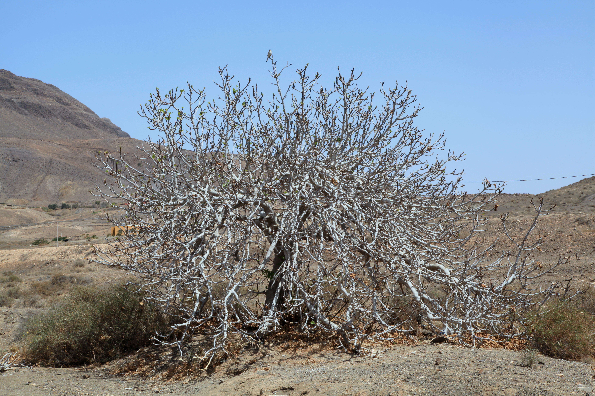

<figure>

<figcaption>Figure 1. Zone 7b: the almost-two-crop belt. Staged stand-in (prune.03.fig-dormant-canopy-pajara-02); Photo: Frank Vincentz, Wikimedia Commons, CC BY-SA 3.0. Prefer publish photo from D:\FIGS\Figs — 7b yard with mixed live and dead tips. See RIGHTS.md.</figcaption>
</figure>
7b is the zone that makes liars out of confident people. Five to ten degrees, on paper. In a protected city lot you will eat brebas in June and tell your brother in the next county that figs are easy. In an open pasture the same winter, the same Celeste is a stool of green shoots in May and a late bowl in September.

The prune has to live with that, or you will have a ritual instead of a crop.

## Two winters, one address

Keep a cheap notebook. Not a spreadsheet. One line per winter: coldest night you actually saw, whether the tips stayed tan or went pithy-gray, whether the little overwintering figs were still there in March.

If the tips lived, you are in a breba year. Prune like someone who can lose those tips on purpose or keep them on purpose. Do not “thin for shape” by taking every long shoot back to a fat knuckle. That is a main-crop prune. It is legal. It is just not the prune you wanted if you were bragging about June figs.

If the tips died, winter already took the breba. Your job is cleanup after green shows, then a decision about how many replacement canes to keep. You are not late. You are on time for a dieback year.

## When to put the blade on the wood

The 7b window is later than the 8b blogs and earlier than the zone 6 buckets.

- **Do not** do a January structural prune. You still have your coldest nights in front of you more years than not.
- **Late February to late March** is the argument, and the argument is settled by the ten-day forecast and by bud swell, not by a date circle.
- **After a nasty winter**, wait until you see which buds break. That may push you into April. People will drive by and think you forgot. Let them.

UGA’s language is useful here: after danger of frost, before growth starts, if you are heading last year’s wood for branching. In 7b “danger of frost” is a longer sentence than it is in Valdosta.

## What I would cut in a kind year

Assume the wood lived. You have maybe six leaders, a few suckers, and a lot of last season’s long laterals with tiny figs near the ends.

1. Take the dead and the rubbers. Always.
2. Take the suckers you do not need. Keep one or two young ones if a leader is hollow or split.
3. Open two or three places in the middle so June air can move. Figs in 7b still get rust.
4. Leave the fruiting tips on the varieties you planted for flavor in June — Olympian, a good Brown Turkey breba, a Desert King only if you truly have a San Pedro that sets without a wasp, which in the Southeast you usually do not.

If the bush is a ceiling-scraper, take height off a *few* leaders, not all of them. A 7b season is not a 9b season. A uniform hard heading can shove the main crop into the first October cold.

## What I would cut in a mean year

Wait. Green. Cut dead to live. Thin the stool to a number of canes you can stake. Do not also impose an open-vase fantasy on four-foot green whips in May. Let them lignify. Stake. Pinch once in June if they are blind poles.

## The 8a neighbor

8a is one half-step south and it feels like a different religion some years. Your 8a friend prunes on February 25 and gets away with it. Copy the *decision rule*, not the date. The rule is: worst cold likely behind you, buds not yet committed, and you know whether this winter left you breba wood.

7b is where that rule earns its keep, because the worst cold is a frequent guest, not a story your parents told.
