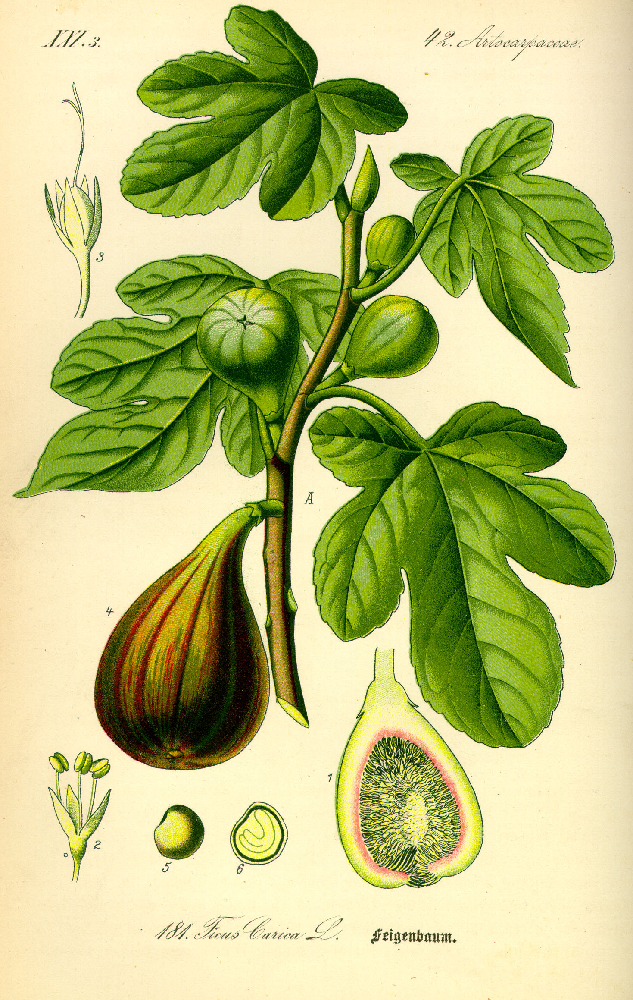

<figure>

<figcaption>Figure 1. Mistake: pruning a first-year fig with apple rules. Staged stand-in (prune.24.kohler-ficus-carica-plate); Köhler-type Ficus carica plate, Wikimedia Commons, PD. Prefer publish photo from D:\FIGS\Fig Labels — fig training not apple central leader. See RIGHTS.md.</figcaption>
</figure>
Apple books are everywhere, and they are confident. Central leader, heading the whip, scaffold selection in year one, fruit on spurs you will meet later. You take that confidence to a fig whip from a nursery pot and you cut it like you are starting a dessert apple.

Figs are not apples. They fruit on last year’s extensions and on this year’s shoots. They sucker from the crown. Their wood is weak. They do not need 800 chill hours. They do need a winter they can survive.

## What UGA actually says to do at planting

Cut off about one-third of the young plant at planting to force shoots from the base. Then *let them grow through the first season.* Late in the winter after that first year, pick three to eight leaders.

That is almost the opposite of “build a central leader and suppress the competition.”

## What people do instead

They keep one stem, rub the base, head the top to an apple height, and wait for scaffolds. In 9b they may get a tree. In 8a they may get a tree until the bad winter. In 7 they get a dead stick and a sulk.

Or they prune three times in year one because the plant looks messy. Year one is roots. A few figs on a first-year plant are a party trick. If they appear, you can pick them. You do not owe the plant a shape-up every month they appear.

## The first-year calendar, 8a

- Planting day (spring is easier here than a late-fall plant that has to face 12 °F with no home yet): one-third off if it is a whip; less drama if it is already a branched shrub in a pot.
- Summer: water. Mulch. No nitrogen party after midsummer. One pinch if a single shoot is a pole and you already took the planting cut.
- Next late winter: choose leaders. Not before you have seen a summer of growth.

## Container year-one

Same rule, smaller stage. Do not root-prune and top-prune and repot in the same week as a hard heading. Pick one insult per season. Young figs forgive, but they do not forgive a stack.

## If you already apple-pruned it

Let it grow. If suckers come, you may have accidentally started a bush. Keep them. You stumbled into the right form.
