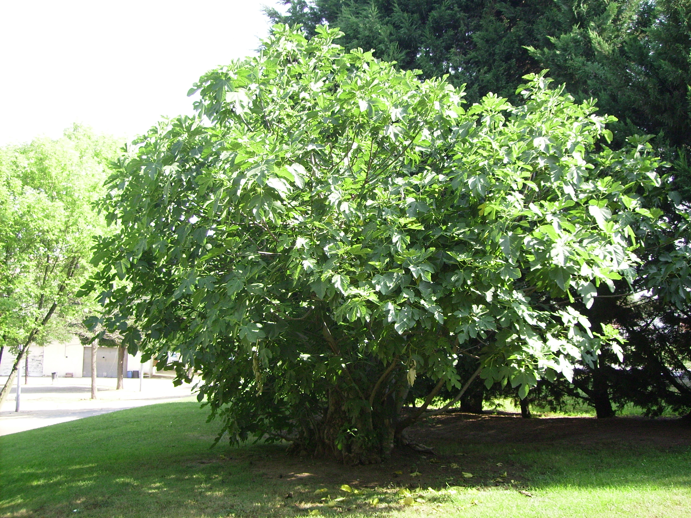

<figure>

<figcaption>Figure 1. Years one to three: train a bush, do not perform a harvest. Staged stand-in (prune.26.fig-potted-tree-la-figuera); Photo: Archaeodontosaurus, Wikimedia Commons, CC BY-SA 3.0. Prefer publish photo from D:\FIGS\Greenhouse photos — years 1–3 training cuts. See RIGHTS.md.</figcaption>
</figure>
The first three years are not a fruit program with a prune attached. They are a prune program with some fruit if the plant is generous.

## Year one

Planting cut: about a third off a whip, to make it throw from the base. If you planted a three-stem plant from a good nursery, you may already have the start of a bush. Do not reduce it to one stem for dignity.

Water. Mulch. No late fertilizer. If a breba appears on wood the nursery grew last year, you may eat it. You may also pick it off if the plant is struggling. That is a judgment, not a rule. I would eat two and leave the rest on a vigorous plant; I would pick them all off a wilted one.

Do not spend year one “opening the vase.” There is no vase yet.

## Year two, late winter (8a: late February)

Look at what lived. Choose three to eight leaders that are spaced. Remove the extras at the base. If you want more branching, head last year’s growth on the keepers by a third to a half — UGA’s move — *unless* you are keeping a breba on a specialist variety. On a specialist, skip the heading and accept a lankier year-two plant.

Summer: pinch a pole once. Stake anything that is already leaning.

## Year three

You now have something that looks like a decision. Repeat the late-winter walk. Take rubbing wood. Replace one weak leader with a bullpen sucker if you have one. This is the first year I would let a Brown Turkey carry a real main crop without guilt. Still do not hard-renovation an 8a plant that is only now getting thick.

## Zone 7 overlay

Years one to three may include a kill-down. That does not reset the calendar to shame. It resets the top. The crown is a year older even when the canes are not. Keep choosing a counted set. The third year after a kill-down can still be a fruit year if the summer is long.

## What success looks like

Not height. Thickness at the base of a few leaders, a hole you can put a hand through in the middle, and fruit you can pick without a ladder you do not own. If year three is a jungle of thin stems, you skipped the choosing. That is fixable. It is not fixable with a hedge trimmer.
