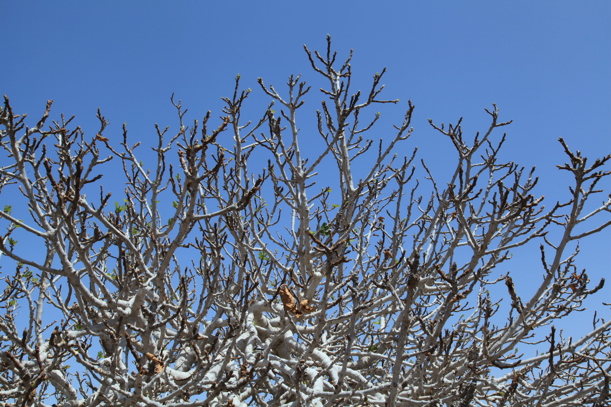

<figure>

<figcaption>Figure 1. After a late April freeze: do not make a second winter with the shears. Staged stand-in (prune.31.fig-dormant-canopy-pajara-03); Photo: Frank Vincentz, Wikimedia Commons, CC BY-SA 3.0. Prefer publish photo from D:\FIGS\Figs — April freeze burned breba wood. See RIGHTS.md.</figcaption>
</figure>
The leaves were out. The breba was swelling. A 26 °F night arrived because 8a does that. In the morning the leaves look wet and dark, then they crisp. The little figs go soft.

This is when people “clean it up.”

Wait.

## What is dead, what is sulking

Soft new leaves can look dead and still have a bud behind them that will push. Breba figs that have frozen are done. You cannot prune them back to life. The wand they sit on may still be useful for laterals and a main crop.

Give it ten to fourteen days. New green will show from lower nodes if the wood lived. Then take the tissue that is truly black and dry back to a live bud. That is all.

## Do not heading-cut the whole plant to “even it up”

Even is how you delay the main crop on every arm at once. You already lost June. You need August. Leave every live leaf you can.

## 7a and 7b

A late freeze after you already cleaned dieback is cruel, and it happens. Same rule. No third prune for pride.

## Fertilizer

Do not answer a freeze with nitrogen. You will get a flush of even softer tissue for the next cold night, and there is sometimes a next one.

## What to write down

The date, the temperature on your thermometer, and which varieties lost breba. If Olympian lost it and Celeste’s main-crop wood is fine, that is information for next February’s vote. If everything lost the tips but the older wood is fine, your wrap needs to stay on longer, or your unwrap was vain.

Also write whether the freeze hit after you had already headed. A freeze on an uncut plant takes fruit. A freeze on a freshly headed plant takes fruit and the buds you asked to replace it. That is why draft 41 treats bud swell as a deadline, not a suggestion.

## The only emergency cut

A split crotch from ice that came with the freeze. Take the hanging arm so it does not peel. Leave the rest to decide.
