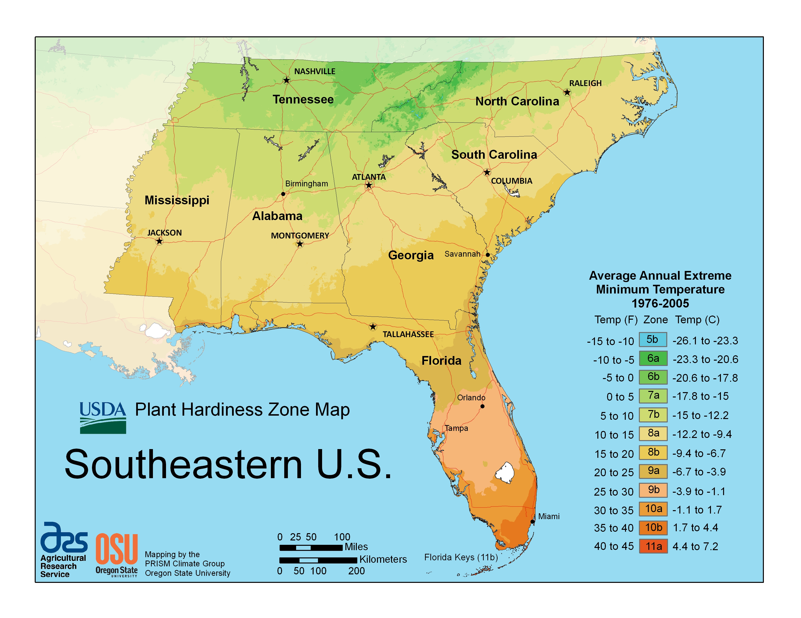

<figure>

<figcaption>Figure 1. Inland 8a and coastal 8a are not the same winter. Staged stand-in (prune.36.usda-phzm-southeast); USDA Plant Hardiness Zone Map (Southeast), PD. Prefer publish photo from D:\FIGS\Figs — inland 8a vs coastal 8a same zone number. See RIGHTS.md.</figcaption>
</figure>
Both cards say 8a. One yard is a Tidewater evening that forgets to freeze. The other is an Oklahoma or north-Georgia night with wind and a sky like a plate. The fig does not read the card. It reads the night.

## Inland

The cold comes fast after a warm week. That is the dangerous one. Wood that thought it was in late March gets a 12 °F morning. If you pruned in the warm week, you helped the plant think it was March.

Inland 8a should lean toward the late side of the 8a window: last days of February, first of March, and later if buds are still shut and the ten-day looks mean. Wrap is not embarrassing. Windbreaks are pruning-adjacent: a plant out of the north wind keeps tips you do not have to cut off as dieback.

## Coastal / marine-influenced 8a

You may have fewer brutal nights and more damp. Rust, not death, is the winter-into-summer problem. You can often prune earlier — mid-February — because the worst cold is a shorter list. You should thin for air more aggressively than the inland person who is trying to keep every leaf for a short season.

Do not steal inland wrap-and-wait anxiety if you truly do not have those nights. Do not steal coastal early-prune confidence if you only visit the coast.

## How to tell which 8a you are

Your own thermometer over two winters will do it. If you never saw 14 °F, you can treat January ice as the rarity and prune more like 8b. If you saw 11 °F twice, you are inland in the way that matters, even if the map drew you pretty.

## The prune that both can share

Dead wood. Counted leaders. A decision about tips. Gloves. Everything else is local.

If a draft in this folder says “late February in 8a,” inland people should hear “not before.” Coastal people may hear “unless your February is already spring, then earlier, but still dormant.” That is not a contradiction. That is two winters sharing a number.
