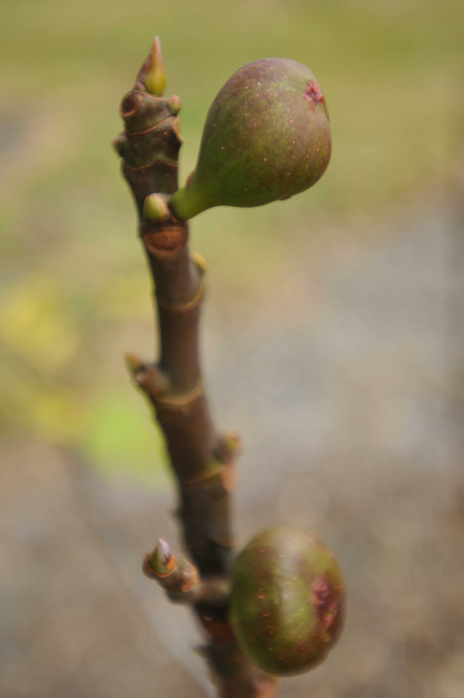

<figure>

<figcaption>Figure 1. Do not spend weeks you do not have: hard headings and short seasons. Staged stand-in (prune.39.ficus-carica-canopy); Photo: Alvesgaspar, Wikimedia Commons, CC BY-SA 3.0. Prefer publish photo from D:\FIGS\Fig Fruit — short-season main crop on new wood. See RIGHTS.md.</figcaption>
</figure>
A hard dormant heading makes vigorous new wood. Vigorous new wood fruits later. Later is a tax. In 9b the tax is cheap. In 8a it is sometimes the whole harvest. In 7a it is often the whole harvest.

This is the mistake of people who read “figs fruit on new wood” and heard “so cut everything and get more new wood.” More is not sooner.

## The delay, in practice

A plant left with last year’s laterals starts sizing main-crop figs on reasonably mature shoots while the hard-cut neighbor is still making canes. I have seen — and every old yard will show you — the uncut or lightly cut bush with ripe Celeste while the sculpted bush still has marbles.

If your first frost is early October, those marbles are compost.

## Who should still cut hard

- A 9b yard with a walkway problem.
- An 8a giant you are reducing over years (draft 27), not in one vote.
- A 7a plant that winter already cut hard. You are not adding delay so much as starting from zero, which is different — and you should still pinch, not sculpt.

## The 8a compromise

Head some, leave some. Keep a little last-year length even if you do not care about breba, because that length is *early main-crop* architecture too. People talk as if only breba lives on old wood. The main crop lives on new shoots, but those shoots come earlier and calmer from a plant that was not reduced to knuckles.

## Numbers you can use without pretending they are a lab

If you take more than half of last year’s extension off every leader, you are in the delay business. If you take a third off some and none off others, you are in the split vote. If you take only dead wood, you are in the leave-it business. All three are legal. Only one is legal in a short year if you want a full bowl.

## The sentence

*New wood is not late wood unless you asked it to start from nothing.* Stop asking, if your frost dates are already talking.
